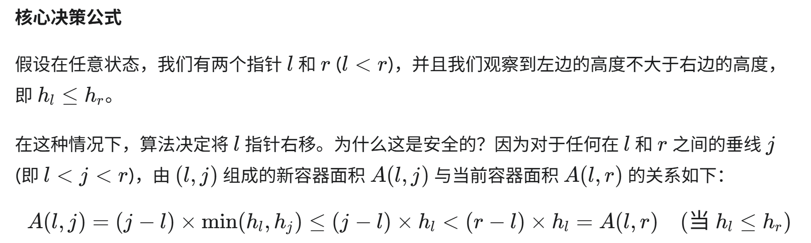
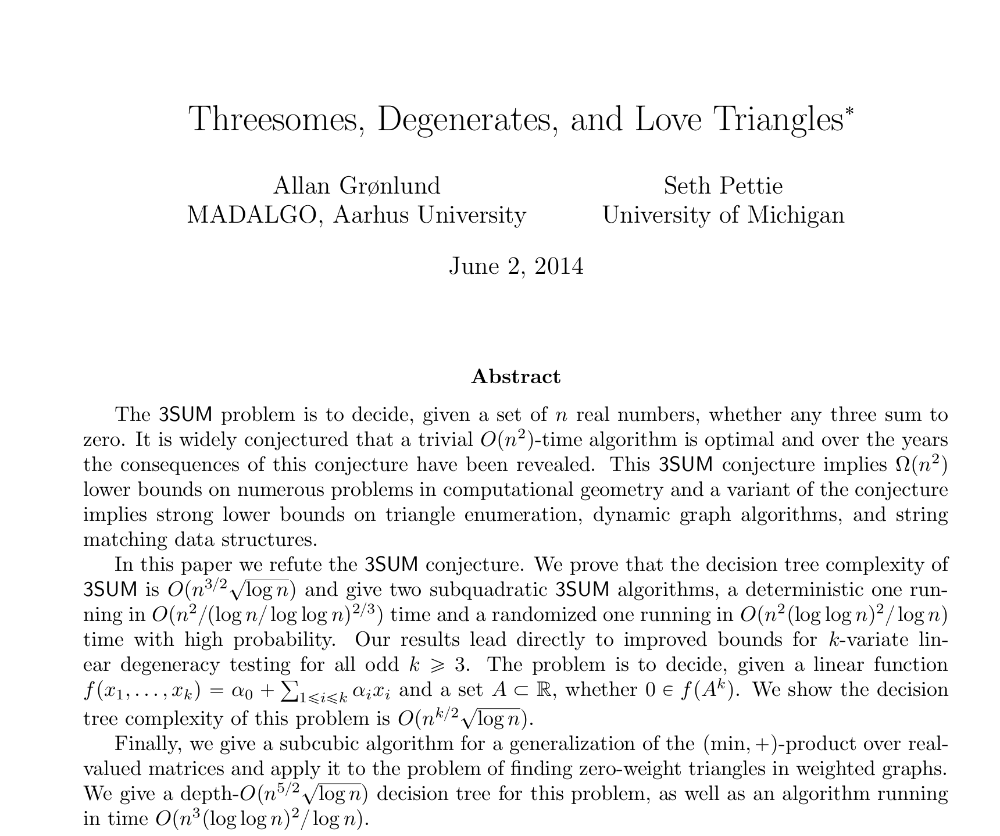

# Leetcode 1 - 500

Currently no Chinese version.

※ Means the basic or foundational algorithm, that can be used in other problems. Such kind of foundations are very important.

## No.1 - No.50

#### 1. ※ Two Sum

The difference between Two Sum and Sum2 is that Two Sum cannot sort the list, because we need the index.

```
traverse the nums list:
    sub = target - num  
    if num not in hashmap:
        store: {num: index of this num}
    else:
        return [index of num, hashmap[sub]]
```

...

...

#### 3. ※ Longest Substring Without Repeating Characters

经典滑动窗口题

```
i是左边界，需要根据情况调整
j是右边界，一直往右移动就可以了
for j in range(len(string)):
    检查当前字符是否在hashmap中:
        如果在，则判断其最新位置是否在[i,j]之间：
            如果在之间，则表明新字符是一个重复字符，不能记录
            移动i到该位置的下一个位置
    记录当前最大值max_len
```

...

...

...

#### 6. Zigzag Conversion

这道题初见较难。如果考虑行列和形状，会导致解法变得复杂。正确思路应该是直接生成对应的行，然后分析当前遍历字符应当处于哪一行，按顺序添加进去。

难点：向上放置的时候，应放行数  = cycle_len - cycle_index，可以想象循环最终一定是在第一行，因此在向上部分，应放行数就等于循环终点 + 离终点的距离。

...

...

#### 11. Container With Most Water

初见：没想出来非暴力解法。

左右指针相向而行，高度更小的指针移动。这个解法如何保证不会遗漏更大的解呢？——这便是这道题非常重要的思想：**缩减搜索空间**。



这是一种非常聪明的剪枝（Pruning）策略。

#### 12. Integer to Roman

The intuitive solution is to set a value list and a roman symbol list, and then perform // and % on the number num to be converted in turn, but it is difficult to handle special values here.

Based on the intuitive solution, make a slight modification, put the special value into the value list, and then subtract this value in turn to get the answer.

New python gramer: `value_symbol = [(1000, 'M), ...` This is the list of tuples. Equals to two lists. When you traverse it, use `for value, symbol in value_symbol:`.

...

#### 13. Roman to Integer

Use a dict/map store roman numbers.

Start from right, if left one is smaller, then sub; else sum.

New python grammer: `for s in reversed(str)` means traverse in reversed order.

#### 14. Longest Common Prefix

这道题初见感觉很简单，很容易想到直观解法（纵向扫描）：从每个单词的第一个字母开始对比，一直对比到出现不同的字母为止。coding的时候有一个技巧：总是把第一个单词作为基准去比较。

这道题初见直观解已经是最高效的了，时间效率O(N*P)，空间效率O(1)。

如果用字典序的方法去排序的话，会导致时间和空间复杂度提升，得不偿失。

#### 15. 3Sum

初见：没想出来。提示后想到把这道题分解为twosum，只是twosum的和的标准是和nums列表一样长的一个基准序列。换句话说，把3sum题转换为一个长度为N的2sum题。

注意：2sum需要先对列表进行排序，python自带的 `.sort()`的时间效率是

解法：

```pseudocode
已知nums数列，对nums排序
基准参数k：for k in range(len(nums)-2)：
    对于每个参数k所对应的有序列表，进行2sum经典解法（左右双指针）
    这里注意，2sum的范围是k后面的区域
    指针移动时跳过连续重复数字，因为nums已经排序，所以相当于防止重复结果
```

时间：O(N^2)，空间：O(N)

python coding注意：`.sort()`是原地修改。

这道题是一个经典的3SUM问题，长期以来一直被认为其复杂度下限就是O(N^2)，不过在科学家们的努力下，该问题如今被压缩到亚二次方（sub-quadratic）级别了；但是，优化改进仅推翻了强3SUM猜想，但是依然无法撼动弱3SUM猜想，即不存在时间复杂度为$O(N^{2-\epsilon})$的算法（其中epsilon为大于0的常数）：



**4SUM问题（3SUM基础上提升）**

4SUM问题不能直接用同样的方式去降维，转而可以使用空间换时间的方法，让时间复杂度同样为O(N^2)，代价是牺牲空间，让空间复杂度为O(N^2)。4SUM详见下一道题。

#### 18 ※ 4Sum

**Solution1: Demension Reduction (This can pass leetcode)**

Reduce demensions, Time: O(N^3), Space: O(1)

```pseudocode
nums.sort()
for i in range(len(nums)-3):
    for j in range(i+1, len(nums)-2):
        left = j + 1
        right = len(nums) - 1
        use 2Sum to find the required pairs
```

More specifically:

```python
class Solution(object):
    def fourSum(self, nums, target):
        if len(nums) < 4:
            return []

        nums.sort()
        result = []
        for i in range(len(nums)-3):
            if i > 0 and nums[i] == nums[i-1]:
                continue
            for j in range(i+1, len(nums)-2):
                if j > i+1 and  nums[j] == nums[j-1]:
                    continue
                left = j + 1
                right = len(nums) - 1
                while left < right:
                    if nums[left] + nums[right] + nums[i] + nums[j] < target:
                        left += 1
                    elif nums[left] + nums[right] + nums[i] + nums[j] > target:
                        right -= 1
                    else:
                        result.append([nums[i],nums[j],nums[left],nums[right]])
                        while left < right and nums[left] == nums[left+1]:
                            left += 1
                        while right > left and nums[right] == nums[right-1]:
                            right -= 1
                        left += 1
                        right -= 1
        return result


```

.

**Solution2: Hashmap (This cannot pass leetcode in extreme testcase)**

Time: O(N^2), Space: O(N^2)

```pseudocode
find sum of all two-numbers, make this problem into find 2 two-sum
traverse the dict, find two pairs that meets the requirement
lastly, eliminate the duplicates
```

More specifically:

```python
if len(nums) < 4:
    return []

from collections import defaultdict
sum_map = defaultdict(list)

for i in range(len(nums)-1):
    for j in range(i+1, len(nums)):
        sum_map[(nums[i]+nums[j])].append((i,j))

result_set = set()
for s1 in sum_map:
    s2 = target - s1
    if s2 in sum_map:
        pairs1 = sum_map[s1]
        pairs2 = sum_map[s2]

        for(a,b) in pairs1:
	    for(c,d) in pairs2:
		if b < c: # because when we create pairs, a < b and c < d
		    quad = tuple(sorted([nums[a],nums[b],nums[c],nums[d]]))
		    result_set.add(quad)

return [list(q) for q in result_set]
```

Why cannot pass leetcode: if the input nums is [2,2,2,2,2,2,2,2,2,2,2,...], then the hashmap will only have one key: 4. This cause the performance of the lookup phase to degenerate from near constant time to a staggering O(N^4)

..

...

...

...

...

#### 26. Remove Duplicates from Sorted Array

two pointers.

#### 27. Remove Element

这道题在循环设置上容易出错：

```python
while i <= j: # 注意这里是小于等于
    if nums[i] == val and nums[j] != val: ...
    elif nums[i] == val and nums[j] == val: ...
    else: ...
```

。。

#### 28. Find the Index of the First Occurence in a String

这个算是一个pyton技巧学习题，找到字符串中对应的单词的方法：`string.find(word)`，返回对应index。python底层在搜索字符上用的是Boyer-Moore-Horspool 算法，感兴趣的人可以看看相关资料。

#### 35. Valid Sudoku

First Meet: Pass with best practice:

```python
class Solution(object):
    def isValidSudoku(self, board):
        row = {}
        column = {}
        box = {}
        for i in range(9):
            for j in range(9):
                val = board[i][j] # This can improve a little bit of time efficiency

                # skip the '.'
                if val == '.':
                    continue

                # for each row, maintain a dict of set
                if i not in row:
                    row[i] = set() # row i's set
                if val not in row[i]:
                    row[i].add(val)
                else:
                    return False

                # for each column, maintain a dict of set
                if j not in column:
                    column[j] = set()
                if val not in column[j]:
                    column[j].add(val)
                else:
                    return False
  
                # for each box, maintain a dict of box
                box_row = i // 3
                box_col = j // 3
                if (box_row, box_col) not in box:
                    box[(box_row, box_col) ] = set()
                if val not in box[(box_row, box_col) ]:
                    box[(box_row, box_col) ].add(val)
                else:
                    return False
        return True
```

...

#### 37. ※ Sodoku Solver (HARD)

First Meet: I think I can make a set for each space, and delete the element when it meets the same exist one. But this idea cannot solve hard sodoku.

This is a CSP (Constraint Satisfaction Problem), the future value matters so cannot use greedy, but need use backtracking.

Basic Idea:

```
Step1: Iterative Constraint Propagation
    make a set of 1 - 9 for all spaces
    eliminate as much as possible for each space's set

Step2: Backtracking Search
    after step1, there might be many spaces with multiple numbers
    find a space (with least possibility), choose a number as a "guess"
    put this "guess" back to step1:
        if any space's set will be eliminated to None
        then we need to change a "guess"
```

More specifically:

...

#### 42. Trapping Rain Water

**Solution1: Dynamic Programming (Easy to Think)**

```
maintain a list max_left:
    max_left[i] means the heighest column to the left of column[i]
maintain a list max_right:
    max_right[i] means the heighest column to the right of column[i]
calculate each column[i]'s water:
    water's volume at column[i] = min(max_left[i], max_right[i]) - height[i]
```

Time/Space: O(N)

**Solution2: Use two pointers, optimize space to O(N)**

This idea comes from the formula `min(max_left, max_right) - height[i]`:

* when max_left is smaller, then the water volume depends on the max_left: `max_left - height[i]`
* else depends on the right

Therefore:

```pseudocode
init pointer i,j
init maxL, maxR as height[0], height[-1]
while i <= j: # The boundry here is very important
    if maxL <= maxR:
        calculate maxL - height[i]
        note: if height[i] >= maxL, then don't calculate, update maxL
    else:
        calculate maxR - height[j]
        note: if height[j] >= maxR, then don't calculate, update maxR
```

Time: O(N)

Space: O(1)

...

...

#### 45. ※ Jump Game II

```
set a cur_range
set a max_range
use greedy strategy:
    when i not reach cur_range:
        max(max_range, cur_max_range)
```

这道题思路简单但是写代码老写错：

```python
class Solution(object):
    def jump(self, nums):
        cur_range = 0
        max_range = 0
        count = 0
        for i in range(len(nums)-1):
            max_range = max(nums[i]+i, max_range)
            if i == cur_range:
                cur_range = max_range
                count += 1
        return count
```

...

...

...

...

#### 49. Group Anagrams

The logic is easy, but notice the implementation in python:

```
create a hashmap
for string in strs:
    ls = sorted(string) # in python, this func will return a list
    key = tuple(ls) # make it in tuple, because list cannot be key
    hashmap[key].append(string)
now the values() can be returned use a python command:
return list(hashmap.values())
```

.

## No.51 - No.100

...

...

...

#### 55. Jump Game

记得先判断当下位置是不是在可达范围内

...

...

...

...

...

...

#### 56. Merge Intervals

First Meeting: Failed. Didn't handle sorting and chain merging issues.

Idea: Make a new list merged, compare merged[-1] and current interval.

solution:

```
sort the intervals (intervals.sort(key=lambda x:x[0]))
init list merged with the first interval
loop the rest of the intevals:
    merged.append(interval) if overlap
    merged.update else.
```

#### 57.

...

...

...

#### 58. Length of Last Word

太简单了，没什么说的。倒着traverse，从第一个字母开始，到最后一个字母结束。用 `.isalpha()`来判断是否是字母。

不过有个一行解法很有意思：`return len(s.strip().split(' ')[-1])`，但是因为要处理整个list，反而增加了时间复杂度和空间复杂度，属于没有什么意义的写法，但是作为趣味可供一乐。

...

...

...

#### 68. Text Justification

这道题直观思路简单，直接greedy一行一行往上填，难点是把代码coding出来（写了几次总是这儿那儿漏点东西），特别是分配带有多个可能不相等的空格的行的时候。

...

...

...

#### 80. ※ Remove Duplicates from Sorted Array II

题目要求是不超过2次重复，按照造轮子的指导方针，这道题现在应当直接给出一个通用解了。

设计一个通用解，关键在于写入条件：一个元素应当被保留，当且仅当：

* 它是一个新出现的数字
* 它是一个重复的数字，但是它的出现还不足K次

这个条件可以抽象概括为：

* **一个元素nums[j]可以被写入到nums[i]的位置，如果它和i左边第k个元素nums[i-k]不相等。**

特殊边界情况：

* **当i<k时，说明有效数组长度还不足k，因此前k个元素应该被无条件保留。**

```python
class Solution(object):
    def removeDuplicates(self, nums, k):
        # 一个通用的解决方案，允许每个元素最多出现 k 次。

        # i 是慢指针（或写指针/Writer）。
        # nums[0...i-1] 是处理好的部分。
        i = 0
  
        # 使用 for 循环遍历每个元素，num 充当快指针（或读指针）的角色。
        for num in nums:
            # 核心判断条件：
            # 1. 如果 i < k，说明当前处理好的数组长度还不足 k，
            #    所以任何元素都可以直接放进来。
            # 2. 如果 num > nums[i-k]，说明当前元素 num 和结果数组中倒数第 k 个元素不同。
            #    因为数组是排序的，这意味着我们还没有 k 个 num，所以可以把它放进来。
            if i < k or num > nums[i - k]:
                nums[i] = num
                i += 1
        return i
```

...

...

#### 88. Merge Sorted Array

Two pointers.

这道题逻辑简单，但是边界很容易写错：

```python
class Solution(object):
    def merge(self, nums1, m, nums2, n):
        if not nums2:
            return nums1
        i = m - 1
        j = n - 1
        for k in range(len(m+n-1,-1,-1):
            # 这里的边界判定很容易出错，导致index out of range error
            if j < 0:
                break
            if i >= 0 and nums1[i] >= nums2[j]:
                nums1[k] = nums1[i]
                i -= 1
            else:
                nums1[k] = nums2[j]
                j -= 1
        return nums1

```

...

## No.101 - No.150

...

...

...

#### 121. ※ Best Time to Buy and Sell Stock I

这道题的关键是关注于两件事：

* 截至目前为止最低的价格
* 截至目前为止最高的利润

```python
min_price = float('inf')
max_profit = 0
for price in prices:
    if price < min_price:
        min_price = price
    max_profit = max(max_profit, price - min_price)
return max_profit
```

#### 122. Best Time to Buy and Sell Stock II

贪心直过，还没I难。

#### 123. Best Time to Buy and Sell Stock III (Hard)

这次**限制最多两次交易**，难度上来了。需要用DP动态规划的思路。

我们先抛开动态规划的概念，来回归到这道题上来：假设你是一个手机倒卖小商贩，本金无限。现在，突然出现了一个限量款的手机，每个人只能拥有一部。你的目标是**最多**在这个市场里倒卖两次，然后赚到最多的钱。现在核心规则如下：

* 你的手里最多只能持有一部手机
* 必须先卖掉第一部，才能买入第二部
* 你最多只能完成两轮“买入-卖出”的交易

四个核心状态（你的四本账）：想象你有四本账，分别记录不同阶段的最佳成果：

1. **账本1 (`buy1`)：记录“第一次买入”后的最佳状态**
   * **含义** ：只考虑第一次买入，你花掉的成本越少越好。这本账记录的是你“欠自己”最少的钱。
   * **每天的决策** ：看到今天的新价格，你问自己：“我是今天才第一次出手买呢，还是保持之前那个更便宜的买入价划算？”
   * **例子** ：第一天手机卖3000，你的账本1是 `-3000`。第二天手机降到2500，你就会想：“太好了，我应该按2500买才对！” 于是你把账本1更新为 `-2500`。你总是在寻找最低的买入点。
2. **账本2 (`sell1`)：记录“第一次卖出”后的最佳状态**
   * **含义** ：只考虑完成第一笔交易后，你手里赚到的最多现金。
   * **每天的决策** ：看到今天的新价格，你问自己：“我是今天把它卖掉呢，还是保持之前某天卖掉赚的钱更多？”
   * **例子** ：你之前在2500买的（账本1是-2500）。今天手机涨到5000，你一卖，就能净赚 `5000 - 2500 = 2500`。如果之前某次交易的最高纪录是赚了2200，那你现在就把账本2更新为 `2500`。
3. **账本3 (`buy2`)：记录“第二次买入”后的最佳状态**
   * **含义** ：在你完成第一笔交易赚到一笔钱后，你又出手买了第二部手机。这本账记录的是 **“第一笔赚的钱 - 第二次买入的成本”** 之后，你手里的“潜在总资产”。
   * **每天的决策** ：看到今天的新价格，你问自己：“我是在今天出手买第二部呢，还是保持之前那个‘买第二部后’的状态更有利？”
   * **例子** ：你第一笔交易净赚了2500（账本2是2500）。今天手机价格是4000，你决定买入第二部。那么你现在的总资产状态是 `2500 (第一笔赚的) - 4000 (第二笔成本) = -1500`。你把这个 `-1500` 记在账本3上。如果明天手机降到3800，你会更新账本3为 `2500 - 3800 = -1300`，因为这个状态更有利。
4. **账本4 (`sell2`)：记录“第二次卖出”后的最佳状态**
   * **含义** ：完成所有两次交易后，你手里最终持有的总现金。**这就是我们的终极目标！**
   * **每天的决策** ：看到今天的新价格，你问自己：“我是今天卖掉第二部手机来锁定总利润呢，还是之前某次完成两笔交易的利润更高？”
   * **例子** ：你买第二部手机后的状态是-1300（账本3是-1300）。今天手机价格涨到了6000，你立刻卖掉。你的最终总利润就是 `-1300 + 6000 = 4700`。你把 `4700` 记在账本4上，这就是你目前为止倒卖两轮能赚到的最多钱。

```python
class Solution:
    def maxProfit(self, prices: list[int]) -> int:
        # 初始化四个状态的利润
        # buy1 和 buy2 初始化为一个极小值，确保第一次计算时会被当天的价格覆盖
        buy1 = float('-inf')
        sell1 = 0
        buy2 = float('-inf')
        sell2 = 0

        # 遍历每一天的价格
        for price in prices:
            # 更新第一次买卖的最大利润
            # max(保持前一天的buy1状态, 今天第一次买入)
            buy1 = max(buy1, -price)
            # max(保持前一天的sell1状态, 今天第一次卖出)
            sell1 = max(sell1, buy1 + price)

            # 更新第二次买卖的最大利润
            # max(保持前一天的buy2状态, 基于sell1的利润今天第二次买入)
            buy2 = max(buy2, sell1 - price)
            # max(保持前一天的sell2状态, 今天第二次卖出)
            sell2 = max(sell2, buy2 + price)

        # 最终的最大利润就是sell2
        # 如果不交易，sell2为0；如果只交易一次，sell2会等于sell1的最大值
        return sell2
```

...

#### 123S. Max Profit at Exactly Two Transactions

如果123的题目改成必须交易两次，那么在DP基础上稍作修改就可以了：

```python
def maxProfitExactlyTwoTransactions(prices: list[int]) -> int:
    # 检查价格序列是否足够长以完成两次交易
    # 买卖一次需要2天，两次需要4天。
    if len(prices) < 4:
        # 在这种情况下，无法完成两次交易，可以根据题意返回0或错误。
        # 但通常这类问题会保证输入长度足够。我们假设可以完成。
        # 如果非要返回一个数字，负无穷代表“不可能”。
        return -1 # 或者根据具体题目要求

    # 初始化四个状态，强制每个状态都必须发生
    buy1 = float('-inf')
    sell1 = float('-inf')  # 关键改动
    buy2 = float('-inf')
    sell2 = float('-inf')  # 关键改动

    for price in prices:
        # 状态转移方程不变
        buy1 = max(buy1, -price)
        sell1 = max(sell1, buy1 + price)
        buy2 = max(buy2, sell1 - price)
        sell2 = max(sell2, buy2 + price)

    # 最终的sell2就是必须完成两次交易后的最大利润
    # 如果市场一直下跌，这个结果可能是负数
    return sell2
```

...

#### 125. Valid Palindrome

初见：直接用python的 `[::-1]`暴力解。

时间：O(N), 空间：O(N)

用双指针法可以将空间优化到O(1)：左右指针同时出发，对比有效字符。

...

#### 128. ※ Longest Consecutive Sequence

这道题要求O(N)，也就是不能排序。

核心要点：对于一个数x，如何飞快地直到x+1在不在数组里？

解题方法：

```
将nums转换为一个set
traverse nums: # 这里注意要用hashset遍历否则会超时 ※
    判断（num-1）是否在set中，如果不在，说明num就是一个连续序列的起点：
        从num开始往后数，一直数到最后，记录连续数列的长度
        更新longest_consecutive_sequence的length或者具体的sequence
```

时间复杂度：

* 把nums转换为set需要O(N)
* 内部循环受限于数列长度也是O(N)

因此总的时间复杂度还是O(N)

空间复杂度：O(N)

注意，set中查找数字的平均情况是O(1)，最差情况是O(N)

...

...

...

#### 134. ※ Gas Station

这道题是一道经典的贪心greedy题，非常适合用来理解greedy思想。

...

...

...

...

...

...

...

#### 146. ※ LRU Cache (Data Structure)

数据结构：双向链表 + HashMap(Node作为值)

面试中推荐手写链表，这样比较清晰一点

...

## No.151 - No.200

#### 151. Reverse Words in a String

直观解法：split后reverse。

python技巧：

* `.split()`可以把连续空格/换行符/制表符视作单个分隔符
* `.strip()`可以把开头和结尾的空格去掉。注意python的string是不可变的，strip操作是return了一个新的string。(英文翻译术语注意：delete leading or trailing spaces)

但是直观解法这里有一个坑要注意，就是python中在做字符串相加的时候，因为string是不可变的，所以每一次string相加都是一个O(N)的操作，这一特点直接会导致时间复杂度爆炸。因此，需要把直观写法 `string += char`改为 `' '.join(list of char)`。注意用法：'分隔符'.join(要用分隔符连接为string的可迭代对象，不一定仅限于list，tuple、iterator等都可以)

...

#### 167. Two Sum II - Input Array Is Sorted

初见：构造一个sub list，存储补数；然后只要list中存在补数，就说明有配对。

但是注意，这道题有个条件我没用到，就是数列是非递减的，那么其实就简单多了：左右双指针相向而行，对比两指针和和target，然后调整左右指针。

...

...

#### 169. Majority Element

摩尔投票法（Boyer-Moore Majority Vote Algorithm）：如果出现过就vote，没出现过就devote，最后剩下来的数字就是要找的数字。

**注意：必须确保存在过半的元素。**

如果没有过半的数字，找最多频率的数字，需要维护一个hashmap，然后记录频率，并即时更新最大值。

...

...

...

#### 189. ※ Rotate Array

原地翻转list，这里要注意，无论是切片还是.reverse()，都是生成了一个新的副本，如果你把新的副本再赋值给nums这个变量，那么原本的nums会丢失。所以在使用的时候，需要使用格外的技巧。

* new = nums[::-1]会创建新的副本，return翻转后的列表。
* **nums[:] = nums[::-1]是修改本身，return None。推荐使用。**
* nums.reverse()是修改本身，return None。但不推荐用这个，不够灵活。

注意: .reverse()是list的方法，修改本身；reversed()是python的内置函数，可用于任何可迭代对象，不修改原始对象，返回一个反向的迭代器iterator。

**Solution1. Slicing**

具体来说，如果使用切片，**需要使用nums[:]命令**，这个代码的意思是不要改变nums这个变量指向的对象，即原地操作；但是对nums[:k]进行修改的时候，这里本身就是切片赋值（slice assignment）：

```python
class SolutionSlicing:
    def rotate(self, nums: list[int], k: int) -> None:
        n = len(nums)
  
        # To handle cases where k is greater than the length of the array,
        # we take the modulo. The effect of rotating by k is the same as
        # rotating by k % n.
        k %= n
  
        if k == 0:
            return

        # Step 1: Reverse the entire list.
        # nums[:] = ... modifies the list in-place.
        # nums[::-1] creates a new reversed copy.
        nums[:] = nums[::-1]
  
        # Step 2: Reverse the first k elements.
        nums[:k] = nums[:k][::-1]
  
        # Step 3: Reverse the remaining n-k elements.
        nums[k:] = nums[k:][::-1]
```

**Solution2: 手撸代码**

```python
class Solution(object):
    def rotate(self, nums, k):
        n = len(nums)
        k = k % n  # 1. 处理 k 大于数组长度的情况

        if k == 0:
            return

        # 辅助函数，用于翻转数组的指定部分
        def reverse(arr, start, end):
            while start < end:
                arr[start], arr[end] = arr[end], arr[start]
                start += 1
                end -= 1

        # 2. 翻转整个数组
        reverse(nums, 0, n - 1)
        # 3. 翻转前 k 个元素
        reverse(nums, 0, k - 1)
        # 4. 翻转后 n-k 个元素
        reverse(nums, k, n - 1)
```

...

...

...

...

## No.201 - No.250

...

...

...

...

...

...

#### 215. ※ Kth Largest Element in an Array

这道题解法众多，需要了解每一种解法的优点和缺点

* 解法一：topK = heapq.nlargest(k,nums); return topK[-1]
  * 优点：在k值较小时相当高效。
  * 缺点：需要维护一个大小为k的heap存储k个元素，如果k很大会消耗很多空间。
  * 时间复杂度：O(N logK)
  * 空间复杂度：O(K) 即heap占用的空间
* 解法二：快速选择 Quick Select（快速排序的变体）
  * 优点：理论上平均时间复杂度最高
  * 缺点：最坏情况下算法性能会退化到O(N^2)
  * 时间复杂度：O(N), 最坏O(N^2)
  * 空间复杂度：O(logN)
  * 这里注意，快速排序的时间复杂度是O(NlogN)，快速选择是O(N)
* 解法三：python自带排序.sort，即Timsort
  * 优点：平均和最坏时间复杂度都为O(NlogN)
  * 缺点：平均时效性不如快速选择
  * 时间复杂度：O(NlogN)
  * 空间复杂度：O(N)

面试的时候可以先提出heapq和python自带sort的方法，作为参考baseline。然后说优化方法是Quick Select，因为这个方法的平均时间复杂度是O(N)，是这道题的最优解。最后说明最坏情况和原因。

这里先学习一下快速排序的方法：【知识点：快速排序 Quick Sort】

在快速排序中，有两个核心概念：

* Pivot：分界点，左边小于等于pivot，右边大于等于pivot；pivot一开始选择哪里都可以
* Partition：以pivot为界，array会被划分为两部分，这个划分步骤就是partition

具体的过程如下：

```
首先选择一个pivot：
    把pivot拿出来
    其他数字依次和pivot比：
        如果比pivot小，就放在pivot左边
        如果比pivot大，就放在pivot右边
        注意：这里只考虑往pivot左边还是右边放，不用考虑放了以后是否有序

比如：15. 22. 13. 27. 12. 10. 20. 25
选第一个15为pivot：
    13.12.10【15】22.27.20.25
    现在，左半边部分的第一个13和右半边的第一个22是pivot：
        12. 10.【13】
        （15）
        20.【22】27.25
        在此基础上继续：
            10.【12】
           （13）
           （15）
           （20）
           （22）
            25.【27】
            如此可见，最后只剩下10和25还没有被选中为pivot过
            最后将10和25选中为pivot，所有数字都被选中过，排序结束

上面的过程整理一下：
原始数组：15, 22, 13, 27, 12, 10, 20, 25
1. 以 15 为 pivot → [13, 12, 10]  15  [22, 27, 20, 25]
2. 左边以 13 为 pivot → [12, 10] 13 （相当于子问题A）
3. 左边以 12 为 pivot → [10] 12 （子问题A的子问题）
4. 右边以 22 为 pivot → [20] 22 [27, 25] （相当于子问题B）
5. 右边以 27 为 pivot → [25] 27 （子问题B的子问题）
最后组合：10, 12, 13, 15, 20, 22, 25, 27
```

写代码的时候，针对面试，最推荐双指针法，用两个函数partition和quick_sort_recursive分别负责divide和conquer。

快速排序算法的攻略如下：（检索关键词：Quick Sort/quick sort/quick_sort）

```python
import random
class Solution(object):
    def findKthLargest(self, nums, k):
        self._quick_sort_recursive(nums, 0, len(nums)-1)
        return nums[-k]
  
    def _quick_sort_recursive(self, arr, low, high):
        if low < high:
            pivot_index = self._partition(arr, low, high)
            self._quick_sort_recursive(arr, low, pivot_index-1)
            self._quick_sort_recursive(arr, pivot_index+1, high)

    def _partition(self, arr, low, high):
        # partition的作用是把总任务或者大的任务，分成三个子任务：（Divide）
        # pivot自己
        # pivot左边的，代表比pivot小
        # pivot右边的，代表比pivot大
        # 整理完后，return pivot的位置，即找到标杆的位置并返回
        # 因此，partition是物理意义上的重新排列
        # 并且要注意，重新排列是最重要的，否则返回的pivot没有任何意义

        # 那么我们怎么完成Divide呢？
        # 首先， 我们假设有两个左膀右臂的小兵配合我们工作
        # 他们分别是i和j
        # 现在，我们把pivot标杆放在最右边
        # 假设我们在排一个身高队伍
        # 然后助手j，负责从第一个人开始，一个一个检查身高，直到检查到标杆pivot前面的那个人
        # 而助手i，则一开始站在队伍外面，即i=-1的地方。
        # 每当助手j发现一个比pivot矮的人的时候，i就动一动：
        #     i首先向右挪一步，现在i到了0的地方
        #     0这里本身就有一个人，于是i把这里0的地方的人，和j发现的第一个矮个子交换位置
        #     以此类推，每当有一个矮个子被发现，i就往右走一步，然后和j发现的矮个子交换位置
        # 当j走到pivot标杆左边那个位置的时候，做最后一次判断后：
        #     现在可以确定，整个队伍的结构如下：
        #     首先，pivot在最后一个位置
        #     然后，i所处的位置及i左边的位置，是矮个子（比pivot矮的人）
        #     然后，i和pivot中间的，就是比pivot高的人。
        #     那么，把i+1和pivot换一下位置，就可以实现：
        #         这样的分区：【比pivot矮，到i】【pivot】【比pivot高】
        # 最后，完成重新排队后，return标杆pivot的位置

        random_pivot_index = random.randint(low, high)
        arr[random_pivot_index], arr[high] = arr[high], arr[random_pivot_index]
        # 默认方法是把最后一个数字作为pivot
        # 如果想optimize就加上面的随机置换就可以了
        # 这里之所以要随机，是因为考虑最差情况：数组已经排序，每次把pivot设为最后
        # 会导致每一次操作只能减少一个最后数字，然后前面的全部再重排
        # 这样时间效率会降低到O(N^2)
        pivot = arr[high]
        i = low - 1 # i指向最后一个小于等于pivot的元素的位置

        for j in range(low, high):
            if arr[j] <= pivot:
                i += 1
                arr[i], arr[j] = arr[j], arr[i]
  
        arr[i+1], arr[high] = arr[high], arr[i+1]
        return i + 1
```

然而，这道题在这里无法通过leetcode测试，是因为leetcode使用了一个含有大量重复元素的testcase，这会导致快速排序效率恶化到O(N^2)。

当然，这道题要找的是最大的K，我们在这里学习一个基于快速排序的新方法：快速选择算法（关键词：Quick Select/quick select/quick_select/快速选择）

在快速排序中，有一个特点至关重要：那就是pivot总是在正确的位置上。因为pivot左边的都比pivot小，pivot右边的又都比pivot大，那么pivot自己一定是在正确的位置上。因此，只要pivot的index和目标索引K相同，那么直接返回这个pivot就求得了本题所寻的K。

算法思路如下：

```
基于快速排序法：
    如果pivot_index==target_index，return pivot
    如果pivot_index > target_index，那么继续找左半边，右半边就不用管了
    如果小于同理
```

如此一来，平均时间复杂度就从O(NlogN)优化到了O(N)：

```python
import random
class Solution(object):
    def findKthLargest(self, nums, k):
        """
        :type nums: List[int]
        :type k: int
        :rtype: int
        """
        low, high = 0, len(nums) - 1
        target_index = len(nums) - k

        while low < high:
            pivot_index = self._partition(nums, low, high)

            if pivot_index == target_index:
                return nums[pivot_index]
            elif pivot_index > target_index:
                # 如果pivot比target大，说明目标在左边
                # 把high移动到pivot左边，右边丢掉
                high = pivot_index - 1
            else:
                low = pivot_index + 1
  
        # 当循环结束时，low == high，此时唯一剩下的这个数字就是我们要找的
        return nums[low]

    def _partition(self, arr, low, high):
        random_pivot_index = random.randint(low, high)
        arr[random_pivot_index], arr[high] = arr[high], arr[random_pivot_index]

        pivot = arr[high]
        i = low - 1 

        for j in range(low, high):
            if arr[j] <= pivot:
                i += 1
                arr[i], arr[j] = arr[j], arr[i]
  
        arr[i+1], arr[high] = arr[high], arr[i+1]
        return i + 1
```

优化后平均O(N), 最坏O(N^2)，这个testcase依然没能通过leetcode设置的一个极端重复测例。对于这种情况，可以返回使用heapq方法，其时间复杂度较为稳定在O(Nlogk)。

又或者，如果是高端面试或者竞赛，依然追求用快速选择法的话，可以引出三路分区法，作为robust的解决方案。三路分区法（3-Way Quicksort）是工业级解决方案：

```python
# 这是一个三路快排的完整实现，您可以作为参考
# findKthLargest 依然是排序后取 nums[-k]
# 但 _quick_sort_recursive 和 _partition 需要换成三路版本

def _quick_sort_3way(self, arr, low, high):
    if low >= high:
        return
    # lt: less than, gt: greater than
    lt, gt = low, high
    i = low + 1
    pivot = arr[low] # 为方便，这里选择第一个元素作基准

    while i <= gt:
        if arr[i] < pivot:
            arr[lt], arr[i] = arr[i], arr[lt]
            lt += 1
            i += 1
        elif arr[i] > pivot:
            arr[gt], arr[i] = arr[i], arr[gt]
            gt -= 1
        else: # arr[i] == pivot
            i += 1
  
    self._quick_sort_3way(arr, low, lt - 1)
    self._quick_sort_3way(arr, gt + 1, high)
```

放到本题中，其实现如下：

```python
import random

class Solution(object):
    def findKthLargest(self, nums, k):
        low, high = 0, len(nums) - 1
        # 目标索引不变
        target_index = len(nums) - k

        # 循环条件可以保持不变，也可以用 while low <= high
        while low <= high:
            # ‼️ 步骤 1: 调用新的三路分区函数，它返回两个边界
            lt, gt = self._partition_3way(nums, low, high)

            # ‼️ 步骤 2: 修改判断逻辑
            if lt <= target_index <= gt:
                # 如果目标索引落在“等于pivot”的区间内，我们直接找到了答案
                return nums[lt]
            elif target_index < lt:
                # 目标在“小于pivot”的区间，更新 high
                high = lt - 1
            else: # target_index > gt
                # 目标在“大于pivot”的区间，更新 low
                low = gt + 1

        return -1 # 理论上，由于逻辑的完备性，循环内部一定会找到答案并返回


    def _partition_3way(self, arr, low, high):
        # 随机化对于避免最坏情况依然至关重要
        rand_idx = random.randint(low, high)
        arr[rand_idx], arr[low] = arr[low], arr[rand_idx]

        pivot = arr[low]
  
        # 初始化三个指针
        lt = low      # 小于 pivot 区间的右边界
        i = low + 1   # 当前考察元素的指针
        gt = high     # 大于 pivot 区间的左边界

        # i 指针从左向右扫描，直到与 gt 相遇
        while i <= gt:
            if arr[i] < pivot:
                # 当前元素 < pivot，把它换到 lt 的位置
                arr[lt], arr[i] = arr[i], arr[lt]
                # lt 和 i 指针都向右移动
                lt += 1
                i += 1
            elif arr[i] > pivot:
                # 当前元素 > pivot，把它换到 gt 的位置
                arr[gt], arr[i] = arr[i], arr[gt]
                # gt 指针向左移动，但 i 指针不动！
                # 因为从 gt 换过来的元素我们还没检查过
                gt -= 1
            else: # arr[i] == pivot
                # 当前元素 == pivot，它属于中间部分，i 指针直接跳过
                i += 1
  
        # 循环结束后，arr[low...lt-1] < pivot
        # arr[lt...gt] == pivot
        # arr[gt+1...high] > pivot
        # 返回“等于pivot”区间的左右边界
        return lt, gt
```

这里要注意，3-Way Quick Select的时间复杂度最坏情况依然是O(N^2)，但是进入最坏情况的可能性非常低，因为3-Way主要解决了以下常见问题：

* 有序数组
* 包含大量重复值的情况

为什么三路分区能解决大量重复值的情况呢？因为三路分区不仅扔掉没用的，对于由留下的部分，也进行了识别筛选，确保留下的都是有用的。比如说，对于大量重复的元素，三路分区直接把重复为同一个值的pivot全部选择。

...

...

...

...

...

...

...

#### 238. ※ Product of Array Ecept Self

Can't use division operation. Must run in O(n) time.

This question is about prefix and suffix product:

```
nums = [... , i , ...]
nums[i]'s product except self = prefix product [i-1] * suffix product [i+1]

eg.  nums = [1, 3, 2, 8, 0, 6]
prefix_ls = [1, 1, 3, 6, 48, 0]
suffix_ls = [0, 0, 0, 0, 6, 0]

so actually you only need one list to maintain, 
and one pointer to temprarily store the info of prefix or suffix
```

more specifically:

```python
class Solution(object):
    def productExceptSelf(self, nums):
        prefix = 1
        ls = []
        for i in range(len(nums)):
            ls.append(prefix)
            prefix *= nums[i]
        suffix = 1
        for i in range(len(nums)-1,-1,-1):
            ls[i] = ls[i] * suffix
            suffix *= nums[i]
        return ls
```

...

#### 242. Valid Anagram

First Meet: Misunderstood the meaning of "Anagram": Anagram means use same characters. I sorted two strings, and compare two lists. But this will cause O(NlogN) in time complexity.

Best Solution: Time Complexity O(N)

```python
if length of nums1 and nums2 are different: return False
count = [0] * 26 # Set a list
for ch1, ch2 in zip(nums1, nums2):
    count[ord(ch1) - ord('a')] += 1
    count[ord(ch2) - ord('a')] -= 1
return all(c == 0 for c in count) # determine if it is True for all element
```

## No.251 - No.300

...

#### 271. ※ Encode and Decode Strings

First Meet: Use a very special string to join and split.

But, to avoid any possibility that the string is contained in the original string, the length of the string should be considered. eg.  `word => '#4#word'`

...

...

...

#### 274. H-Index

这道题本身有一个特别的计算方法，可以记住：

* 逆序排列
* 记录list[i]>=i+1的数量，即h-index

...

...

...

...

...

## No.301 - No.350

...

#### 347. ※ Top K Frequent Elements

It is easy to make a hashmap and store all the frequency. The hard point is to extract k largest frequent elements.

```
use a hashmap to calculate each number's frequency
transfer the hashmap into a list, element is tuple (number, frequency)
use heapq.nlargest(k, list, key=lambda x:x[1]) # use frequency to sort
retrieve the number of heapq
```

...

## No.351 - No.400

...

...

...

...

...

#### 380. Insert Delete GetRandom O(1) (Data Structure)

这是一道【数据结构题】，即手写Set的数据结构

Set的关键点在于O(1)的平均时间复杂度

本题另一个关键点是如何实现O(1)的时间复杂度的getRandom，解法就是用list来存储，然后不进行删除操作：在删除的时候把要删除的内容和末尾的元素互换。

注意：本题不要求list也保持顺序，所以才能实现O(1)的随机取数操作。

本题关键点：

* hashmap存储value和list位置，这样可以根据key（即value）找到list对应位置
* list中存储value，这样就可以根据value找到对应的hashmap
* 使用del命令删除hashmap中的元素
* 使用.pop()删除list的最后一个元素

注意random用法：（关键词：random用法/随机数/随机生成/随机选择）

```
import random
random.randint(0, len(list)-1) # random.randint用的是闭区间, 生成的是整数
random.uniform(1.0, 5.5) # 生成闭区间内的随机小数
random.random() # 生成[0.0, 1.0)之间的浮点数
random.choice(sequence) # 在一个list，tuple或string中随机选一个元素
```

...

...

...

...

#### 392. Is Subsequence

初见看错题了，这道题不是 `.find()`的那种包含关系（子字符串），而是子序列打散后只要按顺序存在于主序列中，就认为是一种包含关系。

这里注意，我在写代码的时候习惯随时写随时优化（短路求值，一旦不满足就提前break或者return），但是Gemini提醒我：过早的优化是万恶之源（Premature optimization is the root of all evil），并推荐我分离循环和判断（最佳实践）。

...

...

## No.401 - No.450

...

## No.451 - No.500

...

#### 454. 4Sum II

初见：用18.4Sum的第二种解法。

First Meet: Use 18. 4Sum's Second Solution.

4Sum II is much easier than 18. 4Sum because in this question, four numbers are from four lists, so there is no need to eliminate duplicates:

```
traverse num1, num2 to get a hashmap
traverse num3, num4 to count if (num3 + num4) is in hashmap
```

.
