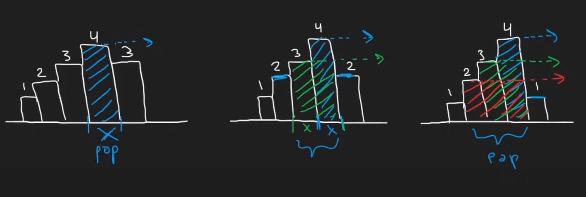
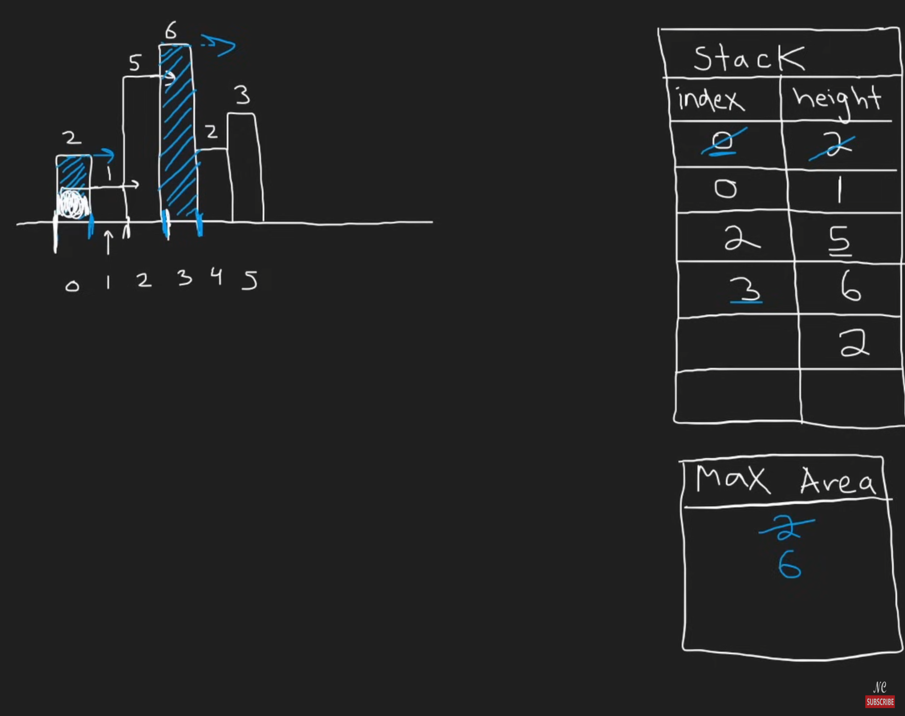
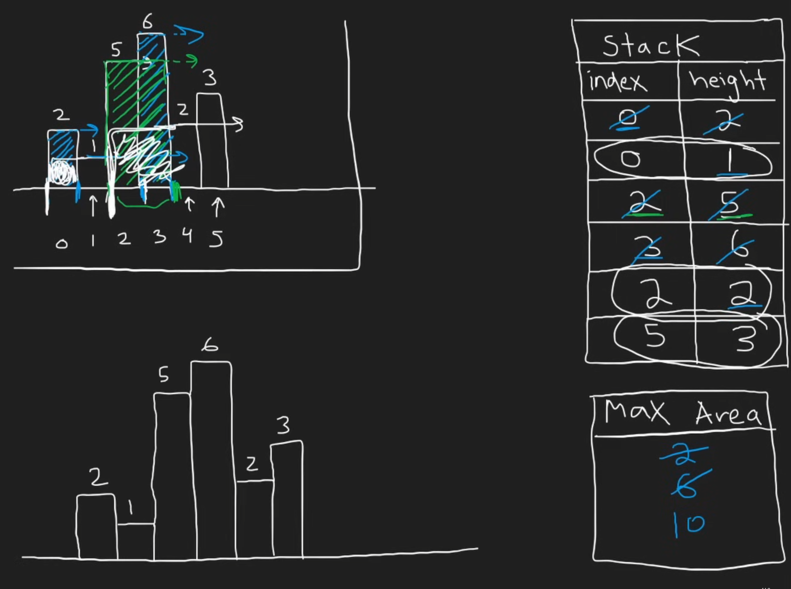
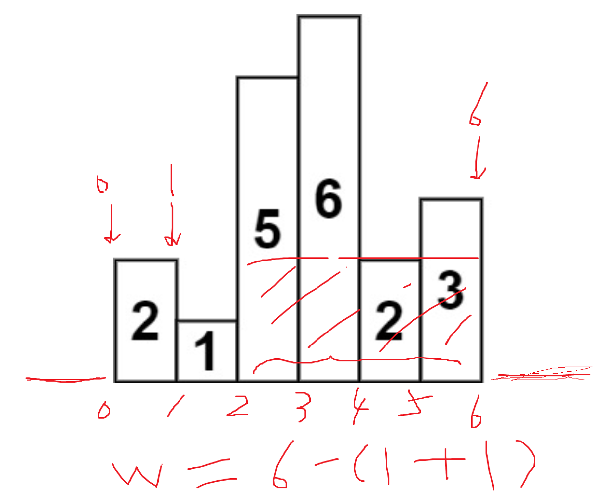

# Leetcode 1 - 500

※ 带有这个标志的表示这道题的算法思路是首次出现或者属于foundation/basic级别的，可以复用在其他题目上。带有这个标志的题必须完全熟悉，建议不熟悉的情况下多复习乃至全文背诵。

※※ 表示第二次或者第N次做的时候依然一下子没想出来解法，这种题可能有特别的奇技淫巧。

🚫表示过于简单，不易展示。这种题感觉有点凑题量了，其中的技巧在其他题中都能找到。

(Mark) 就是还没纯手撸解决过，暂时Mark，等有空再手撸解决。一般Mark的都是比较复杂和难的题，在近期面试中碰到的可能性不大的，但是解题思路和方法值得学习的。

(205)的意思是这道题和(205)那道题一模一样，没必要重复看。

## No.1 - No.50

#### 1. Two Sum

这道题非常经典，是leetcode第一题。用hashmap存放{本数的补数：本数的index}。

#### 2. Add Two Numbers

这道题也非常经典。要注意最后剩下cur1，cur2或者carry的情况，可以三个情况合并为一个循环：

```
while cur1 or cur2 or carry:
    val1 = cur1.val if cur1 else 0
    val2 = cur2.val if cur2 else 0
```

#### 3. ※ Longest Substring Without Repeating Characters

经典滑动窗口题，这道题建议强行记忆。

这里注意，string不能用类似set或者hashmap的直接判断方法，所以需要记录有没有、存在不存在的题，都需要设置set或者hashmap来记录存在与否，而且这样也能保证查询的时间复杂度是O(1)。

这里要注意，左指针跳跃的条件是判断其最新位置是否在当前子字符串范围内，这个技巧非常聪明。

```
i是左边界，需要根据情况调整
for right in range(len(string)):
    检查当前字符是否在hashmap中:
        如果在，则判断其最新位置是否在[i,j]之间：
            如果在之间，则表明新字符是一个重复字符，不能记录
            移动i到该位置的下一个位置
    记录当前最大值max_len
```

最佳实践：

```python
class Solution(object):
    def lengthOfLongestSubstring(self, s):
        if not s:
            return 0
        occurd = {}
        left = 0
        max_len = 0
        for right in range(len(s)):
            cur_char = s[right]
            if cur_char in occurd and occurd[cur_char] >= left:
                left = occurd[cur_char] + 1

            occurd[cur_char] = right
            max_len = max(max_len, len(s[left:right+1]))
   
        return max_len
```

...

...

#### 6. Zigzag Conversion

这道题初见较难。如果考虑行列和形状，会导致解法变得复杂。正确思路应该是直接生成对应的行，然后分析当前遍历字符应当处于哪一行，按顺序添加进去。

难点：向上放置的时候，应放行数  = cycle_len - cycle_index，可以想象循环最终一定是在第一行，因此在向上部分，应放行数就等于循环终点 + 离终点的距离。

...

...

#### 11. Container With Most Water

初见：没想出来非暴力解法。

左右指针相向而行，高度更小的指针移动。这个解法如何保证不会遗漏更大的解呢？——这便是这道题非常重要的思想：**缩减搜索空间**。


这是一种非常聪明的剪枝（Pruning）策略。

#### 12. Integer to Roman

The intuitive solution is to set a value list and a roman symbol list, and then perform // and % on the number num to be converted in turn, but it is difficult to handle special values here.

Based on the intuitive solution, make a slight modification, put the special value into the value list, and then subtract this value in turn to get the answer.

New python gramer: `value_symbol = [(1000, 'M), ...` This is the list of tuples. Equals to two lists. When you traverse it, use `for value, symbol in value_symbol:`.

...

#### 13. Roman to Integer

Use a dict/map store roman numbers.

Start from right, if left one is smaller, then sub; else sum.

New python grammer: `for s in reversed(str)` means traverse in reversed order.

#### 14. Longest Common Prefix

这道题初见感觉很简单，很容易想到直观解法（纵向扫描）：从每个单词的第一个字母开始对比，一直对比到出现不同的字母为止。coding的时候有一个技巧：总是把第一个单词作为基准去比较。

这道题初见直观解已经是最高效的了，时间效率O(N*P)，空间效率O(1)。

如果用字典序的方法去排序的话，会导致时间和空间复杂度提升，得不偿失。

#### 15. 3Sum

初见：没想出来。提示后想到把这道题分解为twosum，只是twosum的和的标准是和nums列表一样长的一个基准序列。换句话说，把3sum题转换为一个长度为N的2sum题。

注意：2sum需要先对列表进行排序，python自带的 `.sort()`的时间效率是

解法：

```pseudocode
已知nums数列，对nums排序
基准参数k：for k in range(len(nums)-2)：
    对于每个参数k所对应的有序列表，进行2sum经典解法（左右双指针）
    这里注意，2sum的范围是k后面的区域
    指针移动时跳过连续重复数字，因为nums已经排序，所以相当于防止重复结果（这是最佳去重的实践方法）
```

时间：O(N^2)，空间：O(N)

python coding注意：`.sort()`是原地修改。

这道题是一个经典的3SUM问题，长期以来一直被认为其复杂度下限就是O(N^2)，不过在科学家们的努力下，该问题如今被压缩到亚二次方（sub-quadratic）级别了；但是，优化改进仅推翻了强3SUM猜想，但是依然无法撼动弱3SUM猜想，即不存在时间复杂度为$O(N^{2-\epsilon})$的算法（其中epsilon为大于0的常数）：


**4SUM问题（3SUM基础上提升）**

4SUM问题不能直接用同样的方式去降维，转而可以使用空间换时间的方法，让时间复杂度同样为O(N^2)，代价是牺牲空间，让空间复杂度为O(N^2)。4SUM详见下一道题。

#### 17. Letter Combinations of a Phone Number

初见过，第一次提交测试发现path设置为''会报错，于是就改成记录为list，然后用''.join(path)把list修改为字符串的方式通过测试。查了下string在python中是不可变对象（immutable object），一旦创建其内部状态的值就不能被改变，所以一定不要用string来当作path，用list很方便。

作为第一道初见过的回溯，并且Beats 100%，我非常高兴！纪念一下我的代码（2025/07/15）：

```python
class Solution(object):
    def letterCombinations(self, digits):
        if not digits:
            return []
  
        # input: ONLY 2-9, so don't need consider 1, 0, *, #
        # output: according to input, output is all possible combination letters

        # for example
        # digit = "2"
        # choices = ["a","b","c"]
        # digit = "23"
        # choices = [
        #     ['a','b','c'], first choose one from this row
        #     ['d','d','f']  then choose one from this row
        # ]

        result = []
        path = []

        hashmap = {
            "2": ["a","b","c"],
            "3": ["d","e","f"],
            "4": ["g","h","i"],
            "5": ["j","k","l"],
            "6": ["m","n","o"],
            "7": ["p","q","r","s"],
            "8": ["t","u","v"],
            "9": ["w","x","y","z"]
        }

        def backtrack(cur_index):
            if len(path) == len(digits):
                path_str = ''.join(path)
                result.append(path_str)
                return

            cur_letter = digits[cur_index]
            choices = hashmap[cur_letter]
            for choice in choices:
                path.append(choice)
                backtrack(cur_index+1)
                path.pop()

        backtrack(0)
        return result
```

...

...

#### 18 ※ 4Sum

**Solution1: Demension Reduction (This can pass leetcode)**

Reduce demensions, Time: O(N^3), Space: O(1)

```pseudocode
nums.sort()
for i in range(len(nums)-3):
    for j in range(i+1, len(nums)-2):
        left = j + 1
        right = len(nums) - 1
        use 2Sum to find the required pairs
```

More specifically:

```python
class Solution(object):
    def fourSum(self, nums, target):
        if len(nums) < 4:
            return []

        nums.sort()
        result = []
        for i in range(len(nums)-3):
            if i > 0 and nums[i] == nums[i-1]:
                continue
            for j in range(i+1, len(nums)-2):
                if j > i+1 and  nums[j] == nums[j-1]:
                    continue
                left = j + 1
                right = len(nums) - 1
                while left < right:
                    if nums[left] + nums[right] + nums[i] + nums[j] < target:
                        left += 1
                    elif nums[left] + nums[right] + nums[i] + nums[j] > target:
                        right -= 1
                    else:
                        result.append([nums[i],nums[j],nums[left],nums[right]])
                        while left < right and nums[left] == nums[left+1]:
                            left += 1
                        while right > left and nums[right] == nums[right-1]:
                            right -= 1
                        left += 1
                        right -= 1
        return result


```

.

**Solution2: Hashmap (This cannot pass leetcode in extreme testcase)**

Time: O(N^2), Space: O(N^2)

```pseudocode
find sum of all two-numbers, make this problem into find 2 two-sum
traverse the dict, find two pairs that meets the requirement
lastly, eliminate the duplicates
```

More specifically:

```python
if len(nums) < 4:
    return []

from collections import defaultdict
sum_map = defaultdict(list)

for i in range(len(nums)-1):
    for j in range(i+1, len(nums)):
        sum_map[(nums[i]+nums[j])].append((i,j))

result_set = set()
for s1 in sum_map:
    s2 = target - s1
    if s2 in sum_map:
        pairs1 = sum_map[s1]
        pairs2 = sum_map[s2]

        for(a,b) in pairs1:
	    for(c,d) in pairs2:
		if b < c: # because when we create pairs, a < b and c < d
		    quad = tuple(sorted([nums[a],nums[b],nums[c],nums[d]]))
		    result_set.add(quad)

return [list(q) for q in result_set]
```

Why cannot pass leetcode: if the input nums is [2,2,2,2,2,2,2,2,2,2,2,...], then the hashmap will only have one key: 4. This cause the performance of the lookup phase to degenerate from near constant time to a staggering O(N^4)

..

#### 19. Remove Nth Node From End of List

这道题初见立马就想到用两个指针，差开N+1的距离，然后找到Nth Node了，但是要注意处理一个特殊的边界情况：如果第一个节点就是要删除的节点呢？

所以这道题一定要引入一个dummy虚拟头节点，然后让fast和slow同时从虚拟头节点开始。

虚拟头节点在linked list中一定要多用、常用，这是一个非常实用并且robust好的实践方法。

...

#### 20. ※ Valid Parentheses

这道题是学习stack的一道题，如果还没做过stack的题建议认真做，然后全文背诵。

```python
class Solution(object):
    def isValid(self, s):
        """
        :type s: str
        :rtype: bool
        """
        hashmap = {
            ")" : "(",
            "]" : "[",
            "}" : "{"
        }

        stack = []

        for char in s:
            if char in hashmap:
                if not stack:
                    return False
                cur_stack_top = stack.pop()
                if cur_stack_top != hashmap[char]:
                    return False
                # the stack top is already pop
            else:
                stack.append(char)

        # if stack is empty: return True
        return not stack
```

【括号系列第一题】下一道题：22. Generate Parentheses

...

...

#### 22. ※ Generate Parentheses

在20中，我们使用stack来validate parentheses，这道题我们来看generate parentheses。这道题也非常经典，如果不熟悉这个算法思路一定要记住。

```python
回溯（左括号数量，右括号数量，path）：
    basecase：path长度达到要求

    如果左括号数量还没达到上限：（left < n)
        回溯（ 左括号数量+1，右括号数量，path+"(" ）

    如果右括号数量小于左括号的数量：(right < left)
        回溯（ 左括号数量，右括号数量+1，path+")" ）
```

【括号系列第二题】下一道题：22S. Generate Parentheses Plus

#### 22S. Generate Parentheses Plus

如果我们把上导体的一种可选括号，改为三种可选括号，其他题目不变，那么这道题将无法用简单的计数方式来解决，从而需要一个显式的stack来实现validation机制（即20. Valid Parentheses的验证方法）。

【括号系列第三题】下一道题：32. Longest Valid Parentheses (Hard)

#### 23. Merge k Sorted Lists (Mark)

这道题是heap题。

暴力解法O(N*K)如下：

```python
# Definition for singly-linked list.
class ListNode(object):
    def __init__(self, val=0, next=None):
        self.val = val
        self.next = next

class Solution(object):
    def mergeKLists(self, lists):
        """
        :type lists: List[Optional[ListNode]]
        :rtype: Optional[ListNode]
        """
        # 创建一个虚拟头节点，简化代码
        head = ListNode()
        current = head
  
        while True:
            smallest_node_val = float('inf')
            smallest_node_index = -1
      
            # 1. 遍历所有链表的当前头节点，找到最小的那个
            #    这个 for 循环实现了你的 "每一轮要把ls中的所有的node拿出来作比较！" 的思路
            for i in range(len(lists)):
                if lists[i] and lists[i].val < smallest_node_val:
                    smallest_node_val = lists[i].val
                    smallest_node_index = i
      
            # 2. 如果 smallest_node_index 仍然是 -1，说明所有链表都已经是 None 了
            #    这实现了你的 "直到lists中所有元素都为空" 的退出条件
            if smallest_node_index == -1:
                break
          
            # 3. 将找到的最小节点接到结果链表的末尾
            #    这实现了你的 "把smallest_node这个节点放到cur_new的下一个上"
            current.next = lists[smallest_node_index]
            current = current.next
      
            # 4. 将那个链表的头指针向后移动一位
            #    这实现了你的 "把smallest_node这个节点进行移动"
            lists[smallest_node_index] = lists[smallest_node_index].next
      
        return head.next
```

...

...

...

#### 26. Remove Duplicates from Sorted Array

two pointers.

#### 27. Remove Element

这道题在循环设置上容易出错：

```python
while i <= j: # 注意这里是小于等于
    if nums[i] == val and nums[j] != val: ...
    elif nums[i] == val and nums[j] == val: ...
    else: ...
```

...

...

#### 28. Find the Index of the First Occurence in a String

这个算是一个pyton技巧学习题，找到字符串中对应的单词的方法：`string.find(word)`，返回对应index。python底层在搜索字符上用的是Boyer-Moore-Horspool 算法，感兴趣的人可以看看相关资料。

...

...

#### 30. Substring with Concatenation of All Words (Hard)

这道题题目看了半天硬是没明白想要我干啥。简单来说就是，给定一个string和一个list，寻找string中有几个包含list中给定的单词组成的字符串，并return这些字符串的开始位置。**并且，最重要的是，list中给定的单词长度一致，这个条件如果漏掉这道题就做不了了**。我一开始想了半天，最后才发现words里的候选词长度一样，难度直接降低了一百倍。

折腾了半天之后用下列算法做了出来：

```
set a hashmap, 记录words中单词和出现次数
设置一个长度相当于words中单词总长的window
对string进行遍历，从头start开始，到len(s)-window_size结束：
    设置一个临时的hashmap
    对当前窗口进行遍历，每步递进一个word的长度：
        获得当下的cur_word
        如果cur_word不在hashmap中，break
        将cur_word计入临时hashmap中
        如果cur_word出现次数超过hashmap中的记录次数，break
    对比临时的hashmap和hashmap：
        当且仅当两者完全一样的时候：
            记录当前的start
```

我的这个解法可以通过leetcode，但是效率有点低。最大的问题就是对每个窗口，都完全重新切分依次。

我的解法时间效率是O(N*M)，N是字符串长度，M是窗口大小。

优化思路是进行多个起始点，比如假设word长度是5，那么就分别以第一个字母、第二个字母、...、第五个字母为起始点。这样做的好处是，每次窗口移动的时候可以移动5个字符量，而不需要每个都移动。

这样修改后，外部循环的次数还是O(N)，但是内部不需要对每个窗口重新切了，因为不需要考虑类似'xtodayidkjsf'中把today给忽略掉的情况，因为五个出发点总有一个能考虑进去。所以内部循环每次只需要把左边踢出去的单词在临时hashmap中去掉，然后把右面新进入的加进来，就可以了。这样子内部的O(M)的平均时间复杂度就降低了，计算的话总共要O(N)次操作，摊销到每个子cur_word不过O(1)。

#### 30S. Substring with Uncertain Words (SuperHard)

给定一个字符串 `s` 和一个字符串数组 `words`，其中 `words` 中各单词长度 **不一定相同** 。定义一个 “连接子串” 为将 `words` 中每个字符串恰好出现一次、按任意顺序拼接而成的串。请返回所有 `s` 中恰好是某个“连接子串”的起始索引。答案可以按 任意顺序 返回。

...

#### 31. Next Permutation

注意：这道题跟回溯中的Permutation排列的解法没关系！这道题本质上是在考察对排列本质的理解。这道题直接记住思路就可以了。

限制条件：

* 必须原地修改
* constant extra memory，常数级别的额外空间

换句话说，就是不能创建一个新的result。

这道题有一个特别的解法，可以学习一下：

1. 以[1, 3, 5, 4, 2]为例，目标是找到比这个数字字典序大一位的下一个数
2. 从右往左看，[5, 4, 2]这个部分是降序的，无论如何都无法更大了
3. （追加判断）这里要注意，如果从头到尾都找不到较小数，或者说整个数列就是降序的，那么这个数字就是最大数；这个数字的下一个就是整个数组翻转过来的最小数。
4. 再往左看一个数字，3比5小，出现了爬坡的趋势，这个3就是我们要找的那个需要被变大的数，我们称之为“较小数”（smaller number）；**找到smaller number以后记得break循环，结束查找**。
5. 我们再看3的右边的数字，我们要从3的右边找到一个比3大的最少的那个数字，我们称为较大的数（larger number）
6. 从右向左遍历3右边的序列[5, 4, 2]，找到**第一个比3大的数**，这个数是4。
7. 交换smaller number 3和larger number 4
8. 交换后得到[1, 4, 5, 3, 2]
9. 交换后观察4右边的序列，发现不是最小的数，最小的序列应该是[2, 3, 5]
10. 对4右边的序列进行升序排序
11. 完成下一个字典序数字的寻找

...

...

...

#### 32. ※ Longest Valid Parentheses (Hard)

三种解题思路：动态规划，stack，two pointers；后两个比较巧妙。

首先是stack方法：这是最直观和最巧妙的解法之一。

* **思路：** 我们用一个栈来存储 **左括号的索引** 。
  1. 为了处理边界情况（例如 "()" 这种从头开始就有效的子串），我们先在栈里放一个 `-1` 作为“哨兵”。
  2. 遍历字符串：
     * 遇到 `'('`，将其**索引**压入栈。
     * 遇到 `')'`，弹出栈顶元素。
       * 如果弹出后栈为空，说明当前的 `')'` 没有匹配的 `'('`，我们将这个 `')'` 的**索引**压入栈，作为新的“哨兵”。
       * 如果弹出后栈不为空，则当前有效子串的长度就是**当前索引 `i`** 减去 **栈顶的新索引** 。我们用这个长度更新最大长度。
* **时间复杂度:** **O**(**N**)
* **空间复杂度:** **O**(**N**)

另一个方法和思路是Two Pointers，这是一个空间复杂度最优的解法：

* **思路：**
  1. **从左到右**遍历字符串，用两个计数器 `left` 和 `right` 分别记录 `(` 和 `)` 的数量。
  2. 当 `left == right` 时，我们找到了一个有效的子串，长度为 `2 * right`，用它来更新最大长度。
  3. 当 `right > left` 时，说明子串不合法，我们将 `left` 和 `right` 都重置为 0。
  4. **从右到左**再重复一遍上述过程（这次是当 `left > right` 时重置计数器），以处理像 `(()` 这样的情况。
* **时间复杂度:** **O**(**N**)
* **空间复杂度:** **O**(**1**)

Two Pointer方法非常巧妙，和22. Generate Parentheses中的使用左右count计数器来判断应该加左括号还是右括号有异曲同工之处。Two Pointer法避免了使用额外的数据结构（如栈或DP数组），将空间复杂度降到了 **O**(**1**)。

**如何确保哪一次遍历的结果是正确的？我们不需要在两次遍历的“结果”之间做选择。我们维护一个全局的最大长度 `max_length`，两次遍历都会尝试去更新这同一个变量。** 两次遍历是互补的，它们各自负责找到不同类型的有效子串。

* **第一次（从左到右）遍历** ：能有效处理像 `()(())` 这样的情况，但会漏掉像 `(()` 这样的情况（因为最终 `left > right`，从未触发更新）。
* **第二次（从右到左）遍历** ：正好可以弥补第一次的不足，它能有效处理像 `(()` 这样的情况。

所以，两次遍历是一个 **合作关系** ，共同协作来找到全局的最优解。

```python
从左到右遍历括号字符串：
    当右括号数量多于左括号时：
        重置left, right指针
    当右括号数量等于左括号时：
        记录最大值

重置left，right指针
从右到左遍历括号字符串：
    当左括号数量多于右括号时：
        重置left，right指针
    当左括号数量等于右括号时：
        记录最大值

最大值即是最长的合格括号子序列
```

【括号系列第四题】下一道题：301. Remove Invalid Parentheses

#### 33. Search in Rotated Sorted Array

相比于153，现在不仅要判断是否在哪里卡断，还要判断target的位置。判断逻辑升级为：先判断一个区间（比如左区间）是否是有序的，如果是，那么判断是否在左区间；如果不是，说明右区间是有序的，那么就在右区间里判断是否有target。

...

...

...

#### 36. Valid Sudoku

First Meet: Pass with best practice:

```python
class Solution(object):
    def isValidSudoku(self, board):
        row = {}
        column = {}
        box = {}
        for i in range(9):
            for j in range(9):
                val = board[i][j] # This can improve a little bit of time efficiency

                # skip the '.'
                if val == '.':
                    continue

                # for each row, maintain a dict of set
                if i not in row:
                    row[i] = set() # row i's set
                if val not in row[i]:
                    row[i].add(val)
                else:
                    return False

                # for each column, maintain a dict of set
                if j not in column:
                    column[j] = set()
                if val not in column[j]:
                    column[j].add(val)
                else:
                    return False
  
                # for each box, maintain a dict of box
                box_row = i // 3
                box_col = j // 3
                if (box_row, box_col) not in box:
                    box[(box_row, box_col) ] = set()
                if val not in box[(box_row, box_col) ]:
                    box[(box_row, box_col) ].add(val)
                else:
                    return False
        return True
```

...

#### 37. ※ Sudoku Solver (HARD) (MARK)

这道题的关键思路有：

* isValid检查不需要检查整个棋盘，只需要检查新加入的这个数字是否会导致冲突，如果冲突的话就不加
* backtrack的参数直接用整个board，因为这道题只需要解一个board，不需要设置result和path来存储多个结果

参考代码（直观解法）：

```python
class Solution(object):
    def solveSudoku(self, board):
        def is_valid(r, c, ch):
            # 检查当前数字 ch 是否可以放在 board[r][c] 处
            for i in range(9):
                # 检查行和列
                if board[r][i] == ch or board[i][c] == ch:
                    return False
                # 检查 3x3 宫格
                box_r = 3 * (r // 3) + i // 3
                box_c = 3 * (c // 3) + i % 3
                if board[box_r][box_c] == ch:
                    return False
            return True

        def backtrack():
            for r in range(9):
                for c in range(9):
                    if board[r][c] == '.':
                        for ch in '123456789':
                            if is_valid(r, c, ch):
                                board[r][c] = ch
                                if backtrack():
                                    return True
                                board[r][c] = '.'  # 撤销
                        return False  # 所有数字都试过了，失败
            return True  # 所有格子都填完了

        backtrack()

```

上述直观解版本是一个非常经典和直观的回溯实现。它的逻辑如下：

1. **`solveSudoku(board)`** : 主函数，调用内部的回溯函数 `backtrack()`。
2. **`backtrack()`** :
   * 从头到尾（从 `board[0][0]` 到 `board[8][8]`）遍历整个数独棋盘。
   * 一旦找到一个空格（值为 `.`），就停下来。
   * 尝试将数字 '1' 到 '9' 依次填入这个空格。
   * 每填一个数字，就调用 `is_valid()` 函数来检查这个数字在当前位置是否合法（即所在行、列、九宫格没有重复）。
   * 如果合法，就继续递归调用 `backtrack()` 来填充下一个空格。
   * 如果递归调用成功（返回 `True`），说明找到了解，立即返回 `True`。
   * 如果递归调用失败（返回 `False`），说明当前数字行不通，需要 **撤销选择** （将格子改回 `.`），然后尝试下一个数字。
   * 如果 '1' 到 '9' 都尝试失败了，说明此路不通，返回 `False`。
3. **`is_valid(r, c, ch)`** :
   * 这是一个辅助函数，专门用来检查在 `(r, c)` 位置放入数字 `ch` 是否违反数独规则。
   * 它会遍历检查 **整行** 、**整列**和 **整个九宫格** ，看是否存在重复数字。

这个普通解法虽然逻辑清晰，但效率较低，其主要问题在于：

1. **大量的重复计算** : 核心瓶颈在于 `is_valid()` 函数。每次我们尝试在一个空格里填入一个数字，都需要重新遍历它所在的行、列和九宫格（总共 9 + 9 + 9 = 27 个单元格）来判断合法性。随着回溯的深入和撤销，这些检查会被反复、大量地执行，造成了巨大的性能浪费。
2. **低效的空格查找** : `backtrack()` 函数每次被调用时，都会从 `board[0][0]` 开始遍历，以寻找下一个需要填充的空格。这意味着，在填充棋盘深处的空格时，程序仍然会把前面已经填好的格子重新“看”一遍，这也是一种不必要的重复操作。

针对上面的问题，下面给出一个优化版本。第二个版本针对第一个版本的两个主要痛点进行了精确优化。

1. **优化一：用空间换时间，实现 O(1) 的合法性检查**
   * **做法** : 它没有使用 `is_valid()` 函数，而是创建了三个二维数组 `rows`, `cols`, 和 `boxes` 来记录状态。
     * `rows[i][d] = True` 表示第 `i` 行已经存在数字 `d+1`。
     * `cols[j][d] = True` 表示第 `j` 列已经存在数字 `d+1`。
     * `boxes[b][d] = True` 表示第 `b` 个九宫格已经存在数字 `d+1`。
   * **效果** : 在尝试将数字 `digit` 填入 `(row, col)` 时，不再需要遍历检查。只需通过 `if not rows[row][digit] and not cols[col][digit] and not boxes[box_index][digit]` 这个 O(1) 时间复杂度的查询，就能瞬间判断该数字是否可用。这极大地减少了重复计算，是性能提升的关键。
2. **优化二：预处理，避免重复查找空格**
   * **做法** : 在回溯开始之前，程序会先遍历一次棋盘，将所有需要填充的空格的坐标 `(i, j)` 存入一个列表 `empty_cells` 中。
   * **效果** : 回溯函数 `backtrack(k)` 直接根据索引 `k` 从 `empty_cells` 列表中获取第 `k` 个要处理的空格。这样，它就跳过了对已填充格子的无效扫描，实现了对空格的 **定向、有序访问** ，避免了重复查找。
3. **更高效的回溯结构**
   * **做法** : 回溯函数 `backtrack(k)` 的参数 `k` 表示当前正在处理 `empty_cells` 列表中的第 `k` 个空格。当递归调用 `backtrack(k + 1)` 时，它清晰地指向下一个目标，逻辑更加直接。
   * **效果** : 这种结构使得回溯路径非常明确，避免了第一个版本中嵌套循环带来的复杂性。

参考代码（竞赛级）：

```python
class Solution(object):
    def solveSudoku(self, board):
        # 优化1：空间换时间，记录每行、每列、每个九宫格已使用的数字
        # rows[i][d] = True 表示第 i 行已经有数字 d+1
        rows = [[False] * 9 for _ in range(9)]
        cols = [[False] * 9 for _ in range(9)]
        # boxes[b][d] = True 表示第 b 个九宫格已经有数字 d+1
        boxes = [[False] * 9 for _ in range(9)]

        # 优化2：预处理，找出所有需要填空的格子
        empty_cells = []

        # 初始化状态数组和空格列表
        for i in range(9):
            for j in range(9):
                if board[i][j] == '.':
                    empty_cells.append((i, j))
                else:
                    digit = int(board[i][j]) - 1
                    box_index = (i // 3) * 3 + (j // 3)
                    rows[i][digit] = True
                    cols[j][digit] = True
                    boxes[box_index][digit] = True
  
        # 定义一个定向回溯函数
        def backtrack(k):
            # Base Case: 如果所有空格都填完了，说明找到了解
            if k == len(empty_cells):
                return True

            # 获取当前要处理的第 k 个空格的坐标
            row, col = empty_cells[k]
            box_index = (row // 3) * 3 + (col // 3)

            # 尝试填入 '1' 到 '9'
            for digit in range(9): # digit from 0 to 8
                # 使用 O(1) 检查合法性
                if not rows[row][digit] and not cols[col][digit] and not boxes[box_index][digit]:
  
                    # 做出选择
                    board[row][col] = str(digit + 1)
                    rows[row][digit] = cols[col][digit] = boxes[box_index][digit] = True

                    # 递归到下一个空格
                    if backtrack(k + 1):
                        return True
  
                    # 撤销选择 (回溯)
                    board[row][col] = '.'
                    rows[row][digit] = cols[col][digit] = boxes[box_index][digit] = False
  
            # 如果 1-9 都无法填入，返回 False
            return False

        backtrack(0)
```

...

...

...

...

...

#### 39. ※ Combination Sum

做这道题之前建议先做78 Subsets回溯基础题。

这道题和78相比，增加了一层难度：回溯的时候可以选择自己。

如果单纯只是把backtrack(start_index=i+1)这里的参数从i+1改成i，会导致无限死循环。为了避免这种无限死循环，需要引入一个新的概念：剪枝（pruning）。

Pruning的意思是：如果手里的资源已经用超了，那么就立刻掉头，不用等到走到尽头了。在这道题中，资源就是target。

同时还要注意，计算和的时候不要临时计算，而是把和作为参数去传递。临时计算的话会导致错误。

```python
class Solution(object):
    def combinationSum(self, candidates, target):
        # a number can be chosen unlimited times
        # 可选无限次是和上一道78 Subsets回溯相比的最大区别
        # 可选无限次意味着backtrack到下一层后，自己还能再次被选
        result = []
        cur = []

        def backtrack(start_index, cur_sum):
            # Pruning一般写在开头（最佳实践）
            if cur_sum == target:
                result.append(list(cur)) # 这里需要加一个副本 ※※※
            if cur_sum > target:
                return
  
            for i in range(start_index, len(candidates)):
                cur.append(candidates[i])

                # 最佳实践的写法：直接在参数传递的时候加上
                backtrack(i, cur_sum + candidates[i])

                cur.pop()
  
        backtrack(0,0)

        return result
```

...

#### 40. ※ Combination Sum II

做这道题之前推荐先做39。这道题在39的基础上，增加了一个类型的剪枝：对于已经探索过的路径，在绝对重复的情况下，直接跳过。

这个pruning skill建议直接死记硬背地记住，因为这是一个基本功：

```
在同一层级的递归中，如果当前数字和它钱一个数字相等，那么就要跳过当前数字：
（1）当前元素candidates[i]是否和前一个元素candidates[i-1]相等（因此需要排序）
（2）当前元素不是我们在本轮for循环处理的第一个元素

代码：
if i > start_index and candidates[i-1] == candidates[i]:
    continue
```

以1，1，1，2，3为例，这道题要处理两个重复：

1. 组合内重复，一个组合内不能出现1a, 1a, 2这样的重复，这个通过backtrack(i+1)就能解决
2. 组合间重复，不能出现1a, 1b, 2和1b, 1c, 2这样的重复，这个比较难想。

第二点如果实在想不出来，暴力的办法就是对结果去重。但是这显然不是我们要学习的方法。这里的思路精髓就是，用 `i > start_index`来判断，比如说，1b现在是i==1，然后现在start_index==0，这是什么意思呢？这个的意思就是说，现在我们还在刚开始的那一个层面中，只是for循环到了第二层，到了i==1，换句话说，在这一轮次中i==0的1a已经进入过backtrack并完成了回溯工作，这个时候才会轮到i==2的1b作为start_index==0这层的第二轮for循环内容。

也就是说，1a已经搜索过一遍了！并且1a是从头开始搜索的。1a从头开始搜索并且已经搜索完了！

假设我们的target是4，那么已经有1a, 1b, 2这个组合了！这个时候我们就不需要再考虑1b, 1c，2这个组合了！就是说i > start_index防止的是出现类似1a, 1b,2和1b, 1c, 2这样的组合，因此在同样是第一个元素这里当1b发现1a已经完成了回溯工作的时候，1b就不需要重复工作了。

总结来说：为了避免重复，我们规定：在一系列相同的数中，只有排在最前面的那个数，有资格被用于构成新的组合，它后面的“双胞胎”们则全部跳过。

...

#### 42. Trapping Rain Water

**Solution1: Dynamic Programming (Easy to Think)**

```
maintain a list max_left:
    max_left[i] means the heighest column to the left of column[i]
maintain a list max_right:
    max_right[i] means the heighest column to the right of column[i]
calculate each column[i]'s water:
    water's volume at column[i] = min(max_left[i], max_right[i]) - height[i]
```

Time/Space: O(N)

**Solution2: Use two pointers, optimize space to O(N)**

This idea comes from the formula `min(max_left, max_right) - height[i]`:

* when max_left is smaller, then the water volume depends on the max_left: `max_left - height[i]`
* else depends on the right

Therefore:

```pseudocode
init pointer i,j
init maxL, maxR as height[0], height[-1]
while i <= j: # The boundry here is very important
    if maxL <= maxR:
        calculate maxL - height[i]
        note: if height[i] >= maxL, then don't calculate, update maxL
    else:
        calculate maxR - height[j]
        note: if height[j] >= maxR, then don't calculate, update maxR
```

Time: O(N)

Space: O(1)

...

...

#### 45. ※ Jump Game II

```
set a cur_range
set a max_range
use greedy strategy:
    when i not reach cur_range:
        max(max_range, cur_max_range)
```

这道题思路简单但是写代码老写错：

```python
class Solution(object):
    def jump(self, nums):
        cur_range = 0
        max_range = 0
        count = 0
        for i in range(len(nums)-1):
            max_range = max(nums[i]+i, max_range)
            if i == cur_range:
                cur_range = max_range
                count += 1
        return count
```

...

#### 46. Permutations

78 Subset中首见回溯Backtracking问题的时候已经给出了解法。

重要提醒：

* path如果是list，加入result的时候一定要记得转换为list
* 无论进行了什么附加操作，都不要忘记backtrack之后的回溯步骤！

这道题的特别优化：用used[i]（存储True/False）比用set存储用过的数字更加高效

#### 47. Permutations II

和46的区别在于47的list中包含重复元素，因此有什么区别？不都可以用一个used list（带有index指针的）来pruning？

区别在于，如果有重复的列表，的确生成的结果是独一无二的，但是很多独一无二的结果是一样的结果，比如1,1,2,我们记作1a, 1b,2，其结果：

* 1a, 1b, 2
* 1b, 1a, 2

都是[1,1,2]，在出结果的时候只出一个[1, 1, 2]

这里的关键点就在于pruning：

* **规则：（必须先排序）如果发现当前的数和左邻居一样，并且左邻居还没用过，那么我们就必须跳过当前这个数字。**

为什么有这个规则呢？因为为了防止重复记录，我们必须遵从以下规则：

* **排序数组后，必须从左往右而不能跳过任何元素**

即，对于一堆相同的数字，必须严格从左到右按照顺序挑选。如果左邻居使用过，那么我们就符合从左到右规则，就可以继续使用当前的数字。

#### 48. Rotate Image

注意：这个题的要求是原地修改，一般要求原地修改的，不能增加额外的空间开销。所以用旋转遍历然后旋转放置的方法是不可以的。

初见用旋转遍历和旋转遍历放置通过，但是空间复杂度很高。旋转遍历并用deque存储matrix信息的方法：

* 时间复杂度：O(2N^2)
* 空间复杂度：O(N^2)

方法二：Transpose&Reverse（符合题目要求）

* 时间复杂度：O(N^2)
* 空间复杂度：O(1)

```
class Solution(object):
    def rotate(self, matrix):
	n = len(matrix)

        # 1. Transpose 转置矩阵
        for i in range(n):
            # 注意这里是 (i,n)，这样做的目的是放置重复交换
            for j in range(i, n):  # 注意这里是(i,n)
                # 交换 matrix[i][j] 和 matrix[j][i]
                matrix[i][j], matrix[j][i] = matrix[j][i], matrix[i][j]

        # 2. Reverse 翻转每一行
        for i in range(n):
            matrix[i].reverse()
```

这道题本质上是想练习transpose转置，这是一个非常重要的数学操作。Transpose就是把行变成列，把列变成行。

上面的显然只适合NxN的matrix，如果是MxN的matrix，需要用下列方法：

```python
def transpose_matrix(matrix):
    # 对一个 M x N 的矩阵进行转置操作。
    # :param matrix: 一个 M x N 的列表的列表 (List[List[int]])
    # :return: 一个 N x M 的新的转置后的矩阵

    # 处理空矩阵或无效输入的边缘情况
    if not matrix or not matrix[0]:
        return []

    # 1. 获取原始矩阵的维度
    M = len(matrix)      # 原始行数
    N = len(matrix[0])   # 原始列数

    # 2. 创建一个新的 N x M 的矩阵，并用 0 或 None 初始化
    # 新矩阵有 N 行 M 列
    transposed = [[0 for _ in range(M)] for _ in range(N)]

    # 3. 遍历原始矩阵，填充新矩阵
    for i in range(M):
        for j in range(N):
            # 将原始矩阵的 (i, j) 元素放到新矩阵的 (j, i) 位置
            transposed[j][i] = matrix[i][j]

    return transposed

# --- 使用示例 ---
# 一个 2x3 的矩阵
matrix_A = [
    [1, 2, 3],
    [4, 5, 6]
]

# 调用函数进行转置
transposed_A = transpose_matrix(matrix_A)

# 打印结果，应该是一个 3x2 的矩阵
# [[1, 4],
#  [2, 5],
#  [3, 6]]
for row in transposed_A:
    print(row)
```

...

#### 49. Group Anagrams

hashmap基础题，没什么难点。

## No.51 - No.100

#### 51. N-Queens

初见代码及修改版：

```python
class Solution(object):
    def solveNQueens(self, n):
        """
        :type n: int
        :rtype: List[List[str]]
        """
        # --- 错误部分已注释 ---
        # 这个方向数组有错误（重复了[-1,-1]），并且用它来检查对角线效率不高且复杂。
        # 在N皇后问题中，我们通常按行放置，所以只需要检查当前行之前的皇后位置即可。
        # directions = [
        #     [-1,-1],
        #     [1,-1],
        #     [-1,1],
        #     [1,1]
        # ]

        # 正确的二维列表初始化 (您的修改是正确的，予以保留)
        grid = [['.' for _ in range(n)] for _ in range(n)]
  
        # 最终结果列表，我们将直接把符合格式的棋盘存入这里
        result = []

        # --- 修改 isValid 函数 ---
        # 原来的isValid函数逻辑上没问题，但可以优化。
        # 因为我们是按行从上往下放皇后，所以在检查 (row, col) 时，
        # 我们根本不需要检查当前行 (row) 或之后的行，因为那些行还没有皇后。
        # 我们只需要检查之前的行 (0 到 row-1) 即可。
        def isValid(row, col):
            # 检查同一列是否有Q (只需检查当前列上方的行)
            for i in range(row):
                if grid[i][col] == 'Q':
                    return False
  
            # 检查左上对角线
            r, c = row - 1, col - 1
            while r >= 0 and c >= 0:
                if grid[r][c] == 'Q':
                    return False
                r -= 1
                c -= 1

            # 检查右上对角线
            r, c = row - 1, col + 1
            while r >= 0 and c < n:
                if grid[r][c] == 'Q':
                    return False
                r -= 1
                c += 1
  
            return True

        # --- 错误部分已注释 ---
        # N皇后问题的核心是“每行有且仅有一个皇后”。
        # 原来的回溯函数 `backtrack(start_i, start_j)` 试图在整个棋盘上找N个点，
        # 这个逻辑不符合N皇后的约束，而且非常低效。
        # 此外，原来的代码没有在 grid 上做状态的修改和撤销（“做选择”和“撤销选择”）。
        # result = []
        # path = []
        # def backtrack(start_i, start_j):
        #     if len(path) == n:
        #         result.append(list(path))
        #         return
        #   
        #     for i in range(start_i, n):
        #         for j in range(start_j, n):
        #             # 尝试在此处下一子 
        #             if isValid(i, j):
        #                 # 如果此处可以下子
        #                 path.append((i,j))
        #                 for direction in directions:
        #                     dx, dy = direction
        #                     new_row, new_col = i + dx, j + dy
        #                     backtrack(new_row, new_col)
        #                 path.pop()

        # --- 新增/修改：正确的回溯函数 ---
        # 我们定义回溯函数 backtrack(row)，它的任务是在第 `row` 行找到一个合法的位置放皇后。
        def backtrack(row):
            # 递归的终止条件：如果成功放到了第 n 行 (row 从0开始)，
            # 说明我们已经找到了一个完整的解。
            if row == n:
                # 将当前的 grid 棋盘状态转换为题目要求的 List[str] 格式
                temp_board = []
                for r in grid:
                    temp_board.append("".join(r))
                # 将这个解加入最终结果
                result.append(temp_board)
                return

            # 遍历当前行的每一列，尝试放置皇后
            for col in range(n):
                # 检查在 (row, col) 这个位置放皇后是否合法
                if isValid(row, col):
                    # 1. 做选择：在这个位置放一个皇后
                    grid[row][col] = 'Q'
  
                    # 2. 进入下一行，继续递归
                    backtrack(row + 1)
  
                    # 3. 撤销选择：将这个位置恢复原状，以便在当前行的下一列进行尝试
                    #    这步是回溯算法的关键
                    grid[row][col] = '.'

        # --- 修改：从第0行开始调用回溯函数 ---
        backtrack(0)

        # --- 错误部分已注释 ---
        # 下面这一大段后处理逻辑不再需要了。
        # 因为我们已经在回溯函数的终止条件里，直接生成了符合格式的解，
        # 并添加到了 `result` 列表中。
        # output = []
        # for ls in result:
        #     # ls中记录了N个tuple
        #     board = [['.' for _ in range(n)] for _ in range(n)]
        #     # 设置一个board，记录所有的Q
        #     for t in ls:
        #         # 每个t都对应着Q的位置
        #         qx, qy = t
        #         board[qx][qy] = 'Q'
        #     # 现在把board的每一行转换为一个string
        #     new_ls = []
        #     for board_row in board:
        #         new_row = ''.join(board_row)
        #         new_ls.append(new_row)
        #     # 现在new_ls就是符合要求的一个结果
        #     output.append(new_ls)
  
        # --- 修改：直接返回 result ---
        # result 列表现在已经包含了所有符合格式的解
        return result
```

...

...

#### 54. Spiral Matrix

这道题主要用来练习对Matrix的操作和coding时对边界的处理。

在python中，首先创建matrix需要一次性创建，比如：matrix = [[element for _ in range(...)] for _ in range(...)]。

这道题思路不难，但是coding的时候有很多细节需要注意，建议把这道题的coding内容着重复习，熟悉matrix的边界。

```python
class Solution(object):
    def spiralOrder(self, matrix):
        # 处理空矩阵的边界情况
        if not matrix or not matrix[0]:
            return []

        rows, cols = len(matrix), len(matrix[0])
        output = []
  
        # 定义四个边界
        left, right, top, bottom = 0, cols - 1, 0, rows - 1

        # 循环条件：确保边界内部至少还有一层元素
        # 这里要注意，等于代表还有一行，top > bottom的时候才是矩形框内没有元素了
        # 这里要注意，一定要用and，为什么呢？因为如果遍历完所有的行后，top会大于bottom，这个时候程序中left<=right可能还是成立的
        while left <= right and top <= bottom:
            # 1. 从左到右遍历上边界 (top)
            # 范围是从左边界(left)到右边界(right)
            for c in range(left, right + 1):
                output.append(matrix[top][c])
            # 上边界向下收缩
            top += 1

            # 2. 从上到下遍历右边界 (right)
            # 范围是从新的上边界(top)到下边界(bottom)
            for r in range(top, bottom + 1):
                output.append(matrix[r][right])
            # 右边界向左收缩
            right -= 1

            # 在收缩后，必须检查边界是否仍然有效，以防只有一行或一列的情况
            # 这里要注意：相等的时候代表上下重合，即只有一行
            if not (left <= right and top <= bottom):
                break

            # 3. 从右到左遍历下边界 (bottom)
            # 范围是从新的右边界(right)反向到左边界(left)
            for c in range(right, left - 1, -1):
                output.append(matrix[bottom][c])
            # 下边界向上收缩
            bottom -= 1

            # 4. 从下到上遍历左边界 (left)
            # 范围是从新的下边界(bottom)反向到上边界(top)
            for r in range(bottom, top - 1, -1):
                output.append(matrix[r][left])
            # 左边界向右收缩
            left += 1
  
        return output
```

#### 55. Jump Game

记得先判断当下位置是不是在可达范围内

...

...

...

...

...

...

#### 56. Merge Intervals

这种题目中没有说sort的题目一定要sort一下。

#### 57. ※ Insert Interval

这道题是56基础上增加了一个newInterval，变得很有意思，因为newInterval的存在可能会改变原本的interval，所以如果直接遍历的话既需要考虑newInterval，也需要考虑原本的interval list。一来一回这个方法最终会变得无比复杂，因此用56的merge方法是不可行的。

这道题最佳实践是分而治之，将问题分为三个清晰、独立的阶段。

**核心思想：三段论 (The Three-Phase Approach)**

想象一下你正在处理一条传送带上的物品（即 `intervals` 列表），而你手里有一个新物品（`newInterval`）。你的任务是把新物品放到传送带的正确位置，并和它接触到的物品合并。

整个过程可以清晰地分为三步：

1. **左侧部分（无重叠）** ：传送带上有些物品在你的新物品应该在的位置的 **左边** ，并且完全碰不到它。对于这些物品，你什么都不用做，直接把它们按原样放到新的传送带（`result` 列表）上。

   * **判断条件** ：`当前区间[1] < newInterval[0]` (当前区间的结束位置，在新区间的开始位置之前)。
2. **中间部分（合并）** ：接下来，你会遇到一串和你的新物品**有重叠**的物品。你需要把所有这些重叠的物品和你手里的新物品融合成一个更大的物品。

   * **操作** ：不断更新你手里 `newInterval` 的边界，让它“吞下”每一个重叠的区间。`newInterval` 的新起点是它自己和当前区间起点的较小值，新终点是它自己和当前区间终点的较大值。
   * **判断条件** ：`当前区间[0] <= newInterval[1]` (当前区间的开始位置，不晚于新区间的结束位置)。只要满足这个条件，就说明有重叠。
3. **右侧部分（无重叠）** ：处理完所有重叠的物品后，你手里现在有了一个最终合并好的、更大的新物品。首先，把它放到新的传送带上。然后，传送带上剩下的所有物品肯定都在它的 **右边** ，并且不会和它重叠。你只需把这些剩下的物品原样依次放到新的传送带上即可。

   * **操作** ：将合并后的 `newInterval` 添加到 `result`，然后将 `intervals` 中所有剩余的区间直接添加到 `result`。

这种方法的优势在于：

* **逻辑清晰** ：每一步只做一件事，没有复杂的嵌套判断。
* **高效** ：只需要遍历一次 `intervals` 列表，时间复杂度为 **O**(**N**)。
* **健壮** ：可以优雅地处理所有边界情况（例如，`intervals` 为空、`newInterval` 在最前或最后）。

```python
result = []
i = 0
n = len(intervals)

# 注意：这里千万不要随便设置变量记录newIntervals
# 因为newIntervals本身也被作为变量使用

# 第一段：添加在newInterval左边且无交集的区间
while i < n and intervals[i][1] < newInterval[0]:
    result.append(intervals[i])
    i += 1

# 第二段：合并所有与newInterval重叠的区间
# 因为第一段的内容已经排除了，所以这里只需要判断当下区间开始段是否还在newInterval范围内
while i < n and intervals[i][0] <= newInterval[1]:
    newInterval[0] = min(newInterval[0], intervals[i][0])
    newInterval[1] = max(newInterval[1], intervals[i][1])
    i += 1
result. append(newInterval)

# 第三段：剩下的都是在newInterval右侧且无交集的，只需要直接加
while i < n:
    result.append(intervals[i])
    i += 1

return result
```

...

...

...

#### 58. Length of Last Word

太简单了，没什么说的。倒着traverse，从第一个字母开始，到最后一个字母结束。用 `.isalpha()`来判断是否是字母。

不过有个一行解法很有意思：`return len(s.strip().split(' ')[-1])`，但是因为要处理整个list，反而增加了时间复杂度和空间复杂度，属于没有什么意义的写法，但是作为趣味可供一乐。

...

...

...

#### 68. Text Justification

这道题直观思路简单，直接greedy一行一行往上填，难点是把代码coding出来（写了几次总是这儿那儿漏点东西），特别是分配带有多个可能不相等的空格的行的时候。

...

#### 71. Simplify Path

这道题初见可以学习一下字符串处理中的几个常见用法：find, replace, split, join。用这几个用法可以轻松解决本题，初见答案如下：

```python
while path.find("//") > -1:
    path = path.replace("//", "/")

if path[-1] == "/":
    path = path[:-1]

ls = path.split("/")

queue = deque(ls)
queue.popleft() 
output = []
while queue:
    cur_element = queue.popleft()
    if cur_element == ".." and not output:
        continue
    elif cur_element == ".." and output:
        output.pop()
        continue
    elif cur_element == ".":
        continue
    else:
        output.append(cur_element)

if not output:
    return "/"

string = '/' + '/'.join(output)
return string
```

时间复杂度O(N)，空间复杂度O(N)。

当然，时间复杂度这里明显在第一个while循环这里稍微有点不够优雅，这里怎么优化呢？

其实，不需要预处理字符，直接split，这个时候会发生什么呢？那些多余的/都会被处理为空字符！

最佳实践：

```python
ls = path.split("/")
result = []

for element in ls:
    if element == "" or element == ".":
        continue
    elif element == "..":
        if result:
            result.pop()
    else:
        result.append(element)

return "/" + "/".join(result)
```

...

#### 73. Set Matrix Zeroes

这道题思路很简单，但是要注意优化。

最佳实践（空间复杂度为O(1)）：

* 先检查第一行和第一列是否有零，记录在两个变量中
* 然后遍历其他行列，遇到零就在对应的第一行和第一列做标记
* 重新遍历matrix，根据标记设置0
* 最后根据一开始的两个变量，决定是否把第一行和第一列转0

...

#### 74. ※ Search a 2D Matrix

【教学题：二维矩阵的降维搜索】

这道题的核心要求是以 **O**(**lo**g(**m**∗**n**)) 的时间复杂度在一个特殊的二维矩阵中查找目标值。这个时间复杂度是一个非常强的提示，它几乎总是指向 **二分搜索 (Binary Search)** 算法。一个常规的思路是遍历矩阵，但时间复杂度为 **O**(**m**∗**n**)，不符合要求。另一个思路是逐行进行二分搜索，时间复杂度为 **O**(**m**∗**lo**g**n**)，同样不达标。

要达到 **O**(**lo**g(**m**∗**n**))，我们需要将整个矩阵看作一个整体进行二分搜索。题目的两个属性是解题的关键：

1. **每行内部递增** ：`matrix[i][j] < matrix[i][j+1]`
2. **下一行的开头大于上一行的结尾** ：`matrix[i+1][0] > matrix[i][n-1]`

这两个属性结合起来，意味着如果我们把这个二维矩阵 **“铺平”** (flatten)，从第一行到最后一行依次连接起来，就会得到一个  **完全有序的一维数组** 。

例如，矩阵 `[[1,3,5,7], [10,11,16,20], [23,30,34,60]]` 可以看作是虚拟的一维数组 `[1, 3, 5, 7, 10, 11, 16, 20, 23, 30, 34, 60]`。既然可以看作一个有序的一维数组，我们就可以直接在这个虚拟数组上进行二分搜索。这个虚拟数组的长度为 `m * n`，索引范围是 `0` 到 `m * n - 1`。

接下来的问题是：如何在二分搜索中，将一维的索引 `mid` 转换回二维矩阵的坐标 `(row, col)`？

假设矩阵有 `m` 行 `n` 列。对于一个一维索引 `idx`：

* 它对应的行号是：**ro**w=**⌊**i**d**x//**n**⌋ （整除）
* 它对应的列号是：**co**l=**i**d**x**%n （取余）

**举例：** 在一个 3x4 的矩阵中，一维索引 `7` 对应的值是什么？

* `row = 7 / 4 = 1`
* `col = 7 % 4 = 3`
* 所以它对应的是 `matrix[1][3]`。

**算法步骤：**

1. **初始化指针** ：设 `left = 0`，`right = m * n - 1`。这代表了我们虚拟一维数组的搜索范围。
2. **循环搜索** ：当 `left <= right` 时，执行循环：
   a.  计算中间索引：`mid = left + (right - left) / 2`。
   b.  将 `mid` 转换为二维坐标：`row = mid / n`，`col = mid % n`。
   c.  获取中间值：`mid_val = matrix[row][col]`。
   d.   **比较** ：

   * 如果 `mid_val == target`，恭喜你找到了，返回 `true`。
   * 如果 `mid_val < target`，说明目标值在右半部分，更新 `left = mid + 1`。
   * 如果 `mid_val > target`，说明目标值在左半部分，更新 `right = mid - 1`。
3. **未找到** ：如果循环结束仍未找到，说明目标值不存在，返回 `false`。

通过这种方式，我们只进行了一次二分搜索，其搜索空间是 `m * n`，因此时间复杂度完美地符合 **O**(**lo**g(**m**∗**n**))的要求。

这种将多维结构映射到一维有序结构并利用二分搜索进行高效查找的思想，在计算机科学的许多领域都有广泛应用。

1. **数据库索引 (Database Indexing)**
   * 数据库中的复合索引（Composite Index）与此非常相似。比如，一个索引基于 `(姓氏, 名字)` 两列排序，数据库在查找时可以高效地定位到特定姓氏的范围，再在该范围内查找名字，其原理与在此矩阵中先定位行再定位列的另一种解法（两次二分搜索，复杂度为 **O**(**lo**g**m**+**lo**g**n**)）异曲同工。
2. **内存管理 (Memory Management)**
   * 操作系统在管理内存时，可能会将空闲的内存块按照地址或大小组织成一个有序列表。当需要分配一块特定大小的内存时，就可以使用二分搜索来快速找到一个合适的空闲块。
3. **地理信息系统 (GIS) 与空间数据**
   * 在处理地理空间数据时，为了加速区域查询（例如，查找某个矩形区域内的所有点），常常使用一种叫做“空间填充曲线”（Space-filling Curve）的技术，如 Z-order curve 或 Hilbert curve。这种技术能将二维或三维空间点映射到一维线上，同时尽量保持其空间的局部性。之后，就可以在一维表示上使用类似二分搜索的快速查找算法。
4. **数据压缩与编码**
   * 在某些编码方案中，符号表或字典是按特定顺序组织的。解码或查找某个编码对应的原始数据时，如果字典有序，就可以通过二分搜索来加速查找过程。

 **总而言之，这个算法的核心价值在于展示了一种降维思想** ：当一个多维数据结构因其内在的排序属性而可以被视为一个“隐式”的一维有序数组时，我们就可以应用最高效的一维搜索算法（二分搜索）来解决问题，从而避免了代价高昂的多维遍历。

#### 75. Sort Colors

这道题有两种解法：

1. Counting Sort
2. 直接一次遍历

一次遍历最巧妙：

* 这个方法使用三个指针 `low`, `mid`, `high` 将数组分为三部分：
  * `[0, low-1]`：全部是 0
  * `[low, mid-1]`：全部是 1
  * `[high+1, n-1]`：全部是 2
* `mid` 指针负责遍历数组，根据 `nums[mid]` 的值与 `low` 或 `high` 指针指向的元素进行交换。

一次遍历法的代码如下：

```python
low = 0
mid = 0
high = len(nums) - 1
while mid <= high:
    if nums[mid] == 0:
        nums[low], nums[mid] = nums[mid], nums[low]
        low += 1
        mid += 1
    elif nums[mid] == 1:
        mid += 1
    else:
        nums[mid], nums[high] = nums[high], nums[mid]
        high -= 1
```

...

#### 76. ※ Minimum Window Substring (Hard)

最小覆盖子串。这道题的match_count的用法非常巧妙，值得记忆。

这里要注意，我第一遍做的时候逻辑是严格包含word中的字符数量，这样会导致错误。正确思路应该是，当子串中包含word中的字符的时候，无论是不是多包含了，都应该被视为包含。比如说，'ggggggggggggggood'这个string，如果要找good，那么用滑动窗口的时候，很明显在'ggggggggggood'的时候才找到了对应的字串，这个时候有非常多个g，需要慢慢收缩左指针left，进而找到最短的子串。

我在第一次写的时候用两个hashmap比对，会导致每次比对的时候牺牲O(M)的时间，其中M是字符t中不同字符的数量，即最坏的情况下是len(t)。right指针循环一遍是O(N)，因此最坏情况是O(M*N)。

正确思路以及本题最核心的要点是维护一个match_count变量，这个变量将记录符合要求的字符数量，当且仅当在刚好符合或者刚好从符合变得不符合的时候调整这个变量，这也是sliding window中非常常见的一种思路。

时间复杂度通过常量match_count的设置可以降低到**O(M+N)**。

算法思路：

```
设置一个origin hashmap，存放目标字符统计
设置一个window hashmap，存放window内的字符统计
设置一个match_count，巧妙快捷地记录符合要求数
left = 0
for right in range(len(s)):
    当下正在遍历访问的字符是cur_char
    把cur_char加入到window中（扩大window）
    更新匹配数，※当且仅当window中的cur_char==origin中的时才更新
    当match_count == len(origin)的时候，循环：
        只要能进入这个循环，就说明当前的window是有效的
        所以，第一步就是更新结果，即判断是否要更新最小字符串
        然后，第二部是收缩：
            收缩的时候判断减少的left字符是否影响了match_count
        更新window hashmap
        最后，移动左指针
return 最小字符串
```

最佳实践：

```python
class Solution(object):
    def minWindow(self, s, t):
        if not s or not t:
            return ""
  
        left = 0
        match_count = 0

        # hashmap for t {alphabet: frequency}
        origin = {}
        for char in t:
            origin[char] = origin.get(char, 0) + 1
  
        left = 0
        window = {}
        min_len = float('inf')
        min_string = ''
        for right in range(len(s)):
            cur_char = s[right]
            window[cur_char] = window.get(cur_char, 0) + 1

            # 用是否严格相等来判断是否调整match_count
            if cur_char in origin and window[cur_char] == origin[cur_char]:
                match_count += 1

            # 整个的这个while循环是本题最难写的一个部分
            # while循环内不同环节的顺序很巧妙
            # 下面给出的是最佳实践顺序
            while match_count == len(origin):
                # 首先更新最小字符串
                cur_string = s[left:right+1]
                cur_len = len(cur_string)
                if cur_len < min_len:
                    min_string = cur_string
                    min_len = cur_len

                # 然后收缩，这里要注意，收缩的时候也是用==去判断
                left_char = s[left]
                if left_char in origin and window[left_char] == origin[left_char]:
                    match_count -= 1

                # 收缩判断后再更新windows hashmap，可以防止出错
                window[left_char] -= 1

                # 最后再移动左指针
                left += 1

        if min_len == float('inf'):
            return ""
        return min_string
```

...

#### 78. ※ Subsets

Backtracking回溯算法入门题。

借这道题来讲一下回溯算法的概念和基本思想。【关键词：回溯教程/Backtracking教程/Backtracking Tutorials】

Backtracking可以被看作是一种聪明的暴力枚举法，他会尝试所有可能的选择；当发现当前的路走不通或者走完的时候，他会回溯，也就是退到上一步，尝试其他的选择。

这就像你在走一个迷宫：

* 你在一个路口，面前有几条路（ Choose **选择** ）。
* 你选择一条路往前走（ Explore/Forward **递进** ）。
* 如果这条路是死胡同，或者你已经走到了迷宫的尽头，你就需要**原路返回**到上一个路口（Backtrack **回溯** ），然后尝试你没走过的其他路。

对于这道题，我们的算法流程是这样的：

1. **开始** ：从一个空子集 `[]` 开始。
2. **决策** ：对于 `nums` 数组中的第一个数字（比如 `1`），我们做选择：

* **不选 `1`** ：继续考虑下一个数字 `2`。
* **选 `1`** ：把 `1` 加入当前子集，变成 `[1]`，然后继续考虑下一个数字 `2`。

1. **递进** ：对每一个后续数字都重复这个“选”与“不选”的决策过程。
2. **结束与回溯** ：当我们考虑完 `nums` 里的所有数字后，就得到了一个完整的子集，把它加入最终结果列表。然后，算法会“回溯”到上一个决策点，去探索其他的选择分支。

**举例 `nums = [1, 2, 3]`：**

* 从 `[]` 开始。
* **考虑 `1`** ：
* **不选 `1`** -> 接着考虑 `2`。
  * **不选 `2`** -> 接着考虑 `3`。
    * **不选 `3`** -> 得到子集 `[]`。
    * **选 `3`** -> 得到子集 `[3]`。
  * **选 `2`** -> 接着考虑 `3`。
    * **不选 `3`** -> 得到子集 `[2]`。
    * **选 `3`** -> 得到子集 `[2, 3]`。
* **选 `1`** -> 接着考虑 `2`。
  * **不选 `2`** -> 接着考虑 `3`。
    * **不选 `3`** -> 得到子集 `[1]`。
    * **选 `3`** -> 得到子集 `[1, 3]`。
  * **选 `2`** -> 接着考虑 `3`。
    * **不选 `3`** -> 得到子集 `[1, 2]`。
    * **选 `3`** -> 得到子集 `[1, 2, 3]`。

你看，通过这种系统性的决策和回溯，我们就能不重不漏地找出所有 `2^n`（n 是元素个数）个子集。

那么如何在计算机上实现回溯呢？下面举一个最简单的例子：

我们就用一个比求子集更简单的例子来彻底搞懂回溯的三个步骤： **生成所有长度为 2 的二进制字符串** 。

我们的目标是生成：`00`, `01`, `10`, `11`。

在这个问题里：

* **元素集合** ：`['0', '1']`
* **决策** ：在字符串的每一个位置，我们都要决定是放 '0' 还是 '1'。
* **目标** ：构建一个长度为 2 的字符串。

一个标准的回溯函数，通常包含下面三个部分：

1. **函数的参数** ：需要记录当前的状态。这里我们需要知道“当前正在构建的路径（path）”和“接下来要做的决策（决策列表）”。
2. **递归的出口（Base Case）** ：什么时候算找到一个完整的解了？对于本例，就是当我们的路径长度达到 2 的时候。这时我们就把路径保存下来，然后返回。
3. **循环和递归调用** ：遍历当前所有可做的选择，做出选择，然后带着这个选择进入下一层决策。决策完成后，一定要**撤销**刚才的选择，这样才能去尝试其他的选择。

用python来实现这个过程：

```python
def generate_binary_strings(n):
    """
    主函数，用来启动整个回溯过程
    """
    # result 用来存放所有找到的解
    result = []
    # path 用来记录当前正在走的路径（即正在构建的字符串）
    path = []

    def backtrack():
        # --- 2. 递归的出口 (Base Case) ---
        # 如果当前路径的长度已经达到 n，说明我们找到了一个完整的解
        if len(path) == n:
            # 将路径拼接成字符串，加入最终结果
            result.append("".join(path))
            # 找到一个解了，结束当前这条路的探索，返回
            return

        # --- 3. 循环和递归调用 ---
        # 对于当前位置，我们有哪些选择？就是 '0' 和 '1'
        possible_choices = ['0', '1']
  
        for choice in possible_choices:
            # 1. 选择 (Choose)
            # 做出选择，把 '0' 或者 '1' 加入到当前路径中
            path.append(choice)
  
            # 2. 递进 (Explore)
            # 进入下一层决策。因为path已经变长了，
            # 下一层的函数调用会去决定下一个位置的字符。
            backtrack()
  
            # 3. 回溯 (Backtrack)
            # **这是最关键的一步！**
            # 当上一行 backtrack() 函数返回时，
            # 说明基于当前 choice 的所有后续路径都探索完了。
            # 我们必须撤销刚才的选择（把加进去的字符删掉），
            # 这样 for 循环下一次迭代时，才能去尝试其他的选择。
            path.pop()

    # 从这里开始第一次调用，启动整个过程
    backtrack()
    return result

# 让我们来运行一下，生成长度为 2 的所有二进制字符串
final_result = generate_binary_strings(2)
print(final_result)
```

第一次接触backtracking的时候，最难理解的就是3. 回溯的部分。这里其实是利用了程序运行时function call的原理，即当backtrack()被调用后，这个时候程序在这里相当于暂停了，然后启动了一个新的子任务；当子任务结束后，程序就会回到这里来继续。

这背后是程序运行的一个基本概念： **函数调用栈 (Function Call Stack)** 。

你可以把函数调用想象成一个“暂停/继续”的游戏：

* 当你调用一个函数时，比如 `A` 调用 `B`，那么函数 `A` 就会在调用的地方 **暂停** ，等待 `B` 的结果。
* 函数 `B` 开始执行。如果 `B` 又调用了 `C`，那么 `B` 也会在那个地方 **暂停** ，等待 `C` 的结果。
* 当 `C` 执行完毕 `return` 时，它会把结果（或什么都不给）返回给 `B`。然后，函数 `B` 就会从它刚才暂停的地方 **继续往下执行** 。
* 同理，当 `B` 执行完毕 `return` 时，`A` 也会从它暂停的地方 **继续往下执行** 。

所以过程实际上如下：

1. backtrack()
   1. path.append(0)
   2. backtrack()
      1. path.append(0)
      2. backtrack()
         1. base case
         2. return
      3. pop
      4. path.append(1)
      5. backtrack()
         1. base case
         2. return
      6. pop
   3. pop
   4. path.append(1)
   5. backtrack()
      1. path.append(0)
      2. backtrack()
         1. basecase
         2. return
      3. pop
      4. path.append(1)
      5. backtrack()
         1. base case
         2. return
      6. pop
   6. pop
2. the function call end

可见，回溯表面上看起来是走回去，其实本质上还是在往下走，在这个过程中利用程序的暂停机制实现了看起来走过去又走回来的特性。真的是太美妙了！

现在回到这道题来，这道题和上面的不同之处在于：

* 选择列表是有限制的，不能每一次都在备选中随便选；一旦被选过，就不能再被选；只能从前往后选。

要实现上述功能，需要用到一个子集/组合问题回溯算法的标志性技巧：

* 给backtrack函数增加一个参数start_index，告诉他这次for循环应该从nums的哪个位置开始

```python
class Solution(object):
    def subsets(self, nums):
        # 正确的回溯不会产生重复的情况，所以这里直接用list存储result
        result = []
        path = []

        def backtrack(start_index):

            result.append(list(path))

            # 这里不需要这个base case
            # 在本题中，只要不进入for循环，就算是结束了
            # if len(path) == len(nums):
            #     return
  
            # start_index = len(path)
            # 不适用参数传递的方法会导致后续紊乱

            for i in range(start_index, len(nums)):

                path.append(nums[i])

                # 这里很关键，第一次写成start_index了
                # 但是这里如果写成start_index
                # 第一轮将正常进行
                # 但是第二轮将错误进行，因为1，2，3来看的话
                # 1完了2，2完了3，但是2和3的轮次完了后
                # 应该直接跟3，因为[2,3]和[3]在本题中是并列的可选子集  
                backtrack(i+1)

                path.pop()
  
        backtrack(0)

        return result
```

通过这道题，对回溯的思想进行了一个系统性的讲解。

...

#### 79. ※ Word Search

这是一道DFS+Backtracking的经典题目，建议牢记解法。

```
用DFS验证点是否匹配word[i]:
    如果找到，return True
    如果已经在路径中 或者 越界 或者 字符不匹配， return False
    path.add((r,c))
    向四个方向探索 ※ 如果为True，说明找到了
    path.remove((r,c))

遍历grid：
    if DFS(点，0)：
        return True
return False
```

这道题的代码一定要熟悉，是一种模板：

```python
class Solution(object):
    def exist(self, board, word):
        rows = len(board)
        cols = len(board[0])
        path = set() # 路径集合，用于防止重复访问

        def dfs(r, c, i):
            # 1. 递归成功的终止条件：i 越过了单词的最后一个字符，说明全部找到了
            if i == len(word):
                return True

            # 2. 递归失败的终止条件（把所有错误情况一次性处理）
            if (r < 0 or c < 0 or         # a. 越界检查
                r >= rows or c >= cols or
                board[r][c] != word[i] or # b. 字符不匹配检查 (你的代码缺失了这个!)
                (r, c) in path):          # c. 当前坐标是否已在路径中 (你的代码写错了!)
                return False

            # --- 到这里说明 (r, c) 这个点是有效的 ---
  
            # 3. 做出选择 (将当前点加入路径)
            path.add((r, c))

            # 4. 向四个方向进行下一层递归
            #    只要有一个方向成功 (返回True)，就立即停止并返回 True
            #    (这解决了你代码中 "found" 被覆盖的问题)
            for dr, dc in directions:
                if dfs(r+dr, c+dc, i+1):
                    found = True
                    break # 一旦找到，就没必要继续尝试其他方向了， 跳出循环

            # 5. 撤销选择 (回溯，为其他路径的探索让路)
            path.remove((r, c))
  
            return found

        # 主循环
        for r in range(rows):
            for c in range(cols):
                # 只需要在这里调用一次 dfs，所有逻辑都在 dfs 内部
                # 我们从 (r,c) 开始，尝试匹配 word 的第一个字符 (i=0)
                if dfs(r, c, 0):
                    return True
  
        return False
```

...

#### 80. ※ Remove Duplicates from Sorted Array II

题目要求是不超过2次重复，按照造轮子的指导方针，这道题现在应当直接给出一个通用解了。

设计一个通用解，关键在于写入条件：一个元素应当被保留，当且仅当：

* 它是一个新出现的数字
* 它是一个重复的数字，但是它的出现还不足K次

这个条件可以抽象概括为：

* **一个元素nums[j]可以被写入到nums[i]的位置，如果它和i左边第k个元素nums[i-k]不相等。**

特殊边界情况：

* **当i<k时，说明有效数组长度还不足k，因此前k个元素应该被无条件保留。**

```python
class Solution(object):
    def removeDuplicates(self, nums, k):
        # 一个通用的解决方案，允许每个元素最多出现 k 次。

        # i 是慢指针（或写指针/Writer）。
        # nums[0...i-1] 是处理好的部分。
        i = 0
  
        # 使用 for 循环遍历每个元素，num 充当快指针（或读指针）的角色。
        for num in nums:
            # 核心判断条件：
            # 1. 如果 i < k，说明当前处理好的数组长度还不足 k，
            #    所以任何元素都可以直接放进来。
            # 2. 如果 num > nums[i-k]，说明当前元素 num 和结果数组中倒数第 k 个元素不同。
            #    因为数组是排序的，这意味着我们还没有 k 个 num，所以可以把它放进来。
            if i < k or num > nums[i - k]:
                nums[i] = num
                i += 1
        return i
```

...

...

...

...

...

...

...

...

...

...

...

...

...

...

...

#### 84. ※ Largest Rectangle in Histogram (Hard)

从左往右看，当出现更小的柱的时候，我们就不用再考虑之前的更高的柱了。

Neetcode的教程特别直观：





维护的时候：

* 增强节点，记录Index和height
* 当出现比top更高的height的时候，push into stack
* 当出现比top更矮的height的时候，一直pop到大于等于top；同时计算更新max_area，用height * (index_cur - index_top)，然后边pop边计算，直到pop掉的大于等于top

到最后：



这个时候traverse完毕了，然后stack里还剩下几个element。这个时候按顺序从top开始计算，这个时候要注意，stack中所有的元素都要直接算到最后，因为还剩在stack里头就表示他们是可以一直延展到最后的。

那么怎么处理最后这一个柱子呢？一个非常聪明的做法就是添加哨兵，这样就不用最终单独处理了：

* 在heights后面添加一个高度为0的哨兵
* 在stack初始化的时候添加一个值为-1的哨兵，当只有一个元素计算的时候，减1再加1（宽度计算要index差值+1）后正好不加不减，等于那个柱子延伸到最左边的宽度（如果那个柱子是最矮的）

最后的最后，处理计算宽度的时候，很容易计算错误。这里我推荐用如下思路：



对于这种带有宽度的，统一把左下角的点看作是坐标轴上的点（即左边界），然后最后计算倒数第二个柱子也就是2的宽度的时候，是从最后的哨兵的左边界index - （柱子2的上一个更小的柱子1的index也就是1 + 1），这里加的1就是把1的index从左边界换到右边界，这样就非常清晰了。

...

...

#### 88. Merge Sorted Array

Two pointers.

这道题逻辑简单，但是边界很容易写错：

```python
class Solution(object):
    def merge(self, nums1, m, nums2, n):
        if not nums2:
            return nums1
        i = m - 1
        j = n - 1
        for k in range(len(m+n-1,-1,-1):
            # 这里的边界判定很容易出错，导致index out of range error
            if j < 0:
                break
            if i >= 0 and nums1[i] >= nums2[j]:
                nums1[k] = nums1[i]
                i -= 1
            else:
                nums1[k] = nums2[j]
                j -= 1
        return nums1

```

...

...

#### 90. ※ Subsets II

这道题找不重复的子集，非常经典，强烈全文背诵加深刻理解。

我们完全从零开始，忘记之前的代码，只看题目。

**目标：对于 `[1, 2, 2]`，找出所有不重复的子集。**

**第一步：直面“重复”的根源**

我们先把两个 `2` 区分开，记作 `2a` 和 `2b`。输入就是 `[1, 2a, 2b]`。
如果我们用最朴素的回溯法，会发生什么？

* 对于元素 `1`，我们可以选，也可以不选。
* 对于元素 `2a`，我们可以选，也可以不选。
* 对于元素 `2b`，我们可以选，也可以不选。

让我们看看子集中包含 `1` 的情况：

* 选 `1`，选 `2a`，不选 `2b`  =>  得到 `{1, 2a}`
* 选 `1`，不选 `2a`，选 `2b`  =>  得到 `{1, 2b}`
* 选 `1`，选 `2a`，选 `2b`   =>  得到 `{1, 2a, 2b}`

问题来了：在最终结果里，`{1, 2a}` 和 `{1, 2b}` 其实是同一个子集 `[1, 2]`。我们必须想办法 **只生成其中一个** 。

**第二步：如何制定一个“唯一”的选择规则？**

要避免重复，我们就得定个规矩，让所有重复的元素在选择时必须遵循同一种模式。
最容易想到的就是： **让相同的元素紧挨在一起** 。这样我们才能方便地比较它们。

* **思考** ：如何让相同元素挨在一起？
* **答案** ：**排序！** 这是解决所有包含重复元素的排列组合问题的标准起手式。

排序后，输入依然是 `[1, 2, 2]`。

**第三步：在决策树中发现重复模式**

我们画一个简化的决策树来模拟回溯过程。

```
                      []
                    /   \
                   /     \ (不选1)
                 [1]      ...
                 / \
      (选第一个2)/   \ (不选第一个2)
               /       \
            [1, 2]      [1]  <-- 此时路径是[1]，接下来要考虑第二个2
             /           \
   (选第二个2)/             \ (选第二个2)
           /                 \
      [1, 2, 2]             [1, 2]  <-- 问题出现！
```

观察上图右侧的分支：

1. 我们选择了 `1`。
2. 然后我们**跳过了**第一个 `2`。
3. 然后我们又**选择了**第二个 `2`。
   这导致我们生成了子集 `[1, 2]`。

再看上图左侧的分支：

1. 我们选择了 `1`。
2. 然后我们**选择了**第一个 `2`。
   这也导致我们生成了子集 `[1, 2]`。

 **重复的根源找到了** ：对于相同的元素（例如两个 `2`），我们既可以“选择第一个，跳过第二个”，也可以“跳过第一个，选择第二个”，这两种不同的选择路径，最终得到了相同的结果。

**第四步：制定剪枝规则，砍掉重复路径**

为了保证唯一性，我们必须在这两种路径中只选一种。哪种更自然？
**规定：对于一串重复的数字，我们只允许从左到右依次选择。我们不允许“跳过前面的重复数，反而去选择后面的”。**

这个规定如何翻译成代码逻辑？

当我们在 `for` 循环中遍历到 `nums[i]` 时：
我们要判断是否要“跳过”（`continue`）`nums[i]`。
根据我们的规定，跳过的条件是：
“我想要跳过前面的重复数，然后选择当前这个数”。—— 这是我们要禁止的行为。

所以，我们的剪枝规则应该是：
**如果当前数字 `nums[i]` 和它前一个数字 `nums[i-1]` 相同，并且我们是在“跳过了 `nums[i-1]`”的决策路径上，那么我们也必须跳过 `nums[i]`。**

在代码中，`for i in range(start_index, len(nums))` 这个循环本身就包含了“选择”和“跳过”的逻辑。当 `for` 循环从 `i-1` 迭代到 `i` 时，本身就意味着我们结束了对 `nums[i-1]` 的所有决策（即“回溯”了），相当于在当前层级“跳过”了 `nums[i-1]`。

因此，我们的规则可以精确地写成：
`if i > start_index and nums[i] == nums[i-1]`

* `nums[i] == nums[i-1]`：保证了我们正在处理重复元素。
* `i > start_index`：这是最精妙的部分！它保证了这个判断只在**同一层递归**的 `for` 循环中生效。如果 `i == start_index`，说明 `nums[i]` 是当前这层递归中我们遇到的第一个元素，我们无论如何都应该考虑它，所以不能剪枝。只有当 `i` 比 `start_index` 大时，才意味着我们正在横向遍历决策树的同一层，此时 `nums[i-1]` 就是我们刚刚考虑过的、位于同一层的兄弟节点。

**总结一下思考路径：**

1. **目标** ：去重。
2. **发现问题** ：不排序的话，相同的元素 `2a` 和 `2b` 会产生 `[1, 2a]` 和 `[1, 2b]` 这样的重复。
3. **初步解决方案** ：先 **排序** ，让 `[1, 2a, 2b]` 变成 `[1, 2, 2]`，把问题集中化。
4. **深入分析** ：画决策树，发现重复来源于“跳过第一个2，选择第二个2”这样的操作。
5. **制定规则** ：禁止这种操作。规定对于重复元素，只能从左到右选，不能跳着选。
6. **代码化规则** ：将规定翻译成 `if i > start_index and nums[i] == nums[i-1]: continue`，精准地砍掉产生重复的搜索分支。

代码中关键部分我已经专门写出，建议直接记忆，慢慢理解：

```python
...
nums.sort()
def backtrack(start_index):
    result.append(list(path))
    for i in range(start_index, len(nums)):
        if i > start_index and nums[i] == nums[i-1]:
            continue
        ...
```

...

...

...

...

...

...

...

...

...

...

...

...

...

...

...

...

...

## No.101 - No.150

...

...

...

#### 121. ※ Best Time to Buy and Sell Stock I

这道题的关键是关注于两件事：

* 截至目前为止最低的价格
* 截至目前为止最高的利润

这道题建议一定要记住，因为这道题中的左指针是min_price，而不是常见的left。

```python
min_price = float('inf')
max_profit = 0
for price in prices:
    if price < min_price:
        min_price = price
    max_profit = max(max_profit, price - min_price)
return max_profit
```

#### 122. Best Time to Buy and Sell Stock II

贪心直过，还没I难。

#### 123. Best Time to Buy and Sell Stock III (Hard)

这次**限制最多两次交易**，难度上来了。需要用DP动态规划的思路。

我们先抛开动态规划的概念，来回归到这道题上来：假设你是一个手机倒卖小商贩，本金无限。现在，突然出现了一个限量款的手机，每个人只能拥有一部。你的目标是**最多**在这个市场里倒卖两次，然后赚到最多的钱。现在核心规则如下：

* 你的手里最多只能持有一部手机
* 必须先卖掉第一部，才能买入第二部
* 你最多只能完成两轮“买入-卖出”的交易

四个核心状态（你的四本账）：想象你有四本账，分别记录不同阶段的最佳成果：

1. **账本1 (`buy1`)：记录“第一次买入”后的最佳状态**
   * **含义** ：只考虑第一次买入，你花掉的成本越少越好。这本账记录的是你“欠自己”最少的钱。
   * **每天的决策** ：看到今天的新价格，你问自己：“我是今天才第一次出手买呢，还是保持之前那个更便宜的买入价划算？”
   * **例子** ：第一天手机卖3000，你的账本1是 `-3000`。第二天手机降到2500，你就会想：“太好了，我应该按2500买才对！” 于是你把账本1更新为 `-2500`。你总是在寻找最低的买入点。
2. **账本2 (`sell1`)：记录“第一次卖出”后的最佳状态**
   * **含义** ：只考虑完成第一笔交易后，你手里赚到的最多现金。
   * **每天的决策** ：看到今天的新价格，你问自己：“我是今天把它卖掉呢，还是保持之前某天卖掉赚的钱更多？”
   * **例子** ：你之前在2500买的（账本1是-2500）。今天手机涨到5000，你一卖，就能净赚 `5000 - 2500 = 2500`。如果之前某次交易的最高纪录是赚了2200，那你现在就把账本2更新为 `2500`。
3. **账本3 (`buy2`)：记录“第二次买入”后的最佳状态**
   * **含义** ：在你完成第一笔交易赚到一笔钱后，你又出手买了第二部手机。这本账记录的是 **“第一笔赚的钱 - 第二次买入的成本”** 之后，你手里的“潜在总资产”。
   * **每天的决策** ：看到今天的新价格，你问自己：“我是在今天出手买第二部呢，还是保持之前那个‘买第二部后’的状态更有利？”
   * **例子** ：你第一笔交易净赚了2500（账本2是2500）。今天手机价格是4000，你决定买入第二部。那么你现在的总资产状态是 `2500 (第一笔赚的) - 4000 (第二笔成本) = -1500`。你把这个 `-1500` 记在账本3上。如果明天手机降到3800，你会更新账本3为 `2500 - 3800 = -1300`，因为这个状态更有利。
4. **账本4 (`sell2`)：记录“第二次卖出”后的最佳状态**
   * **含义** ：完成所有两次交易后，你手里最终持有的总现金。**这就是我们的终极目标！**
   * **每天的决策** ：看到今天的新价格，你问自己：“我是今天卖掉第二部手机来锁定总利润呢，还是之前某次完成两笔交易的利润更高？”
   * **例子** ：你买第二部手机后的状态是-1300（账本3是-1300）。今天手机价格涨到了6000，你立刻卖掉。你的最终总利润就是 `-1300 + 6000 = 4700`。你把 `4700` 记在账本4上，这就是你目前为止倒卖两轮能赚到的最多钱。

```python
class Solution:
    def maxProfit(self, prices: list[int]) -> int:
        # 初始化四个状态的利润
        # buy1 和 buy2 初始化为一个极小值，确保第一次计算时会被当天的价格覆盖
        buy1 = float('-inf')
        sell1 = 0
        buy2 = float('-inf')
        sell2 = 0

        # 遍历每一天的价格
        for price in prices:
            # 更新第一次买卖的最大利润
            # max(保持前一天的buy1状态, 今天第一次买入)
            buy1 = max(buy1, -price)
            # max(保持前一天的sell1状态, 今天第一次卖出)
            sell1 = max(sell1, buy1 + price)

            # 更新第二次买卖的最大利润
            # max(保持前一天的buy2状态, 基于sell1的利润今天第二次买入)
            buy2 = max(buy2, sell1 - price)
            # max(保持前一天的sell2状态, 今天第二次卖出)
            sell2 = max(sell2, buy2 + price)

        # 最终的最大利润就是sell2
        # 如果不交易，sell2为0；如果只交易一次，sell2会等于sell1的最大值
        return sell2
```

...

#### 123S. Max Profit at Exactly Two Transactions

如果123的题目改成必须交易两次，那么在DP基础上稍作修改就可以了：

```python
def maxProfitExactlyTwoTransactions(prices: list[int]) -> int:
    # 检查价格序列是否足够长以完成两次交易
    # 买卖一次需要2天，两次需要4天。
    if len(prices) < 4:
        # 在这种情况下，无法完成两次交易，可以根据题意返回0或错误。
        # 但通常这类问题会保证输入长度足够。我们假设可以完成。
        # 如果非要返回一个数字，负无穷代表“不可能”。
        return -1 # 或者根据具体题目要求

    # 初始化四个状态，强制每个状态都必须发生
    buy1 = float('-inf')
    sell1 = float('-inf')  # 关键改动
    buy2 = float('-inf')
    sell2 = float('-inf')  # 关键改动

    for price in prices:
        # 状态转移方程不变
        buy1 = max(buy1, -price)
        sell1 = max(sell1, buy1 + price)
        buy2 = max(buy2, sell1 - price)
        sell2 = max(sell2, buy2 + price)

    # 最终的sell2就是必须完成两次交易后的最大利润
    # 如果市场一直下跌，这个结果可能是负数
    return sell2
```

...

#### 125. Valid Palindrome

初见：直接用python的 `[::-1]`暴力解。

时间：O(N), 空间：O(N)

用双指针法可以将空间优化到O(1)：左右指针同时出发，对比有效字符。

...

#### 128. ※※ Longest Consecutive Sequence

这道题要求O(N)，也就是不能排序。

核心要点：对于一个数x，如何飞快地直到x+1在不在数组里？

解题方法：

```
将nums转换为一个set
遍历这个set：
    判断（num-1）是否在set中；
    如果不在，说明num就是一个连续序列的起点：
        从num开始往后数，一直数到最后，记录连续数列的长度
        更新longest
```

时间复杂度：

* 把nums转换为set需要O(N)
* 内部循环受限于数列长度也是O(N)

因此总的时间复杂度还是O(N)

空间复杂度：O(N)

注意，set中查找数字的平均情况是O(1)，最差情况是O(N)

这道题的解法背后蕴含着一个非常重要的算法优化思想：**通过增加空间复杂度来换取时间复杂度的降低，并识别“独立工作单元”以避免重复计算。**

总结一下这两个思想：

1. **空间换时间 (Space for Time Trade-off)** ：最朴素的想法可能是对每个数字都向两边搜索，时间复杂度会很高。我们引入哈希集合 `set`，将查找时间从 **O**(**N**) 降到了 **O**(**1**)，这是一个典型的用空间（**O**(**N**) 的 `set`）换时间（从 **O**(**N**2**)** 到 **O**(**N**)）的案例。
2. **识别起点，避免重复计算 (Identifying Starting Points to Avoid Redundant Work)** ：这是整个解法的精髓。我们没有盲目地对集合里的每一个数字都去计算它所在的连续序列长度。而是通过 `if num - 1 not in numset` 这个聪明的判断，只对一个连续序列的“头” (例如 `[1, 2, 3, 4]` 中的 `1`) 启动计算。对于序列中的其他元素 (`2, 3, 4`)，我们直接跳过。这确保了每个连续序列，无论多长，其计数工作只会被执行 **一次** 。

这个思想可以概括为：**对一个需要线性扫描的复杂问题，如果其中包含了大量重复或可预测的子任务，我们可以通过标记（通常用哈希表）来识别出每个任务的“唯一入口”或“起点”，从而保证每个任务只被完整执行一次。**

这个“识别起点，避免重复计算”的思想在很多算法中都有体现，尤其是在图论和动态规划中。

应用案例：

1. **图的遍历 (Graph Traversal - DFS/BFS)**
   * **问题** ：遍历一个图，访问所有节点。
   * **思想应用** ：在进行深度优先搜索（DFS）或广度优先搜索（BFS）时，我们必须使用一个 `visited` 集合（通常是哈希集合）来记录已经访问过的节点。当我们准备访问一个邻居节点时，会先检查它是否在 `visited` 集合中。如果在，就直接跳过。这和 `longestConsecutive` 中的 `if num - 1 in numset` 就跳过的逻辑异曲同工。它避免了在有环的图中无限循环，也保证了每个节点只被处理一次，从而将算法复杂度控制在 **O**(**V**+**E**)（V是顶点数，E是边数）。
2. **单词拆分 (Word Break - LeetCode 139)**
   * **问题** ：给定一个字符串 `s` 和一个单词词典 `wordDict`，判断 `s` 是否可以被拆分为一个或多个字典中出现的单词。
   * **思想应用** ：我们可以用动态规划或记忆化搜索来解决。定义一个函数 `canBreak(index)` 表示字符串从 `index` 位置开始的后缀 `s[index:]` 能否被成功拆分。在函数内部，我们会尝试所有可能的单词匹配。如果没有优化，我们会反复计算 `canBreak` 对于同一个 `index` 的值。
   * 这里的“起点”就是 `index`。我们可以用一个哈希表或数组 `memo` 来存储 `canBreak(index)` 的计算结果。在函数开头，先检查 `memo[index]` 是否已经计算过。如果计算过，直接返回结果。这完全符合我们“识别起点（`index`），避免重复计算”的思想。

...

...

#### 131. ※ Palindrome Partitioning

这是一道经典的分割/分段模型题。（Segmentation Model）

这道题有点难，需要对input string进行多种可能的切割，和之前遇到的其他backtracking题都有点不一样。常规的回溯题是从元素集合中选择元素，每次分叉面临的选择是：选择哪个元素？

而这道题需要换个思维方式，在每一次选择的时候，选的不是元素，而是切的那一刀。遍历的不是元素，而是字符和字符之间的缝隙，在每个缝隙处，都要面临一个问题：切不切。

在此基础上，其实没必要每一个字符都切割。这道题是组合类问题，所以组合类问题就用start_index；但是这道题又不是普通的组合问题，因为所有可能的切割方法都要考察。所以在此基础上，我们从start_index开始，到字符串结束，访问每一个以start_index为起点的子字符串substring。即，尝试的是以start_index未开始，i为结束子字符串。

如果substring是一个回文，那么就把这一段切出来，然后把start_index设置为切完后的下一个字母。比如说'ababa'，先找到了'a'，以'b'为下一个start_index；这一轮recursion结束后，再回溯恢复，以'aba'为下一个回文子序列，进而继续遍历下一个可能的以第二个'b'作为下一个start_index。

```python
class Solution(object):
    def partition(self, s):
        n = len(s)
        result = []  # 用于存放所有有效分割方案的最终结果
        path = []    # 用于存放当前正在探索的单个分割方案

        # --- 步骤 1: 创建一个辅助函数来判断回文 ---
        # 这个函数会按需被调用
        def is_palin(sub):
            # 一个非常简洁的 Python 写法，判断一个字符串是否和它的逆序相等
            return sub == sub[::-1]

        # --- 步骤 2: 核心回溯函数 ---
        # start_index 表示当前需要处理的子串的起始位置
        def backtrack(start_index):
            # 基线条件 (Base Case):
            # 如果起始位置已经到达了原字符串的末尾，
            # 说明我们已经成功地将整个字符串分割完毕。
            if start_index == n:
                # 将当前路径的一个副本加入到结果集中。
                # 必须是副本 (list(path))，否则后续 path 的修改会影响已存入 result 的结果。
                result.append(list(path))
                return

            # --- 决策循环 ---
            # 从 start_index 开始，尝试所有可能的切割终点 i
            for i in range(start_index, n):
                # 定义我们想要尝试切割的子串
                substring = s[start_index : i + 1]

                # 检查这个子串是否为回文
                if is_palin(substring):
                    # 如果是回文，这是一个有效的选择
  
                    # 1. 做出选择 (Choose)
                    # 将这个有效的回文子串加入当前路径
                    path.append(substring)
  
                    # 2. 继续探索 (Explore)
                    # 从 i + 1 的位置开始，继续对字符串的剩余部分进行分割
                    backtrack(i + 1)
  
                    # 3. 撤销选择 (Unchoose / Backtrack)
                    # 当从上一层的递归调用返回后，我们需要撤销当前的选择，
                    # 以便 for 循环可以继续尝试其他的切割点 (比如尝试更长的子串)。
                    path.pop()
                # 如果不是回文，for 循环会继续，i会增加，尝试一个更长的子串

        # --- 步骤 3: 启动回溯 ---
        # 从索引 0 开始，对整个字符串进行分割
        backtrack(0)
  
        return result
```

【最佳实践/最优解】在朴素的回溯中，我们会反复判断同一个子串是否是回文，比如处理'ababa'时，字串'aba'会被多次检查。为了避免这种冗余计算，我们可以预先计算出所有字串的回文属性，并将结果存储起来。这样在回溯的时候，判断一个字串是否是回文就从O(N)的复杂度变成了O(1)的查询操作。

```python
class Solution(object):
    def partition(self, s):
        n = len(s)
        # 如果字符串为空，直接返回空列表
        if n == 0:
            return []

        # --- 步骤 1: 动态规划预处理 ---
        # 创建一个 DP 表，dp[i][j] = True 表示子串 s[i..j] 是回文
        # 初始化为 False
        # 下面的部分等同于： dp = [[False] * n for _ in range(n)]
        dp = []  # 先创建一个空列表
        for _ in range(n):  # 循环 n 次
            # 每一次循环，都创建一个全新的行
            row = [False] * n
            # 把这一行加到 dp 列表中
            dp.append(row)

        # 填充 DP 表
        # i 从右往左遍历，j 从 i 往右遍历，这样可以保证计算 dp[i][j] 时,
        # 所依赖的 dp[i+1][j-1] 已经被计算过。
        for i in range(n - 1, -1, -1):
            for j in range(i, n):
                # 如果 s[i] 和 s[j] 相等，则s[i..j]是否为回文取决于 s[i+1..j-1]
                # 状态转移方程：dp[i][j] = (s[i] == s[j]) and (j - i < 2 or dp[i+1][j-1])
                # j - i < 2 是处理边界情况：
                #   - j == i: 单个字符，必是回文
                #   - j == i + 1: 两个字符，相等即是回文
                if s[i] == s[j] and (j - i < 2 or dp[i + 1][j - 1]):
                    dp[i][j] = True

        # --- 步骤 2: 回溯搜索 ---
        result = []
        path = []

        def backtrack(start_index):
            if start_index == n:
                result.append(list(path))
                return

            for i in range(start_index, n):
                # [优化关键] 使用DP表进行 O(1) 的查询
                # 如果 s[start_index..i] 不是回文，则这条路是死路，直接跳过（剪枝）
                if not dp[start_index][i]:
                    continue

                path.append(s[start_index : i + 1])
  
                backtrack(i + 1)

                path.pop()

        backtrack(0)
        return result
```

...

#### 134. ※ Gas Station

这道题是一道经典的贪心greedy题，非常适合用来理解greedy思想。

本题要点：

* 设置一个总计数器，用来判断最终是否能符合条件
* 设置一个子计数器，用来判断哪个位置是合格的起点

...

#### 135. ※ Candy (Hard)

这道题可以记一下贪心策略，以后可能会用上类似的思想：

* 从左到右贪心
* 从右到左贪心

...

#### 136. 🚫Single Number

用iter()返回最后剩下的set中的那一个数字。

return next(iter(s))

...

...

...

#### 138. Copy List with Random Pointer

这道题有两个方法：

1. 最常见的，预设一个初始值为{None:None}的hashmap，预设这个初始值是防止cur.next为None的情况，会导致找不到None这个节点的问题。
2. 不创建新的hashmap，空间复杂度为O(1)，在每个node后面创建新node，建立好映射关系后再拆开。

...

#### 139. ※ Word Break (Mark)

这道题乍一看没啥难的，结果提交了三次都Fail。最后发现测例子中有类似"cat", "cats"这种细微区别的子单词。因此这道题显然不能用常规的set解法，因为set一般搭配贪心策略，只能对当下的单词和字符进行处置，而无法处理cat, cats；and, sand这种相近单词做出有效区分。显然，对于这种出现cats的时候需要同时考虑cat或者cats的情况，**我们需要考虑到未来的分布，这种情况下要么是回溯，要么是动态规划。**

**解法一：朴素回溯（更入门思路，但是会超时）**

朴素回溯法”就是我们之前讨论的，最符合人类直觉的递归搜索方法。它不使用任何“备忘录”来记录中间结果，因此会对同一个子问题进行重复计算。

把问题看作一个决策树。从字符串的第一个字符开始，尝试所有可能的“第一步”（即匹配字典里的一个单词）。每成功匹配一个单词，就对剩余的字符串进行递归，这相当于深入树的一个分支。如果这个分支走到了死胡同（剩余的字符串无法再拆分），就“回溯”到上一个决策点，尝试另一个单词（另一个分支）。

```python
class Solution:
    def wordBreak_Backtracking(self, s: str, wordDict: list[str]) -> bool:
        # 将字典转为集合，提高查找效率
        word_set = set(wordDict)
  
        # 这是我们的递归函数（回溯的核心）
        def backtrack(start_index) -> bool:
            """
            判断 s 从 start_index 开始的子串是否可以被拆分
            """
            # 基本情况 (Base Case)：如果起始索引已经到达字符串末尾，
            # 说明前面的所有部分都成功匹配了，返回 True
            if start_index == len(s):
                return True
  
            # 递归探索 (Recursive Step)
            # 尝试从 start_index 开始的所有可能的结束位置
            for end_index in range(start_index, len(s)):
                # 截取当前的单词
                current_word = s[start_index : end_index + 1]
  
                # 如果这个单词在字典里
                if current_word in word_set:
                    # 就继续对剩余部分进行回溯
                    # 如果后续的递归调用返回 True，说明找到了一条完整的路径
                    if backtrack(end_index + 1):
                        return True
  
            # 如果所有可能的单词都尝试过了，都无法成功拆分剩余部分
            # 说明从 start_index 开始的这条路是死胡同，返回 False
            return False

        # 从索引 0 开始，启动整个回溯过程
        return backtrack(0)
```

但是，你可以想象一下这个例子：`s = "aaaaaaaaab"`，`wordDict = ["a", "aa", "aaa"]`。

当你试图判断 `s` 能否拆分时，你会进行如下的探索：

* 尝试 "a"，然后递归解决 `s[1:]` ("aaaaaaaab")。
* 尝试 "aa"，然后递归解决 `s[2:]` ("aaaaaaab")。
* 尝试 "aaa"，然后递归解决 `s[3:]` ("aaaaaab")。

你会发现，要解决 `s[1:]`，你可能又要先尝试 "a"，然后去解决 `s[2:]`。看到了吗？**“解决 `s[2:]` 能否被拆分”** 这个子问题，被多次重复地遇到和计算。随着字符串变长，这种重复计算会呈指数级增长，导致严重的性能问题，在最坏情况下（例如 `s="aaaaa"`, `wordDict=["a", "aa", "aaa"]`），决策树的分支会爆炸式增长，导致对同一个子问题（例如判断 `s` 的某个后缀能否拆分）进行大量重复计算，时间复杂度达到O(2^n)，导致该方法不能作为一个通用解法。

**解法二：动态规划（本题最佳解法）**

动态规划通过“自底向上”地填表，系统性地解决了所有子问题，并确保每个子问题只计算一次。

**核心思路：**
创建一个 `dp` 数组，`dp[i]` 表示字符串 `s` 的前 `i` 个字符 `s[0:i]` 能否被成功拆分。从 `dp[0]` 开始，依次计算出 `dp[1]`, `dp[2]`, ..., 直到 `dp[len(s)]`。计算 `dp[i]` 时，我们会利用已经计算好的 `dp[0]` 到 `dp[i-1]` 的结果。

```python
class Solution:
    def wordBreak_DP(self, s: str, wordDict: list[str]) -> bool:
        # 将字典转为集合，提高查找效率
        word_set = set(wordDict)
        n = len(s)
  
        # dp[i] 表示 s 的前 i 个字符 s[0:i] 是否能被拆分
        dp = [False] * (n + 1)
  
        # base case: 空字符串总是可以被拆分的
        dp[0] = True
  
        # i 从 1 遍历到 n
        for i in range(1, n + 1):
            # j 从 0 遍历到 i-1
            for j in range(i):
                # 状态转移方程：
                # 如果 s[0:j] 可以被拆分 (dp[j] is True)
                # 并且 s[j:i] 这个单词在字典里
                if dp[j] and s[j:i] in word_set:
                    # 那么 s[0:i] 就可以被拆分
                    dp[i] = True
                    # 找到一种方法即可，跳出内层循环
                    break
      
        # 返回整个字符串的拆分结果
        return dp[n]
```

通过两层嵌套循环解决问题。`dp` 数组确保了每个子问题 `s[0:i]` 是否能拆分只被计算一次。这是一个巨大的性能提升。时间复杂度是O(N^2)，多项式级解法。

对于这道题，虽然朴素回溯法在逻辑上是通的，但由于存在大量的重叠子问题，它的性能是不可接受的。动态规划通过巧妙地存储和利用历史计算结果，将指数级的复杂度降为了多项式级，是解决这个问题的正确且高效的选择。

**解法三：带备忘录的回溯法**

实际上，还有一种介于两者之间的方法，叫做“带备忘录的回溯法” (Memoized Backtracking)，它在朴素回溯的基础上增加一个“备忘录”数组来存储计算过的结果，从而避免重复计算。这种方法本质上就是“自顶向下”的动态规划，其时间和空间复杂度与“自底向上”的动态规划版本相同。

它的逻辑框架和朴素回溯法完全一样，都是通过递归去尝试各种可能性。唯一的区别是，我们增加了一个“备忘录”（一个数组或哈希表），用来记录已经计算过的子问题的结果。

**执行流程如下：**

1. 当递归函数被调用，需要解决子问题 `s[i:]` 能否被拆分时，首先去“备忘录”里查询。
2. **如果查到了** ：说明这个子问题之前就算过了，直接返回备忘录里存的结果，不再进行任何计算。
3. **如果没查到** ：说明这是第一次遇到这个子问题。那么就按照朴素回溯法原来的逻辑去计算。
4. 在计算出结果（无论是 `True` 还是 `False`）后，在函数返回之前， **把这个结果存入备忘录** 。这样下次再遇到同一个子问题时，就能在第 2 步直接查到了。

通过这个简单的“查表->计算->存表”的流程，我们保证了每个子问题（例如 `s` 从某个特定索引开始的后缀能否被拆分）都只会被实际计算一次。下面是带备忘录的回溯法代码。你可以和朴素回溯法的代码对比来看，会发现改动很小，但效果天差地别：

```python
class Solution:
    def wordBreak(self, s: str, wordDict: list[str]) -> bool:
        word_set = set(wordDict)
  
        # 1. 创建备忘录 (Memoization Table)
        # memo[i] 用于存储 s[i:] 这个子串能否被成功拆分的结果。
        # 我们用 None 表示“未计算”，True 表示“可以拆分”，False 表示“不可以拆分”。
        memo = [None] * len(s)

        def backtrack_with_memo(start_index: int) -> bool:
            # 判断 s 从 start_index 开始的子串是否可以被拆分 (带有备忘录)
            # Base Case: 成功到达字符串末尾
            if start_index == len(s):
                return True
  
            # 2. 检查备忘录
            # 如果该子问题已经计算过，直接返回存储的结果
            if memo[start_index] is not None:
                return memo[start_index]
  
            # --- 以下的核心逻辑与朴素回溯完全相同 ---
            for end_index in range(start_index, len(s)):
                current_word = s[start_index : end_index + 1]
  
                if current_word in word_set:
                    # 递归调用，如果后续部分可以拆分...
                    if backtrack_with_memo(end_index + 1):
                        # 3. 记录结果到备忘录
                        # 找到了一个解，将 True 存入备忘录并返回
                        memo[start_index] = True
                        return True
  
            # 3. 记录结果到备忘录
            # 如果循环结束都没找到解，说明此路不通
            # 将 False 存入备忘录并返回
            memo[start_index] = False
            return False

        # 从索引 0 开始启动回溯
        return backtrack_with_memo(0)
```

...

...

#### 141. Linked List Cycle

这道题引申出了一个非常经典的算法：弗洛伊德龟兔赛跑双指针法。双指针不仅可以找到是否有cycle，还能找到cycle的入口和cycle的长度。

#### 142. Linked List Cycle II

这道题用的还是141的弗洛伊德龟兔赛跑双指针。

```python
# Definition for singly-linked list.
# class ListNode(object):
#     def __init__(self, x):
#         self.val = x
#         self.next = None

class Solution(object):
    def detectCycle(self, head):
        """
        :type head: ListNode
        :rtype: ListNode
        """
        slow, fast = head, head

        # 步骤 1: 判断是否有环，并找到相遇点
        # fast 走两步, slow 走一步
        while fast and fast.next:
            fast = fast.next.next
            slow = slow.next
            if slow == fast:
                # 找到相遇点，跳出循环
                break
        else:
            # 如果循环正常结束 (不是 durch break)，说明 fast 走到了链表末尾
            # 这意味着链表无环
            return None

        # 步骤 2: 找到环的入口
        # 将一个指针（比如 slow）重置回头节点
        slow = head
        # 两个指针都以相同速度（一步）前进，直到它们再次相遇
        # 它们再次相遇的节点就是环的入口
        while slow != fast:
            slow = slow.next
            fast = fast.next
  
        return slow
```

为什么当他们相遇后，我们把一个指针放回起点 (`head`)，然后两个指针都用慢速（每次 1 步）前进，再次相遇的地方就一定是环的入口呢？

我们来做一点简单的数学分析。

**设几个变量：**

* `L`：从 **起点 (`head`)** 到 **环入口** 的距离。
* `C`：**环的周长** (Cycle)。
* `k`：从 **环入口** 到 **相遇点** 的距离。

**分析相遇时两个指针走过的路程：**

1. **慢指针 `slow` 走过的路程** ：
   它先走了 `L` 距离到达环入口，然后在环里又走了 `k` 距离到达相遇点。
   所以，`路程_slow = L + k`
2. **快指针 `fast` 走过的路程** ：
   它也走了 `L` 距离到达环入口，然后在环里追上 `slow`。因为它速度是 `slow` 的两倍，它可能已经在环里跑了 `n` 圈了。
   所以，`路程_fast = L + k + n * C` (这里的 `n` 是 `fast` 比 `slow` 多跑的圈数，`n >= 1`)

**建立两个路程之间的关系：**

因为 `fast` 的速度是 `slow` 的两倍，所以 `fast` 走过的路程也是 `slow` 的两倍。
`路程_fast = 2 * 路程_slow`

**推导神奇的公式：**

现在我们把上面的公式代入这个关系：
`L + k + n * C = 2 * (L + k)`

展开右边：
`L + k + n * C = 2L + 2k`

两边都减去 `L + k`：
`n * C = L + k`

**现在，把这个公式变形一下，这是最关键的一步！**
`L = n * C - k`

这个公式可能还不够直观，我们再变一下形：
`L = (n - 1) * C + (C - k)`

**解读公式 `L = (n - 1) * C + (C - k)`：**

这个公式告诉我们一个惊人的事实：

* **`L`** ：是从 **起点 (`head`)** 到 **环入口** 的距离。
* **`(C - k)`** ：是从 **相遇点** 继续往前走，回到 **环入口** 的距离。（因为环周长是 `C`，从入口到相遇点是 `k`）。

所以，这个公式的物理意义是：
**从【起点】走到【环入口】的距离，等于 从【相遇点】走到【环入口】的距离，可能再加上 `n-1` 圈环的长度。**

...

#### 143. Reorder List

这道题本质上是三道简单题组合在了一起：

1. 用快慢针找到linked list的中点
2. reverse下半部分（Reverse a linked list）
3. 合并上半部分和reverse后的先办部分（Merge linked lists）

...

#### 146. ※ LRU Cache (Data Structure)

数据结构：双向链表 + HashMap(Node作为值)

面试中推荐手写链表，这样比较清晰一点

最佳实践：

```python
# 1. 修正 Node 类，让它同时存储 key 和 value
class Node:
    def __init__(self, key, val):
        self.key = key
        self.val = val
        self.next = None
        self.prev = None

class LRUCache(object):

    def __init__(self, capacity):
        """
        :type capacity: int
        """
        self.capacity = capacity
        self.hashmap = {} # 正常的空字典即可
  
        # 2. 正确初始化哨兵节点，并把它们连接起来
        # self.head 是最“新”端，self.tail 是最“旧”端
        self.head = Node(None, None) 
        self.tail = Node(None, None)
        self.head.next = self.tail
        self.tail.prev = self.head

    # --- 内部辅助方法，让代码更清晰 ---
    def _move_to_head(self, node):
        """将一个已存在的节点移动到链表头部"""
        # a. 先将node从当前位置断开
        node.prev.next = node.next
        node.next.prev = node.prev
        # b. 再将node插入到head之后
        self._add_to_head(node)

    def _add_to_head(self, node):
        """将一个新节点添加到链表头部"""
        # head <-> node <-> head.next
        node.next = self.head.next
        self.head.next.prev = node
        self.head.next = node
        node.prev = self.head
  
    def _remove_tail(self):
        """移除链表的尾部节点（最久未使用的）"""
        # tail_node 就是实际上的最后一个节点
        tail_node = self.tail.prev
        # 从链中断开它
        tail_node.prev.next = self.tail
        self.tail.prev = tail_node.prev
        return tail_node

    # --- 公共API方法 ---
    def get(self, key):
        """
        :type key: int
        :rtype: int
        """
        if key not in self.hashmap:
            return -1
  
        node = self.hashmap[key]
        # 3. get操作的核心：将被访问的节点移动到链表头部
        self._move_to_head(node)
        return node.val

    def put(self, key, value):
        """
        :type key: int
        :type value: int
        :rtype: None
        """
        # 4. 修正 put 的逻辑
        if key in self.hashmap:
            # key已存在：更新值，并移动到头部
            node = self.hashmap[key]
            node.val = value
            self._move_to_head(node)
        else:
            # key不存在：创建新节点
            new_node = Node(key, value)
            self.hashmap[key] = new_node # 忘记的步骤：添加到哈希表
            self._add_to_head(new_node)
      
            # 检查容量
            if len(self.hashmap) > self.capacity:
                # 容量超限：淘汰最末尾的节点
                removed_node = self._remove_tail()
                # 忘记的步骤：从哈希表中也删除它
                del self.hashmap[removed_node.key] 

# Your LRUCache object will be instantiated and called as such:
# obj = LRUCache(capacity)
# param_1 = obj.get(key)
# obj.put(key,value)
```

...

...

...

...

#### 150. Evaluate Reverse Polish Notation

这道题看着很简单，但是很容易在几个细节上犯错误：

* 不能直接把字符拿来运算，要转换
* pop出来的两个元素计算时有先后顺序之分
* python中除法（详见算法宝典的除法部分）

...

## No.151 - No.200

#### 151. Reverse Words in a String

直观解法：split后reverse。

python技巧：

* `.split()`可以把连续空格/换行符/制表符视作单个分隔符
* `.strip()`可以把开头和结尾的空格去掉。注意python的string是不可变的，strip操作是return了一个新的string。(英文翻译术语注意：delete leading or trailing spaces)

但是直观解法这里有一个坑要注意，就是python中在做字符串相加的时候，因为string是不可变的，所以每一次string相加都是一个O(N)的操作，这一特点直接会导致时间复杂度爆炸。因此，需要把直观写法 `string += char`改为 `' '.join(list of char)`。注意用法：'分隔符'.join(要用分隔符连接为string的可迭代对象，不一定仅限于list，tuple、iterator等都可以)

...

#### 153. Find Minimum in Rotated Sorted Array

这道题很容易想到：

* O(logN)代表二分查找
* target那个数字是唯一左边一个数字比他大的数字，或者当mid查找到第一个没有左边的数字的时候的那个数字

但是接下来就会出现这道题的难点：当你把mid找到后，你会发现不知道如何判断接下来是该去左边搜索，还是该去右边搜索！因为左边和右边都是递增序列，很难判断。

这个时候，考察的就是对单调递增数列的理解：一个旋转过的排序数组，比如 `[4,5,6,7,0,1,2]`，它有一个非常重要的特性： **它实际上是由两个有序的子数组组成的** 。

* 左边部分：`[4, 5, 6, 7]` （数值较大）
* 右边部分：`[0, 1, 2]` （数值较小）

 **关键洞察** ：左边部分的任何一个数，都**大于**右边部分的任何一个数。而我们寻找的最小值，就是右边那个有序数组的第一个元素。

二分查找的核心是 **每次排除一半的搜索空间** 。我们如何利用上面的洞察来排除一半呢？

答案是： **将 `nums[mid]` 与数组的边界元素（比如 `nums[right]`）进行比较** 。这可以帮助我们判断 `mid` 当前位于哪个有序子数组中。

让我们以 `right` 作为参照点来分析：

1. **如果 `nums[mid] > nums[right]`** :

* 这意味着 `mid` 落在**左边的、数值较大的**那个有序数组里。
* 比如在 `[4,5,6,7,0,1,2]` 中，`right` 指向 `2`。如果 `mid` 指向 `7`，那么 `nums[mid]` (7) > `nums[right]` (2)。
* 这说明从 `mid` 到 `right` 这一段必然包含了那个 "悬崖"（即从大数到小数的转折点）。因此，最小值一定在 `mid` 的 **右边** 。
* **操作** ：收缩左边界，`left = mid + 1`。

1. **如果 `nums[mid] <= nums[right]`** :

* 这意味着 `mid` 落在**右边的、数值较小的**那个有序数组里，或者 `mid` 本身就是最小值。
* 比如在 `[4,5,6,7,0,1,2]` 中，`right` 指向 `2`。如果 `mid` 指向 `0`，那么 `nums[mid]` (0) <= `nums[right]` (2)。
* 这说明最小值 **就是 `nums[mid]` 或者在 `mid` 的左边** 。
* **操作** ：收缩右边界，`right = mid`。我们用 `right = mid` 而不是 `right = mid - 1` 是因为 `mid` 本身有可能是答案，我们不能把它排除掉。

通过这种比较，我们每次都可以确定地将搜索范围缩小一半。当循环结束时（`left == right`），那个位置就是最小值所在。

最后总结一下这道题：

* 根据left和right来判断target在哪一侧
* 移动的时候要注意，往右边转移的时候要考虑到mid本身也可能是答案

最佳实践：

```
# 稳健解法
while left < right:
    mid = left + (right - left) // 2
    if nums[mid] > nums[right]:
        left = mid + 1
    else:
        right = mid
return nums[left]
```

详细解释：

```python
class Solution(object):
    def findMin(self, nums):
        left, right = 0, len(nums) - 1
  
        # =================================================================
        # 1. 为什么循环条件是 left < right，而不是 left <= right?
        # =================================================================
        # 目标：将搜索空间不断压缩，直到 left 和 right 指向同一个位置，
        # 那里就是唯一的候选者——最小值。
        #
        # 使用 '<' 可以保证循环在 left 和 right 相遇时终止，避免死循环。
        # 如果用 '<='，当 left 和 right 相同时，mid 也将和它们相同。
        # 在某些情况下（比如 right = mid 的分支），left 和 right 的值将不再改变，
        # 导致无限循环。
        while left < right:
            mid = left + (right - left) // 2
    
            # =================================================================
            # 2. 为什么用 nums[mid] 和 nums[right] 比较？
            # =================================================================
            # 目标：判断 mid 落在左边的“大数递增区间”还是右边的“小数递增区间”。
            #
            # nums[right] 是整个搜索区间的“锚点”。
            # 因为数组是旋转排序的，右边区间的数总是小于左边区间的数。
            # 所以通过和最右边的 nums[right] 比较，可以可靠地判断 mid 的位置。
            if nums[mid] > nums[right]:
                # =================================================================
                # 3. 为什么是 left = mid + 1?
                # =================================================================
                # 条件 nums[mid] > nums[right] 成立，说明 mid 位于左边的“大数区间”。
                # 例如：[4, 5, 6, 7, 0, 1, 2]，mid 指向 7，right 指向 2。7 > 2。
                #
                # 这明确告诉我们，最小值一定在 mid 的右侧。
                # 同时，nums[mid] 本身（那个较大的数）绝对不可能是最小值。
                # 因此，我们可以放心地将搜索区间的左边界移动到 mid 的下一个位置，
                # 即 `left = mid + 1`，将 mid 及它左边的所有元素全部排除。
                left = mid + 1
            else: # (nums[mid] <= nums[right])
                # =================================================================
                # 4. 为什么是 right = mid，而不是 right = mid - 1?
                # =================================================================
                # 条件 nums[mid] <= nums[right] 成立，说明 mid 位于右边的“小数区间”。
                # 例如：[...7, 0, 1, 2]，mid 指向 0，right 指向 2。0 <= 2。
                #
                # 这种情况下，nums[mid] 本身就【有可能是】最终的最小值。
                # 例如在 [3, 1, 2] 中，mid 指向 1，它就是最小值。
                #
                # 因为我们不能排除 nums[mid] 是答案的可能性，所以我们不能执行 `right = mid - 1`。
                # 我们只能确定，最小值位于 mid 或者 mid 的左边。
                # 因此，我们将搜索区间的右边界收缩到 mid 的位置，即 `right = mid`，
                # 从而保留 nums[mid] 这个潜在的答案。
                right = mid
        
        # 循环结束时，left 和 right 相遇在同一点，这个点就是整个数组的最小值。
        return nums[left]
```

...

#### 155. ※ Min Stack

这道题有O(1)的时间复杂度要求，因此不能用和heap解决。有两种解法，各有利弊，都非常经典，建议全文背诵：

* 辅助栈：本题的最佳实践解法
* 存储元组：增强节点的思想可以运用在更多的问题中

首先来看一下辅助stack的思想：构建一个辅助的stack，只存储最小值。

```python
辅助stack的逻辑：
    当push的数字 <= 辅助stack的top：
        入栈（辅助stack）
    当pop的数字 == 辅助stack的top：
        出栈（辅助stack）
```

接着看一下增强stack节点的方法在，这个方法虽然会占用更多时间，但是可扩展性强：

只用一个栈，但栈里存储的不是单个值，而是一个元组 `(value, current_min)`，其中 `current_min` 是**包含当前元素在内的**栈中所有元素的最小值。

* **`push(x)`** :
  * 获取当前栈顶的最小值 `last_min`。如果栈为空，则 `last_min` 就是 `x`。
  * 新的最小值为 `new_min = min(x, last_min)`。
  * 将元组 `(x, new_min)` 压入栈中。
* **`pop()`** :
  * 直接弹出栈顶的元组。
* **`top()`** :
  * 返回栈顶元组的 `value` 部分。
* **`getMin()`** :
  * 返回栈顶元组的 `current_min` 部分。

这个方法非常巧妙，因为stack就像是一个很深的桶，pop的时候就像是你要不断往出掏东西。当你掏出一个东西的时候哦，在他下面的内容所记录的只需要管到下面的内容，不需要管后来的内容，这也是stack最经典的先进后出思想的体现，即先进去的看不到后进来的东西的属性，因此在维护比如最小值的属性的时候，不需要考虑后进来的东西的属性。

...

...

...

...

...

...

...

#### 167. Two Sum II - Input Array Is Sorted

初见：构造一个sub list，存储补数；然后只要list中存在补数，就说明有配对。

但是注意，这道题有个条件我没用到，就是数列是非递减的，那么其实就简单多了：左右双指针相向而行，对比两指针和和target，然后调整左右指针。

...

...

#### 169. Majority Element

摩尔投票法（Boyer-Moore Majority Vote Algorithm）：如果出现过就vote，没出现过就devote，最后剩下来的数字就是要找的数字。

**注意：必须确保存在过半的元素。**

如果没有过半的数字，找最多频率的数字，需要维护一个hashmap，然后记录频率，并即时更新最大值。

...

...

...

#### 189. ※ Rotate Array

原地翻转list，这里要注意，无论是切片还是.reverse()，都是生成了一个新的副本，如果你把新的副本再赋值给nums这个变量，那么原本的nums会丢失。所以在使用的时候，需要使用格外的技巧。

* new = nums[::-1]会创建新的副本，return翻转后的列表。
* **nums[:] = nums[::-1]是修改本身，return None。推荐使用。**
* nums.reverse()是修改本身，return None。但不推荐用这个，不够灵活。

注意: .reverse()是list的方法，修改本身；reversed()是python的内置函数，可用于任何可迭代对象，不修改原始对象，返回一个反向的迭代器iterator。

**Solution1. Slicing**

具体来说，如果使用切片，**需要使用nums[:]命令**，这个代码的意思是不要改变nums这个变量指向的对象，即原地操作；但是对nums[:k]进行修改的时候，这里本身就是切片赋值（slice assignment）：

```python
class SolutionSlicing:
    def rotate(self, nums: list[int], k: int) -> None:
        n = len(nums)
  
        # To handle cases where k is greater than the length of the array,
        # we take the modulo. The effect of rotating by k is the same as
        # rotating by k % n.
        k %= n
  
        if k == 0:
            return

        # Step 1: Reverse the entire list.
        # nums[:] = ... modifies the list in-place.
        # nums[::-1] creates a new reversed copy.
        nums[:] = nums[::-1]
  
        # Step 2: Reverse the first k elements.
        nums[:k] = nums[:k][::-1]
  
        # Step 3: Reverse the remaining n-k elements.
        nums[k:] = nums[k:][::-1]
```

**Solution2: 手撸代码**

```python
class Solution(object):
    def rotate(self, nums, k):
        n = len(nums)
        k = k % n  # 1. 处理 k 大于数组长度的情况

        if k == 0:
            return

        # 辅助函数，用于翻转数组的指定部分
        def reverse(arr, start, end):
            while start < end:
                arr[start], arr[end] = arr[end], arr[start]
                start += 1
                end -= 1

        # 2. 翻转整个数组
        reverse(nums, 0, n - 1)
        # 3. 翻转前 k 个元素
        reverse(nums, 0, k - 1)
        # 4. 翻转后 n-k 个元素
        reverse(nums, k, n - 1)
```

...

...

...

...

...

...

...

...

...

...

#### 200. ※ Number of Islands

这是一道入门知识学习题，主要学习DFS和BFS。

一般来说，求最短路径，BFS效率更好一点；求任意解或者所有解，一般用DFS。如果是本道题这种求连通性的，DFS更简洁。

（关键词：BFS/DFS/深度优先搜索/广度优先搜索/岛屿问题/图基础问题）

这道题的解题思路是：

```
遍历图：
    当出现岛屿的时候，记录该位置
    用DFS或者BFS把从该位置出发的所有岛屿全部淹没
    记录一次淹没，即一个岛屿
```

DFS用递归实现，BFS用队列实现。DFS有点类似于回溯，BFS则是用一个队列实现所有相关内容的遍历。

DFS算法思路：

```
def dfs(x,y):
    如果点(x,y)超出了边界或者位于水域：
        return
    将(x,y)的性质变更为水
    dfs(右边的一格)
    dfs(上边的一格)
    dfs(左边的一格)
    dfs(下边的一格)
```

DFS代码实现：

```python
class Solution:
    def numIslands(self, grid: list[list[str]]) -> int:
        if not grid:
            return 0

        rows, cols = len(grid), len(grid[0])
        island_count = 0

        def dfs(r, c):
            # 1. 检查边界和是否是水域，如果是则返回
            if r < 0 or r >= rows or c < 0 or c >= cols or grid[r][c] == '0':
                return
  
            # 2. 将当前陆地 '1' 变为 '0'，表示已经访问过（沉岛）
            grid[r][c] = '0'

            # 3. 递归地访问四个方向的邻居
            dfs(r + 1, c) # 向下
            dfs(r - 1, c) # 向上
            dfs(r, c + 1) # 向右
            dfs(r, c - 1) # 向左

        # --- 主逻辑 ---
        # 遍历整个网格
        for r in range(rows):
            for c in range(cols):
                # 如果找到一块陆地
                if grid[r][c] == '1':
                    # 岛屿数量加一
                    island_count += 1
                    # 使用DFS将整个岛屿沉没
                    dfs(r, c)
  
        return island_count
```

BFS算法思路：

```
创建一个队列，一般用queue = collections.deque([(x,y)])
将该点标记为淹没 ※ 最佳实践：先淹没，再入队
当queue不为空的时候：
    取出队首元素
    找到队首元素的四个邻居格子a, b, c, d
    遍历a, b, c, d:
        如果是陆地且没有在界外：
            标记为淹没
            将该格子加入队列，等待未来处理
```

BFS代码实现：

```python
import collections

class Solution:
    def numIslands(self, grid: list[list[str]]) -> int:
        if not grid:
            return 0

        rows, cols = len(grid), len(grid[0])
        island_count = 0
  
        # --- 主逻辑 ---
        for r in range(rows):
            for c in range(cols):
                if grid[r][c] == '1':
                    island_count += 1
                    # 使用BFS将整个岛屿沉没
  
                    # 1. 创建队列并加入起始点
                    q = collections.deque([(r, c)])
                    # 2. 标记起始点已访问 ※ 这里要在入队前就标记
                    grid[r][c] = '0'
  
                    while q:
                        # 3. 取出队首元素
                        row, col = q.popleft()
  
                        # 4. 探索四个方向
                        directions = [(1, 0), (-1, 0), (0, 1), (0, -1)]
                        for dr, dc in directions:
                            nr, nc = row + dr, col + dc
  
                            # 检查新坐标是否有效且为陆地
                            if 0 <= nr < rows:
                                if 0 <= nc < cols
                                    if grid[nr][nc] == '1':
                                        # 加入队列并标记
                                        q.append((nr, nc))
                                        grid[nr][nc] = '0'

        return island_count
```

在最终的DFS/BFS处理上有一个细微的小的区别：

* DFS主要判断是否“不合格”，如果不合格就直接return
* BFS主要判断是否“合格”，如果合格就淹没然后入队

这种区别来自于DFS和BFS的理念上的不同：

* DFS是递归函数，因此第一要务是做好base case终止条件，否则程序会崩溃
* BFS

DFS中这种在函数一开头就立马检查不行就退出的风格，被称为卫语句（Guard Clauses）。Guard守护函数内部不会出现未被检查而导致程序崩溃的坏角色出现。因此DFS有点像夜店，开头的守卫就是夜店门口的保安。

...

## No.201 - No.250

...

#### 202. ※ Happy Number

这道题有两种思路，第一种是数学知识硬解码：

* 每一轮计算后，如果结果不是1并且在之前出现过，那么这个数字就一定不是快乐数。这是“计算过程的确定性”原理。
* 这个方法需要设置一个hashmap，空间复杂度为O(logN)

第二种思路则是借用了收敛的概念：

* 设置两个指针，一个快指针fast，一个慢指针slow：fast每次运算两次，slow每次运算一次
* 当fast==1或者fast==slow的时候循环结束。如果循环结束后fast不是1，就说明这个数字不是快乐数。
* 这个方法的空间复杂度为O(1)。

两个方法的时间复杂度：收敛需要O(logN)，循环有常数上限因此是O(1)

```python
def cal(num):
    num_string = str(num)
    sums = 0
    while num > 0:
        digit = num % 10
        sums += digit * digit
        num = num // 10
    return sums

fast = n
slow = n
while True:
    fast = cal(cal(fast))
    slow = cal(slow)
    if fast == slow or fast == 1:
        break

return fast == 1
```

...

#### 205. Isomorphic Strings

这道题题意要正确理解，他所说的isomorphic不仅需要每个字母出现的频率一样，还要能够替换的字母出现的位置一样，换句话说就是不能排序。

比如说：s = "paper", t = "title"

映射为：s="ABACD", t="ABACD"

这道题有一个优化思路值得关注，就是如何保证两个映射后的字符串或者列表的映射关系同步保持一致呢？最简单的方法是新建两个list，存储两个映射，空间复杂度是O(N)，是合理的。

**优化**

那么优化思路是什么呢？这里其实不需要新建两个list存储顺序，只需要在traverse的时候同步检查两个hashmap的动态，如果出现一个hashmap加了一个字母的频率和另一个出现了不同步，那么就说明顺序上不一样了，这个时候直接return False即可。

如果想同步构建并检查两个hashmap，我们可以想象s和t是一本加密字典和一本解密字典：

比如说： s= "paper"是明文，t="title"是密文，那么p和t就是映射关系。

这个解法建议记住：

```python
class Solution(object):
    def isIsomorphic(self, s, t):
        # 题目保证了s和t长度相同，所以用len(s)即可
        if len(s) != len(t):
             return False # 严谨起见，可以加一个长度检查

        s_to_t = {}
        t_to_s = {}

        # 使用索引 i 来遍历字符串；或者用zip更便捷
        for i in range(len(s)):
            # 通过索引获取s和t中对应位置的字符
            char_s = s[i]
            char_t = t[i]

            # 检查
            if char_s in s_to_t and s_to_t[char_s] != char_t:
                return False
            if char_t in t_to_s and t_to_s[char_t] != char_s:
                return False
  
            s_to_t[char_s] = char_t
            t_to_s[char_t] = char_s
  
        return True
```

...

#### 206. Reverse Linked List

这是一道教学题，用来学习/复习Linked List的知识点。那我们就来一起复习一下吧：

**链表的核心知识点**

链表是一种线性数据结构，与数组不同，它的元素在内存中不是连续存储的。每个元素（称为 **节点 Node** ）包含两部分：

* **数据（Data）** : 存储节点的值。
* **指针（Pointer/Next）** : 指向下一个节点的内存地址。

**关键概念:**

* **头节点（Head）** : 链表的第一个节点，是访问链表中所有节点的入口。
* **尾节点（Tail）** : 链表的最后一个节点，其指针通常指向 `null` 或 `None`，表示链表的结束。
* **单向链表（Singly Linked List）** : 每个节点只有一个指向下一个节点的指针。
* **双向链表（Doubly Linked List）** : 每个节点有两个指针，一个指向下一个节点，一个指向上一个节点。
* **循环链表（Circular Linked List）** : 尾节点的指针指向头节点，形成一个环。

**与数组的对比:**

| 特性                | 数组 (Array)                | 链表 (Linked List)          |
| ------------------- | --------------------------- | --------------------------- |
| **内存分配**  | 连续的内存空间              | 非连续的内存空间            |
| **大小**      | 固定大小                    | 动态大小，可随时增删        |
| **访问元素**  | 通过索引随机访问 (O(1))     | 只能从头节点顺序访问 (O(n)) |
| **插入/删除** | 效率低，需要移动元素 (O(n)) | 效率高，只需修改指针 (O(1)) |

**反转链表（Reverse Linked List）**

反转链表是一个经典的链表问题，目标是将一个给定的单向链表的方向反转。例如，将 `1 -> 2 -> 3 -> 4 -> 5 -> null` 反转为 `5 -> 4 -> 3 -> 2 -> 1 -> null`。

下面我们以**迭代法**为例，讲解其思路过程：

**核心思路：**

我们需要在遍历原始链表的过程中，逐个将节点的指针方向反转。为了实现这一点，我们需要三个指针来辅助操作：

1. `prev` (previous): 指向当前节点的前一个节点。初始时，头节点的前一个节点是 `null`。
2. `curr` (current): 指向当前正在处理的节点。初始时，指向头节点 `head`。
3. `next` (next): 指向当前节点的下一个节点。用于在反转当前节点的指针后，还能找到原始链表的下一个节点。

**步骤详解：**

假设我们有链表：`1 -> 2 -> 3 -> null`

1. **初始化:**

   * `prev = null`
   * `curr = 1`
   * `next = null`

   **状态:**

   ```
   prev  curr  next
   null   1  ->  2  ->  3  -> null
   ```
2. **开始循环 (当 `curr` 不为 `null` 时):**

   * **第一次迭代:**

     * `next = curr.next` (保存 `curr` 的下一个节点，即 `2`)
     * `curr.next = prev` (将 `curr` 的 `next` 指针指向 `prev`，即 `1 -> null`)
     * `prev = curr` (将 `prev` 移动到 `curr` 的位置，即 `prev = 1`)
     * `curr = next` (将 `curr` 移动到下一个节点，即 `curr = 2`)

     **状态:**

     ```
           prev  curr  next
     null <- 1     2  ->  3  -> null
     ```
   * **第二次迭代:**

     * `next = curr.next` (保存 `curr` 的下一个节点，即 `3`)
     * `curr.next = prev` (将 `curr` 的 `next` 指针指向 `prev`，即 `2 -> 1`)
     * `prev = curr` (将 `prev` 移动到 `curr` 的位置，即 `prev = 2`)
     * `curr = next` (将 `curr` 移动到下一个节点，即 `curr = 3`)

     **状态:**

     ```
                 prev  curr  next
     null <- 1 <- 2     3  -> null
     ```
   * **第三次迭代:**

     * `next = curr.next` (保存 `curr` 的下一个节点，即 `null`)
     * `curr.next = prev` (将 `curr` 的 `next` 指针指向 `prev`，即 `3 -> 2`)
     * `prev = curr` (将 `prev` 移动到 `curr` 的位置，即 `prev = 3`)
     * `curr = next` (将 `curr` 移动到下一个节点，即 `curr = null`)

     **状态:**

     ```
                       prev  curr  next
     null <- 1 <- 2 <- 3    null
     ```
3. **循环结束 (当 `curr` 为 `null` 时):**
   此时，`prev` 指向的就是反转后链表的头节点 `3`。我们返回 `prev` 即可。

**最终结果:** `3 -> 2 -> 1 -> null`

反转完成！

...

#### 209. Minimum Size Subarray Sum

最佳实践：滑动窗口只用一个left指针，然后右指针通过遍历完成。

...

...

#### 215. ※ Kth Largest Element in an Array

这道题解法众多，需要了解每一种解法的优点和缺点

* 解法一：topK = heapq.nlargest(k,nums); return topK[-1]
  * 优点：在k值较小时相当高效。
  * 缺点：需要维护一个大小为k的heap存储k个元素，如果k很大会消耗很多空间。
  * 时间复杂度：O(N logK)
  * 空间复杂度：O(K) 即heap占用的空间
* 解法二：快速选择 Quick Select（快速排序的变体）
  * 优点：理论上平均时间复杂度最高
  * 缺点：最坏情况下算法性能会退化到O(N^2)
  * 时间复杂度：O(N), 最坏O(N^2)
  * 空间复杂度：O(logN)
  * 这里注意，快速排序的时间复杂度是O(NlogN)，快速选择是O(N)
* 解法三：python自带排序.sort，即Timsort
  * 优点：平均和最坏时间复杂度都为O(NlogN)
  * 缺点：平均时效性不如快速选择
  * 时间复杂度：O(NlogN)
  * 空间复杂度：O(N)

面试的时候可以先提出heapq和python自带sort的方法，作为参考baseline。然后说优化方法是Quick Select，因为这个方法的平均时间复杂度是O(N)，是这道题的最优解。最后说明最坏情况和原因。

这里先学习一下快速排序的方法：【知识点：快速排序 Quick Sort】

在快速排序中，有两个核心概念：

* Pivot：分界点，左边小于等于pivot，右边大于等于pivot；pivot一开始选择哪里都可以
* Partition：以pivot为界，array会被划分为两部分，这个划分步骤就是partition

具体的过程如下：

```
首先选择一个pivot：
    把pivot拿出来
    其他数字依次和pivot比：
        如果比pivot小，就放在pivot左边
        如果比pivot大，就放在pivot右边
        注意：这里只考虑往pivot左边还是右边放，不用考虑放了以后是否有序

比如：15. 22. 13. 27. 12. 10. 20. 25
选第一个15为pivot：
    13.12.10【15】22.27.20.25
    现在，左半边部分的第一个13和右半边的第一个22是pivot：
        12. 10.【13】
        （15）
        20.【22】27.25
        在此基础上继续：
            10.【12】
           （13）
           （15）
           （20）
           （22）
            25.【27】
            如此可见，最后只剩下10和25还没有被选中为pivot过
            最后将10和25选中为pivot，所有数字都被选中过，排序结束

上面的过程整理一下：
原始数组：15, 22, 13, 27, 12, 10, 20, 25
1. 以 15 为 pivot → [13, 12, 10]  15  [22, 27, 20, 25]
2. 左边以 13 为 pivot → [12, 10] 13 （相当于子问题A）
3. 左边以 12 为 pivot → [10] 12 （子问题A的子问题）
4. 右边以 22 为 pivot → [20] 22 [27, 25] （相当于子问题B）
5. 右边以 27 为 pivot → [25] 27 （子问题B的子问题）
最后组合：10, 12, 13, 15, 20, 22, 25, 27
```

写代码的时候，针对面试，最推荐双指针法，用两个函数partition和quick_sort_recursive分别负责divide和conquer。

快速排序算法的攻略如下：（检索关键词：Quick Sort/quick sort/quick_sort）

```python
import random
class Solution(object):
    def findKthLargest(self, nums, k):
        self._quick_sort_recursive(nums, 0, len(nums)-1)
        return nums[-k]
  
    def _quick_sort_recursive(self, arr, low, high):
        if low < high:
            pivot_index = self._partition(arr, low, high)
            self._quick_sort_recursive(arr, low, pivot_index-1)
            self._quick_sort_recursive(arr, pivot_index+1, high)

    def _partition(self, arr, low, high):
        # partition的作用是把总任务或者大的任务，分成三个子任务：（Divide）
        # pivot自己
        # pivot左边的，代表比pivot小
        # pivot右边的，代表比pivot大
        # 整理完后，return pivot的位置，即找到标杆的位置并返回
        # 因此，partition是物理意义上的重新排列
        # 并且要注意，重新排列是最重要的，否则返回的pivot没有任何意义

        # 那么我们怎么完成Divide呢？
        # 首先， 我们假设有两个左膀右臂的小兵配合我们工作
        # 他们分别是i和j
        # 现在，我们把pivot标杆放在最右边
        # 假设我们在排一个身高队伍
        # 然后助手j，负责从第一个人开始，一个一个检查身高，直到检查到标杆pivot前面的那个人
        # 而助手i，则一开始站在队伍外面，即i=-1的地方。
        # 每当助手j发现一个比pivot矮的人的时候，i就动一动：
        #     i首先向右挪一步，现在i到了0的地方
        #     0这里本身就有一个人，于是i把这里0的地方的人，和j发现的第一个矮个子交换位置
        #     以此类推，每当有一个矮个子被发现，i就往右走一步，然后和j发现的矮个子交换位置
        # 当j走到pivot标杆左边那个位置的时候，做最后一次判断后：
        #     现在可以确定，整个队伍的结构如下：
        #     首先，pivot在最后一个位置
        #     然后，i所处的位置及i左边的位置，是矮个子（比pivot矮的人）
        #     然后，i和pivot中间的，就是比pivot高的人。
        #     那么，把i+1和pivot换一下位置，就可以实现：
        #         这样的分区：【比pivot矮，到i】【pivot】【比pivot高】
        # 最后，完成重新排队后，return标杆pivot的位置

        random_pivot_index = random.randint(low, high)
        arr[random_pivot_index], arr[high] = arr[high], arr[random_pivot_index]
        # 默认方法是把最后一个数字作为pivot
        # 如果想optimize就加上面的随机置换就可以了
        # 这里之所以要随机，是因为考虑最差情况：数组已经排序，每次把pivot设为最后
        # 会导致每一次操作只能减少一个最后数字，然后前面的全部再重排
        # 这样时间效率会降低到O(N^2)
        pivot = arr[high]
        i = low - 1 # i指向最后一个小于等于pivot的元素的位置

        for j in range(low, high):
            if arr[j] <= pivot:
                i += 1
                arr[i], arr[j] = arr[j], arr[i]
  
        arr[i+1], arr[high] = arr[high], arr[i+1]
        return i + 1
```

然而，这道题在这里无法通过leetcode测试，是因为leetcode使用了一个含有大量重复元素的testcase，这会导致快速排序效率恶化到O(N^2)。

当然，这道题要找的是最大的K，我们在这里学习一个基于快速排序的新方法：快速选择算法（关键词：Quick Select/quick select/quick_select/快速选择）

在快速排序中，有一个特点至关重要：那就是pivot总是在正确的位置上。因为pivot左边的都比pivot小，pivot右边的又都比pivot大，那么pivot自己一定是在正确的位置上。因此，只要pivot的index和目标索引K相同，那么直接返回这个pivot就求得了本题所寻的K。

算法思路如下：

```
基于快速排序法：
    如果pivot_index==target_index，return pivot
    如果pivot_index > target_index，那么继续找左半边，右半边就不用管了
    如果小于同理
```

如此一来，平均时间复杂度就从O(NlogN)优化到了O(N)：

```python
import random
class Solution(object):
    def findKthLargest(self, nums, k):
        """
        :type nums: List[int]
        :type k: int
        :rtype: int
        """
        low, high = 0, len(nums) - 1
        target_index = len(nums) - k

        while low < high:
            pivot_index = self._partition(nums, low, high)

            if pivot_index == target_index:
                return nums[pivot_index]
            elif pivot_index > target_index:
                # 如果pivot比target大，说明目标在左边
                # 把high移动到pivot左边，右边丢掉
                high = pivot_index - 1
            else:
                low = pivot_index + 1
  
        # 当循环结束时，low == high，此时唯一剩下的这个数字就是我们要找的
        return nums[low]

    def _partition(self, arr, low, high):
        random_pivot_index = random.randint(low, high)
        arr[random_pivot_index], arr[high] = arr[high], arr[random_pivot_index]

        pivot = arr[high]
        i = low - 1 

        for j in range(low, high):
            if arr[j] <= pivot:
                i += 1
                arr[i], arr[j] = arr[j], arr[i]
  
        arr[i+1], arr[high] = arr[high], arr[i+1]
        return i + 1
```

优化后平均O(N), 最坏O(N^2)，这个testcase依然没能通过leetcode设置的一个极端重复测例。对于这种情况，可以返回使用heapq方法，其时间复杂度较为稳定在O(Nlogk)。

又或者，如果是高端面试或者竞赛，依然追求用快速选择法的话，可以引出三路分区法，作为robust的解决方案。三路分区法（3-Way Quicksort）是工业级解决方案：

```python
# 这是一个三路快排的完整实现，您可以作为参考
# findKthLargest 依然是排序后取 nums[-k]
# 但 _quick_sort_recursive 和 _partition 需要换成三路版本

def _quick_sort_3way(self, arr, low, high):
    if low >= high:
        return
    # lt: less than, gt: greater than
    lt, gt = low, high
    i = low + 1
    pivot = arr[low] # 为方便，这里选择第一个元素作基准

    while i <= gt:
        if arr[i] < pivot:
            arr[lt], arr[i] = arr[i], arr[lt]
            lt += 1
            i += 1
        elif arr[i] > pivot:
            arr[gt], arr[i] = arr[i], arr[gt]
            gt -= 1
        else: # arr[i] == pivot
            i += 1
  
    self._quick_sort_3way(arr, low, lt - 1)
    self._quick_sort_3way(arr, gt + 1, high)
```

放到本题中，其实现如下：

```python
import random

class Solution(object):
    def findKthLargest(self, nums, k):
        low, high = 0, len(nums) - 1
        # 目标索引不变
        target_index = len(nums) - k

        # 循环条件可以保持不变，也可以用 while low <= high
        while low <= high:
            # ‼️ 步骤 1: 调用新的三路分区函数，它返回两个边界
            lt, gt = self._partition_3way(nums, low, high)

            # ‼️ 步骤 2: 修改判断逻辑
            if lt <= target_index <= gt:
                # 如果目标索引落在“等于pivot”的区间内，我们直接找到了答案
                return nums[lt]
            elif target_index < lt:
                # 目标在“小于pivot”的区间，更新 high
                high = lt - 1
            else: # target_index > gt
                # 目标在“大于pivot”的区间，更新 low
                low = gt + 1

        return -1 # 理论上，由于逻辑的完备性，循环内部一定会找到答案并返回


    def _partition_3way(self, arr, low, high):
        # 随机化对于避免最坏情况依然至关重要
        rand_idx = random.randint(low, high)
        arr[rand_idx], arr[low] = arr[low], arr[rand_idx]

        pivot = arr[low]
  
        # 初始化三个指针
        lt = low      # 小于 pivot 区间的右边界
        i = low + 1   # 当前考察元素的指针
        gt = high     # 大于 pivot 区间的左边界

        # i 指针从左向右扫描，直到与 gt 相遇
        while i <= gt:
            if arr[i] < pivot:
                # 当前元素 < pivot，把它换到 lt 的位置
                arr[lt], arr[i] = arr[i], arr[lt]
                # lt 和 i 指针都向右移动
                lt += 1
                i += 1
            elif arr[i] > pivot:
                # 当前元素 > pivot，把它换到 gt 的位置
                arr[gt], arr[i] = arr[i], arr[gt]
                # gt 指针向左移动，但 i 指针不动！
                # 因为从 gt 换过来的元素我们还没检查过
                gt -= 1
            else: # arr[i] == pivot
                # 当前元素 == pivot，它属于中间部分，i 指针直接跳过
                i += 1
  
        # 循环结束后，arr[low...lt-1] < pivot
        # arr[lt...gt] == pivot
        # arr[gt+1...high] > pivot
        # 返回“等于pivot”区间的左右边界
        return lt, gt
```

这里要注意，3-Way Quick Select的时间复杂度最坏情况依然是O(N^2)，但是进入最坏情况的可能性非常低，因为3-Way主要解决了以下常见问题：

* 有序数组
* 包含大量重复值的情况

为什么三路分区能解决大量重复值的情况呢？因为三路分区不仅扔掉没用的，对于由留下的部分，也进行了识别筛选，确保留下的都是有用的。比如说，对于大量重复的元素，三路分区直接把重复为同一个值的pivot全部选择。

...

...

...

...

...

#### 219. Contains Duplicate II

第一种解法：hashmap，轻松解决。

另一种最优解：滑动窗口

还有一个常见的、同样是时间最优的解法是使用 **滑动窗口** 。这个方法在空间上可能更有优势，特别是当 `k` 远小于 `n` 时。

这个思路是维护一个大小最多为 `k` 的集合（`set`）。

1. 遍历数组，对于每个数字 `num`。
2. 如果 `num` 已经存在于集合中，说明在最近的 `k` 个元素内出现了重复，直接返回 `True`。
3. 如果不存在，就把 `num` 加入集合。
4. 如果集合的大小超过了 `k`，就移除窗口最左边的元素（即 `nums[i-k]`）。

两种方法的efficiency：

* **时间复杂度** ：两种方法都是 **O**(**n**)。
* **空间复杂度** ：
  * hashtable解法：**O**(**n**)。
  * 滑动窗口解法：**O**(**min**(**n**,**k**))。当 `k` 远小于 `n` 时，滑动窗口法使用的内存更少。

...

...

...

...

...

#### 224. Basic Calculator (Hard) (Mark)

该题是Basic Calculator系列的第一道，难度标记为Hard。I和II在普通面试中可能出现，III在顶级公司中可能会出现。可以先把I和II掌握。

| 题标 | 问题                 | 特点                   |
| ---- | -------------------- | ---------------------- |
| 224  | Basic Calculator I   | 只有括号和同级运算符   |
| 227  | Basic Calculator II  | 运算符优先级，没有括号 |
| 772  | Basic Calculator III | 有括号和运算符优先级   |
| 770  | Basic Calculator IV  | 引入了代数，目的是化简 |

四道题中前两道掌握一下吧。

首先来看224，需要考虑括号，但是没有乘法和除法，所以思路是设置层级，当识别到一对括号的时候，对当前层级内的元素进行运算。

我们来学习一下最佳实践解法：

维护三个重要的变量：

* result: 当前作用域内部的累计结果
* sign：当前数字前面的符号，来决定下一个数字应该被加上，还是被减去；可以用1和-1来直接乘下一个数字。
* stack：存储不同的作用域，一旦遇到左括号，就把当前的result和sign存储起来。存储的是tuple，(result, sign)，比如(3, 1)，代表就是 3 + (.....

然后开始遍历：

1. 首先看这个字符是不是数字，如果是数字的话，就暂时存起来（以应对多个数字的情况）；可以用一个变量num暂存。
2. 接着判断是否是sign，如果是sign，就把sign变量更新为1或者-1.
3. 接着判断是否是括号，如果是左括号，代表新的作用域开始了，把result和sign存储到stack中，重置result和sign。
4. 接着判断是否是右括号，如果是右括号，代表作用域计算完毕了，那么就需要读档。首先要明白，现在的result就是括号内全部求完的值，然后读取stack的top，根据top的sign和result进行合并。

代码如下：

```python
class Solution(object):
    def calculate(self, s):
        """
        :type s: str
        :rtype: int
        """
        digit = ("1","2","3","4","5","6","7","8","9","0")
        stack = []
        result = 0
        sign = 1
        num = 0
        for char in s:
            if char in digit:
                cur_digit = int(char)
                num = num * 10 + cur_digit
            elif char == "+" or char == "-":
                # 遇到运算符号的时候，表明数字读取已经完毕
                # 现在num是这个运算符号前的一个数字
                # 所以我们要做的是把num和前一个数字用前一个运算符相加/相减
                result = result + sign * num
                # 然后才记录sign
                sign = 1 if char == "+" else -1

                # num要重置
                num = 0
            elif char == "(":
                stack.append((result, sign))
                # result和sign要重置
                result, sign = 0, 1
            elif char == ")":
                # 这个时候的result还不是这一层的结果
                # 需要先计算这一层的结果
                result = result + sign * num
                # 计算后立马重置num
                num = 0

                # 接着需要拿出上一层的结果来加起来
                # 比如 3          +          （5 + 7）
                #  last_res    last_sign     restult
                last_res, last_sign = stack.pop()
                result = last_res + last_sign * result

        # 如果是1 + 2， 上面的循环没有处理最后一个数字
        # 这个时候num里存储着最后一个数字
        result = result + sign * num
        return result


```

...

#### 227. Basic Calculator II (Mark)

该题是Basic Calculator系列的第二道，难度标记为Medium。I和II在普通面试中可能出现，III在顶级公司中可能会出现。可以先把I和II掌握。

| 题标 | 问题                 | 特点                   |
| ---- | -------------------- | ---------------------- |
| 224  | Basic Calculator I   | 只有括号和同级运算符   |
| 227  | Basic Calculator II  | 运算符优先级，没有括号 |
| 772  | Basic Calculator III | 有括号和运算符优先级   |
| 770  | Basic Calculator IV  | 引入了代数，目的是化简 |

这道题的思路：

```python
class Solution(object):
    def calculate(self, s):
        """
        :type s: str
        :rtype: int
        """
        # 这个算法的思想是，记录上一个符号，然后在遇到下一个符号的时候
        # 根据上一个符号的情况来判断是计算还是直接push to stack
        # 所以整个运算思路是延迟计算的
        # 因此需要在初始化的时候加入哨兵

        # digit 变量可以省略，直接用 char.isdigit() 判断更方便
        num = 0
        stack = []
        last_sign = "+" # 相当于在运算前面加了个：  0  +  （初始化）
        s += '+' # 这个是加在最后，用来处理最后一个数字的   （初始化）

        for char in s:
            if char.isspace():  # 使用 isspace() 判断空格更标准
                continue
  
            if char.isdigit(): # 使用 isdigit() 判断数字更标准
                num = num * 10 + int(char)
            else: # 遇到新的运算符
                if last_sign == "+":
                    stack.append(num)
                elif last_sign == "-":
                    stack.append(-num)
                elif last_sign == "*":
                    stack.append(stack.pop() * num)
                # 修正点 1 & 2: 判断 last_sign 并且使用 last_num / num
                elif last_sign == "/":
                    last_num = stack.pop()
                    # Python 3 中可以直接用 // 整除，但为了处理负数截断问题，用int(float/...)更稳妥
                    stack.append(int(last_num / num))

                num = 0
                last_sign = char

        return sum(stack)
```

...

...

...

#### 228. ※ Summary Ranges

这道题看着简单，但是coding细节很多：

```python
# SENTINEL节点，因为最后一个字符是不会被处理的，这导致最后一个区间都不会被处理
nums.append("SENTINEL")

output = []

interval_start = 0
for i in range(1,len(nums)):
    if nums[i-1] + 1 == nums[i]:
        # 说明他们在一个区间内，继续记录该区间
        continue
    else:
        # 当前字符和刚才的区间断开了，整理总结刚才的区间
        interval_end = i-1
  
        if nums[interval_start] == nums[interval_end]:
            output.append(str(nums[interval_start]))
        else:
            string = str(nums[interval_start]) + '->' + str(nums[interval_end])
            output.append(string)
  
        interval_start = i

return output
```

...

#### 238. ※ Product of Array Ecept Self

Can't use division operation. Must run in O(n) time.

This question is about prefix and suffix product:

```
nums = [... , i , ...]
nums[i]'s product except self = prefix product [i-1] * suffix product [i+1]

eg.  nums = [1, 3, 2, 8, 0, 6]
prefix_ls = [1, 1, 3, 6, 48, 0]
suffix_ls = [0, 0, 0, 0, 6, 0]

so actually you only need one list to maintain, 
and one pointer to temprarily store the info of prefix or suffix
```

more specifically:

```python
class Solution(object):
    def productExceptSelf(self, nums):
        prefix = 1
        ls = []
        for i in range(len(nums)):
            ls.append(prefix)
            prefix *= nums[i]
        suffix = 1
        for i in range(len(nums)-1,-1,-1):
            ls[i] = ls[i] * suffix
            suffix *= nums[i]
        return ls
```

...

#### 242. Valid Anagram

Anagram就是用到了一样的词汇，用hashmap加减统计是最方便的，用一个26个字母的list并不能节省多少空间，因为hashmap在本题的情况下最长长度也就是26。S查找的话，list和hashmap都是O(1)。

但是如果仔细追究的话，请注意，在python中：

* list[N]的访问速度是固定的O(1)
* hashmap[N]的访问速度平均是O(1)，极端情况会退化到O(N)

不过这种极端情况在python中也并不多见，非常稀有，可以认为在实际使用中不存在这种影响。

## No.251 - No.300

...

#### 271. ※ Encode and Decode Strings

First Meet: Use a very special string to join and split.

But, to avoid any possibility that the string is contained in the original string, the length of the string should be considered. eg.  `word => '#4#word'`

...

...

...

#### 274. H-Index

这道题本身有一个特别的计算方法，可以记住：

* 逆序排列
* 记录list[i]>=i+1的数量，即h-index

...

#### 287. Find the Duplicate Number

...

#### 289. Game of Life

这道题是一道matrix/grid simulation的集大成者题，考察了以下几个重要内容：

* 原地修改，in-place modifaction，即不适用额外内存
* 四个规则必须同时应用，不能一个一个应用否则会出错（状态污染）

我们先来看不原地修改的思路：设置一个新的board，然后根据四条规则来判断，记录下一代的状态。这个思路非常清晰。

但是如果要原地修改的话，就需要用一个“复合状态”来实现了。具体来说，就是相当于增加了时间维度，让活死状态升维成带有下一代信息的【本代活死+下代活死状态】，由于考虑下一代也不过多了2个，所以我们可以直接设置4个状态：

| 标记 | 本代状态 | 下代状态 |
| ---- | -------- | -------- |
| dd   | 死       | 死       |
| aa   | 活       | 活       |
| ad   | 活       | 死       |
| da   | 死       | 活       |

这样的话，我们在遍历的时候，可以把遍历到的这个元素修改为上面的复合状态，然后判断的时候也是判断复合状态或者原本状态，避免状态污染。

总共两次遍历，第一次标记为复合状态，第二次根据复合状态进入下一代。额外空间仅使用了四个变量，为O(1)。

#### 290. Word Pattern (205)

这道题和205一模一样，不再赘述。

...

...

...

## No.301 - No.350

#### 301. Remove Invalid Parenthese (Hard) (Mark)

【括号系列第五题】这道题需要找出所有可能的有效子序列，属于搜索/枚举问题（Search/Enumeration Problem），和括号系列前几道题中的最长有效括号（优化问题，可以用Greedy策略）不同。

本题需要在巨大的状态空间里寻找最短路径，从初始字符串（根节点）开始，每次删除一个括号就相当于走到一个新的状态（子节点）。我们要找到离根节点“最近”的那些有效的字符串状态。

最经典的解法是**广度优先搜索 (BFS)** 和  **深度优先搜索 (DFS)** 。

如果能理解这道题的本质是“最短路径问题”，那么就应当意识到这道题应该优先使用BFS，因为BFS 的特性是逐层遍历，天然适合寻找**最短路径**问题。

解法思路：

1. **队列和集合** ：创建一个队列 `queue`，用于存放待处理的字符串；创建一个集合 `visited`，用于存放已经处理过的字符串，避免重复计算。
2. **初始化** ：将初始字符串 `s` 放入队列和集合中。
3. **循环** ：当队列不为空时，开始逐层处理。
   * 在每一层，我们遍历当前队列中的所有字符串。
   * 对于每个字符串，检查它是否有效。如果有效，就把它加入结果列表。
   * **关键点** ：一旦在当前层找到了**至少一个**有效字符串，就说明我们已经找到了“最少删除次数”，直接结束整个 BFS 过程，返回结果即可。因为更深层次的删除次数肯定更多。
   * 如果当前层没有找到有效字符串，那么对于每个字符串，我们生成所有可能的“删除一个括号”后的新字符串，如果这个新字符串没有在 `visited` 集合中出现过，就把它加入队列和 `visited` 集合，供下一层处理。

...

```python
设置一个独立的函数isValide(s)：
    当右括号数量超过左括号的时候：
        return False
    return left == right # 左右括号完全相等的时候才算是valid的

function removeInvalidParentheses(s):
  // 步骤 1: 初始化
  queue = a new deque, add s to it
  visited = a new set, add s to it
  result = an empty list
  found = False

  // 步骤 2: BFS 主循环
  while queue is not empty:

    // 步骤 3: 逐层处理，获取当前层的节点数量
    level_size = size of queue
    for i from 1 to level_size:
      current_s = queue.pop_front() // 从队列头部取出一个字符串

      // 步骤 4: 检查当前字符串是否有效
      if isValid(current_s):
        // 如果有效，说明我们已经找到了最短删除路径
        add current_s to result
        found = True // 打开开关

      // 步骤 5: 优化：如果在本层已找到解，则不再为当前节点生成下一层
      // 但需要继续检查完本层的其他节点
      if found == True:
        continue

      // 步骤 6: 如果还没找到解，生成所有可能的下一个状态（即删除一个括号）
      for j from 0 to length of current_s - 1:
        char_to_remove = character at current_s[j]

        // 只对括号进行操作，跳过字母
        if char_to_remove is not '(' and char_to_remove is not ')':
          continue

        // 生成新字符串
        next_s = current_s with character at j removed

        // 如果这个新字符串没有被访问过，就加入队列和 visited 集合
        if next_s not in visited:
          visited.add(next_s)
          queue.append(next_s)

    // 步骤 7: 检查开关。如果在本层已经找到解，则无需进入更深层次的搜索
    if found == True:
      break // 结束整个 while 循环

  // 步骤 8: 返回结果
  return result
```

...

...

#### 347. ※ Top K Frequent Elements

It is easy to make a hashmap and store all the frequency. The hard point is to extract k largest frequent elements.

```
use a hashmap to calculate each number's frequency
transfer the hashmap into a list, element is tuple (number, frequency)
use heapq.nlargest(k, list, key=lambda x:x[1]) # use frequency to sort
retrieve the number of heapq
```

...

...

...

...

#### 349. 🚫Intersection of Two Arrays

过于简单不易展示

...

## No.351 - No.400

...

...

...

...

...

#### 380. Insert Delete GetRandom O(1) (Data Structure)

这是一道【数据结构题】，即手写Set的数据结构

Set的关键点在于O(1)的平均时间复杂度

本题另一个关键点是如何实现O(1)的时间复杂度的getRandom，解法就是用list来存储，然后不进行删除操作：在删除的时候把要删除的内容和末尾的元素互换。

注意：本题不要求list也保持顺序，所以才能实现O(1)的随机取数操作。

本题关键点：

* hashmap存储value和list位置，这样可以根据key（即value）找到list对应位置
* list中存储value，这样就可以根据value找到对应的hashmap
* 使用del命令删除hashmap中的元素
* 使用.pop()删除list的最后一个元素

注意random用法：（关键词：random用法/随机数/随机生成/随机选择）

```
import random
random.randint(0, len(list)-1) # random.randint用的是闭区间, 生成的是整数
random.uniform(1.0, 5.5) # 生成闭区间内的随机小数
random.random() # 生成[0.0, 1.0)之间的浮点数
random.choice(sequence) # 在一个list，tuple或string中随机选一个元素
```

...

...

#### 383. Ransom Note

这道题没啥说的，唯一注意的是对于可能性只有26个字母的hashmap来说，可以通过设置一个长度为26的list来优化空间。当然，值得注意的是，因为只有26个字母，hashmap本身最长也只会到26个key，所以用hashmap也是O(1)的空间开销，区别并不大。而如果不是仅仅只有26个字母，而是unicode字符集，hashmap的可操作性、可扩展性都要高得多。

...

...

#### 392. Is Subsequence

初见看错题了，这道题不是 `.find()`的那种包含关系（子字符串），而是子序列打散后只要按顺序存在于主序列中，就认为是一种包含关系。

这里注意，我在写代码的时候习惯随时写随时优化（短路求值，一旦不满足就提前break或者return），但是Gemini提醒我：过早的优化是万恶之源（Premature optimization is the root of all evil），并推荐我分离循环和判断（最佳实践）。

...

...

## No.401 - No.450

...

...

...

#### 424. ※※ Longest Repeating Character Replacement

这道题巧妙绝伦，建议全文背诵！

注意：所有只有一种单调类型的字母的题都可以考虑是否用一个26个字母组成的数组来单调维护。这样可以避免频繁修改hashmap导致的效率低下。

核心思路：

* 当且仅当（window长度  - 窗口内出现的最多的字符的数量  <=  K）的时候，一个窗口是valid的。
* 维护一个非常巧妙的max_freq，当（right - left + 1 - max_freq > k）时，窗口收缩。这里要注意，窗口收缩的时候，max_freq不需要同步收缩，因为我们求的是最长窗口。换句话说，对于一个小于最高纪录的窗口，我们没有必要计算其精确的max_freq。一个窗口能够达到的最大有效长度，就是（max_freq + k）。要想让这个窗口变得更长，唯一的办法就是提升max_freq。

你可以把这个算法想象成一个 **只想着破纪录的跳高运动员** ：

* `longest` 是他已经跳过的最高高度。
* `max_freq` 是他的“力量值”。
* 他不会在每次助跑失败（窗口收缩）后都去重新评估自己的全部身体状态（重新计算 `max_freq`）。
* 他只会一直尝试，直到某一次他感觉“力量更足了”（`max_freq` 增加了），他才会去尝试冲击一个新的高度（让窗口长度 `longest` 增加）。

算法思路：

```
设置一个count，统计各个字符出现的频率
设置一个max_freq，记录在所有有效窗口中出现过的历史最高频率 ※
设置一个left指针
设置一个longest变量，存放最大
for right in range(len(s)):
    将right指针对应的字符加入窗口
    直接更新最大频率max_freq，这是一个乐观锁，不用回退
    如果窗口长度 - max_freq > k:
        从左边移出一个字符，即字典中对应字符的频率 -1
        同时left指针向右移动一格
    更新longest；每一轮都直接更新，不用担心错误更新
return longest
```

最佳实践：

```python
class Solution(object):
    def characterReplacement(self, s, k):
        count = {}  # 使用字典来存储窗口内各字符的频率，更通用
        left = 0
        longest = 0
        max_freq = 0  # 记录窗口内最频繁字符的出现次数

        for right in range(len(s)):
            # 1. 扩展窗口：将 right 指针的字符加入窗口
            char = s[right]
            count[char] = count.get(char, 0) + 1
  
            # 2. 更新窗口内的最大频率
            max_freq = max(max_freq, count[char])

            # 3. 检查有效性并收缩窗口
            # window_len = right - left + 1
            # replacements_needed = window_len - max_freq
            # 如果需要替换的字符数 > k，说明窗口无效，需要收缩
            if (right - left + 1) - max_freq > k:
                # 从左边移出一个字符
                left_char = s[left]
                count[left_char] -= 1
                left += 1
  
            # 4. 更新结果
            # 窗口在收缩后，长度不一定会减小，因为一进一出，长度可能不变
            # 所以我们可以在每次循环都计算当前有效窗口的长度
            longest = max(longest, right - left + 1)

        return longest
```

为什么不需要显示检查窗口是否valid呢？因为在检查有效性并收缩窗口后， 窗口的长度减少了一，因此它不可能比longest更长。这个解法是一个非常高级的滑动窗口解法，美丽无比。

...

...

...

...

## No.451 - No.500

...

...

...

...

...

...

...

...

...

...

...

#### 452. Minimum Number of Arrows to Burst Balloons

这道题看起来很像56. Merge Intervals，但是要注意，这道题题目很长所以容易读错。实际上，题目的意思是，每个靶子都有个区间，然后所有的靶子都排布在x轴上，每个飞镖可以从x轴的某处发出，把所有区间在x点上的靶子全部射破。

所以这道题在merge的时候不是往大了merge，而是往小了merge！

```python
if not points:
    return 0
if len(points) == 1:
    return 1

# merged intervals into new list result
# return length of result
points.sort()
result = [points[0]]
for i in range(1, len(points)):
    last_start, last_end = result[-1]
    this_start, this_end = points[i]
    if this_start <= last_end:
        # 往小了merge，从四个中找到中间的两个
        result[-1][1] = min(last_end, this_end)
    else:
        result.append(points[i])

return len(result)
```

该方法时间复杂度主要体现在排序上，是O(NlogN)，空间复杂度额外占用一个list是O(N)。

排序是无法省去的，所以时间上无法进一步优化了。但是空间上我们有没有办法不用额外的list就能解决这道题呢？

下面给出一个针对这道题优化的greedy解法。简单来说，就是让所有区间排序，然后从左往右开始，每出现一个新的没有被覆盖的区间，就射出一根新的arrow，这arrow总是往新的区间的末尾射击，以尝试覆盖更多的区间：

```python
# 1. 按每个气球的 end 坐标进行升序排序
points.sort(key=lambda x: x[1])

arrows = 1
# 2. 第一支箭的位置，射在第一个气球的末端
arrow_pos = points[0][1]

# 3. 遍历后续气球
for i in range(1, len(points)):
    # 如果当前气球的起始点在前一支箭的覆盖范围之外
    if points[i][0] > arrow_pos:
        # 需要一支新的箭
        arrows += 1
        # 更新箭的位置到当前气球的末端
        arrow_pos = points[i][1]

return arrows

```

...

...

#### 454. 4Sum II

初见：用18.4Sum的第二种解法。

First Meet: Use 18. 4Sum's Second Solution.

4Sum II is much easier than 18. 4Sum because in this question, four numbers are from four lists, so there is no need to eliminate duplicates:

```
traverse num1, num2 to get a hashmap
traverse num3, num4 to count if (num3 + num4) is in hashmap
```

...

...

...

...

...

...

...

...

...

...

...
