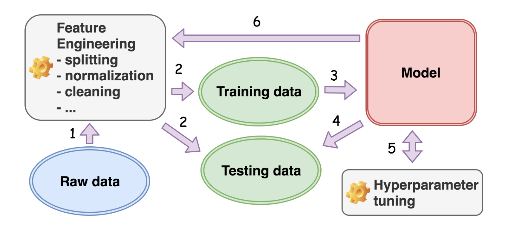
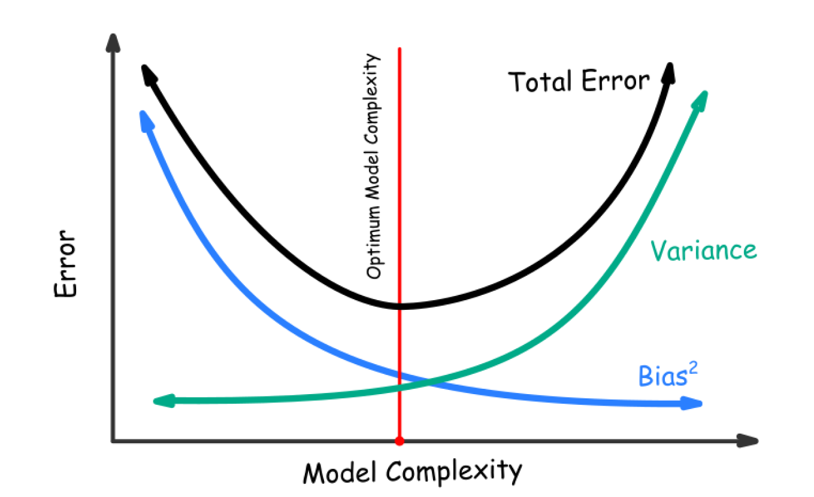

# Machine Learning Intro (Leetcode)

## Common Questions

Q: What's difference between a ML algorithm and a Non-ML algorithm?

A: The key difference is that a ML algorithm adapt its behavior according to new input.

Q: What is a ML model?

A: A ML model is the outcome of a ML algorithm. The model relies on the function and the training data. The function will output certain results according to the given input. The training data is very important: if data changes, the model changes.

Q: What is a ML task?

A: To learn the function.

Q: What is supervised learning?

A: The data sample contains a target attribute y, also known as ground truth or labeled data.

Q: What is unsupervised learning?

A: In dataset, there is no ground truth. Two main tasks are clustering and association. Clustering cluster the samples into groups. Association find hidden association patterns among the  samples.

Q: What is semi-supervised learning?

A: The dataset is massive but the labels are few. The strategy commonly starts with unsupervised learning, cluster the samples into different group. Then use supervised learning in each group.

Q: What is self-supervised learning?

A: ...

Q: What is "Rule of thumb":

A: Garbage in, garbage out.

Q: What is the common workflow of ML?

A: Data-centric workflow:

Q: What is generalization?

A: Generalization measures how well the model derived from the training data can predict the desired attribute of the unseen data. A well generalized model is good fit, instead of overfitting or underfitting.

Q: What is underfitting?

A: The model significantly deviated from the ground truth.

Q: What is overfitting?

A: The model fits well with the training data, but does not generalized well to the unseen data.

Q: What is bias?

A: Bias is the loss incurred by the difference between the main prediction and the actual value of the target attribute.

Q: What is variance?

A: Variance measrues the loss incurred by its fluctuation around the main prediction in response to different training sets.

Q: What is loss function?

A:
