# Data Structures

注意：不要修改标题名称，否则会导致很多地方的链接失效。

## Array

...

## Dynamic List

...

## Linked List

...

## Stack

...

## Queue and Deque

...

## Heap / Priority Queue

Priority Queue是一个ADT（抽象数据类型），它定义了一组行为或操作：

* Enqueue: 入队，可以把带有优先级的元素放入队列中
* Dequeue(Extract-Min/Max): 取出队列中优先级最低/最高的元素

实现Priority Queue的方式有很多种，常见的有：

* Heap，最常见和最高效的实现方式，查找/移除根元素是O(1)，插入和删除其他元素是O(logN)
* 无序数组/链表：插入快，但是查找/删除最高级优先元素要O(N)
* 有序数组/链表：查找/删除最高优先级元素O(1)，但插入O(N)
* BST，平均O(logN)，但可能退化到O(N)

### Heap Implementation

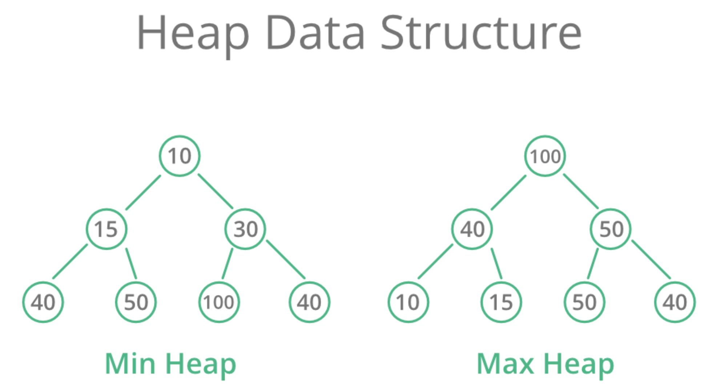

Heap的定义是：所有的parent node都必须小于或等于（最小堆）/大于或等于（最大堆）其所有的子节点。因此，最小堆的根节点就是最小的节点，最大堆的根节点就是最大的节点。

* Min-Heap 最小堆：每个父节点都小于等于其任何子节点
* Max-Heap 最大堆：每个父节点都大于等于其任何子节点

Heap的重要性质包括：

* 局部有序：只保证父子节点的顺序关系，不保证兄弟节点或者不同子树之间的具体大小关系
* 完全二叉树：heap必须是完全二叉树。（除了最后一层，其他层都是完全填满的；如果最后一层存在空缺，也必须是从左到右连续填充的，不允许中间有空隙，也不允许右边有节点而左边空缺）
* 允许重复值

根据上述性质，一般在实现的时候用一个array就可以存储heap的内容。而这个实现原理也解释了为什么一定要把heap设计成完全二叉树：

完全二叉树的父子节点关系可以用数组索引来直接计算：

假设一个节点在数组中的索引是 `i`（我们通常从 `0` 或 `1` 开始索引）：

* **如果数组从索引 0 开始：**
  * 父节点的索引：`(i - 1) // 2` (整除)
  * 左子节点的索引：`2 * i + 1`
  * 右子节点的索引：`2 * i + 2`
* **如果数组从索引 1 开始（有些算法喜欢这样，计算更简洁）：**
  * 父节点的索引：`i // 2`
  * 左子节点的索引：`2 * i`
  * 右子节点的索引：`2 * i + 1`

实现一个heap，主要功能实现方法如下：

* sift up: 不断和parent比较，如果比parent小就交换位置
* sift down：不断和childs比较，如果比child大，就和更小的那个child交换
* heapify：从第一个非叶子节点开始，向前遍历，逐一sift down
* add: 把新元素放到数组的最末尾，然后执行sift up操作
* pop: 把list[0]和list[-1]调换位置，然后对新的list[0] sift down

重要速算，对于一个长度为n的最小堆list：

* 第一个非叶子节点：(n // 2) - 1
* 第k小的元素：无法直接计算
* 节点i的父节点：(i - 1) // 2
* 节点i的左子节点：2 * i + 1
* 节点i的右子节点：2 * i + 2
* 非叶子节点的数量：n // 2
* 叶子节点的数量：n - n // 2
* heap的高度：math.floor(math.log2(n))

#### Insertion, Deletion

我们以**数组从索引 0 开始**为例来解释。

堆的核心操作是**插入 (Insertion)** 和 **删除根节点 (Deletion of Root)** ，这两个操作都需要在执行后 **恢复堆的属性** 。

**(1) 插入 (Insertion) - `heapq.heappush()` 的逻辑**

当向堆中插入一个新元素时，为了保持堆的属性：

1. **添加到末尾：** 将新元素添加到数组的 **末尾** （即完全二叉树的下一个可用位置）。
2. **上浮 (Heapify-up / Sift-up):** 新添加的元素可能破坏了堆的顺序属性（因为它可能比父节点更小或更大）。因此，需要将这个新元素 **向上移动** ，与它的父节点比较：
   * 如果新元素比父节点 **更符合堆的属性** （例如，在最小堆中新元素更小），就交换它们的位置。
   * 重复这个过程，直到新元素找到一个合适的位置（即它不破坏父子关系），或者到达根节点。

这个上浮过程的时间复杂度是  **O(log N)** ，因为元素最多从叶子节点移动到根节点，路径长度是树的高度（log N）。

**(2) 删除根节点 (Deletion of Root) - `heapq.heappop()` 的逻辑**

删除堆的根节点（即最大堆的最大元素或最小堆的最小元素）是另一个核心操作：

1. **移除根并替换：** 将根节点（数组的第一个元素）移除。为了保持完全二叉树的结构，将数组**最后一个元素**移到根节点的位置。
2. **下沉 (Heapify-down / Sift-down):** 新放在根位置的元素可能不符合堆的顺序属性（因为它可能比子节点更大或更小）。因此，需要将这个元素 **向下移动** ，与它的子节点比较：
   * 选择子节点中**更符合堆属性**的那个（例如，在最小堆中选择更小的子节点，在最大堆中选择更大的子节点）。
   * 如果当前元素比选中的子节点 **不符合堆的属性** （例如，在最小堆中它比子节点大），就交换它们的位置。
   * 重复这个过程，直到元素找到一个合适的位置（即它不破坏父子关系），或者到达叶子节点。

这个下沉过程的时间复杂度也是  **O(log N)** ，因为元素最多从根节点移动到叶子节点。

---

python中一般直接用heapq，但如果要自己写的话，也不难：

```python
class MinHeap:
    def __init__(self):
        """
        初始化一个空的最小堆。
        堆的底层使用一个列表来存储元素。
        """
        self.heap = []

    def _parent_index(self, index):
        """计算父节点的索引"""
        return (index - 1) // 2

    def _left_child_index(self, index):
        """计算左子节点的索引"""
        return 2 * index + 1

    def _right_child_index(self, index):
        """计算右子节点的索引"""
        return 2 * index + 2

    def _has_parent(self, index):
        """检查节点是否有父节点"""
        return self._parent_index(index) >= 0

    def _has_left_child(self, index):
        """检查节点是否有左子节点"""
        return self._left_child_index(index) < len(self.heap)

    def _has_right_child(self, index):
        """检查节点是否有右子节点"""
        return self._right_child_index(index) < len(self.heap)

    def _swap(self, index1, index2):
        """交换两个索引位置的元素"""
        self.heap[index1], self.heap[index2] = self.heap[index2], self.heap[index1]

    def _sift_up(self, index):
        """
        元素上浮操作：当新元素插入或元素值变小后，
        将其与其父节点比较，如果小于父节点则交换，直到满足堆属性。
        """
        while self._has_parent(index) and self.heap[index] < self.heap[self._parent_index(index)]:
            parent_idx = self._parent_index(index)
            self._swap(index, parent_idx)
            index = parent_idx # 继续向上比较

    def _sift_down(self, index):
        """
        元素下沉操作：当根元素被移除或元素值变大后，
        将其与其子节点比较，选择更小的子节点交换，直到满足堆属性。
        """
        while self._has_left_child(index): # 只要有左子节点，就可能有子节点
            smaller_child_idx = self._left_child_index(index)
  
            # 如果有右子节点，并且右子节点比左子节点更小，则选择右子节点
            if self._has_right_child(index) and \
               self.heap[self._right_child_index(index)] < self.heap[smaller_child_idx]:
                smaller_child_idx = self._right_child_index(index)
  
            # 如果当前节点比最小的子节点还小，则满足堆属性，停止下沉
            if self.heap[index] <= self.heap[smaller_child_idx]:
                break
            else:
                self._swap(index, smaller_child_idx)
                index = smaller_child_idx # 继续向下比较

    def insert(self, item):
        """
        向堆中插入一个新元素。
        时间复杂度：O(logN)
        """
        self.heap.append(item) # 将元素添加到列表末尾
        self._sift_up(len(self.heap) - 1) # 对新元素执行上浮操作

    def extract_min(self):
        """
        移除并返回堆中最小的元素（即根节点）。
        时间复杂度：O(logN)
        """
        if self.is_empty():
            raise IndexError("Heap is empty, cannot extract minimum.")

        if len(self.heap) == 1:
            return self.heap.pop() # 如果只有一个元素，直接弹出

        min_item = self.heap[0] # 最小元素总在根部
        self.heap[0] = self.heap.pop() # 将最后一个元素移到根部
        self._sift_down(0) # 对新的根元素执行下沉操作
        return min_item

    def peek_min(self):
        """
        查看堆中最小的元素（根节点），但不移除。
        时间复杂度：O(1)
        """
        if self.is_empty():
            return None
        return self.heap[0]

    def is_empty(self):
        """检查堆是否为空"""
        return len(self.heap) == 0

    def size(self):
        """返回堆中元素的数量"""
        return len(self.heap)

    def __str__(self):
        """方便打印堆的内容（内部列表表示）"""
        return str(self.heap)
```

使用这个最小heap：

```python
# 创建一个最小堆实例
min_heap = MinHeap()

# 插入元素
print("--- 插入元素 ---")
min_heap.insert(30)
print(f"插入 30: {min_heap}") # [30]
min_heap.insert(10)
print(f"插入 10: {min_heap}") # [10, 30] - 10 上浮到根部
min_heap.insert(50)
print(f"插入 50: {min_heap}") # [10, 30, 50]
min_heap.insert(5)
print(f"插入 5: {min_heap}")  # [5, 10, 50, 30] - 5 上浮到根部
min_heap.insert(20)
print(f"插入 20: {min_heap}") # [5, 10, 20, 30, 50] - 20 上浮到正确位置

print(f"\n当前堆中最小元素 (不移除): {min_heap.peek_min()}")
print(f"堆的大小: {min_heap.size()}")

# 提取最小元素
print("\n--- 提取最小元素 ---")
print(f"提取: {min_heap.extract_min()}") # 提取 5
print(f"堆变为: {min_heap}") # [10, 30, 20, 50] -> 10 成为新根，50 下沉

print(f"提取: {min_heap.extract_min()}") # 提取 10
print(f"堆变为: {min_heap}") # [20, 30, 50]

print(f"\n再次查看最小元素: {min_heap.peek_min()}")
print(f"堆的大小: {min_heap.size()}")

# 继续提取直到堆空
print("\n--- 继续提取直到堆空 ---")
while not min_heap.is_empty():
    print(f"提取: {min_heap.extract_min()}")
    print(f"堆变为: {min_heap}")

print(f"\n堆是否为空？ {min_heap.is_empty()}")
# min_heap.extract_min() # 这会引发 IndexError
```

...

#### Push, Pop

**（1）Push (插入) 操作**

* **目的：** 将一个新元素添加到堆中，并确保堆的属性（最小堆的父节点小于等于子节点，最大堆的父节点大于等于子节点）仍然保持。
* **如何工作：**
  1. **添加到底部：** 新元素会被放到堆底层数组的最后一个可用位置（也就是逻辑上的完全二叉树的下一个叶子节点）。
  2. **上浮 (Sift-Up / Heapify-Up)：** 新添加的元素可能比它的父节点更“优先”（例如，在最小堆中它比父节点小）。为了恢复堆的属性，这个新元素会不断地 **向上移动** ，和它的父节点比较并交换位置，直到它到达一个合适的位置（即不再比父节点更优先），或者到达堆的根部。
* **时间复杂度：**  **O(log N)** 。因为元素最多从叶子节点移动到根节点，移动的步数就是树的高度，而树的高度是 `log N`（N 是堆中元素的数量）。

**（2）Pop (提取) 操作**

* **目的：** 移除并返回堆中优先级最高的元素（对于最小堆是最小的元素，对于最大堆是最大的元素）。同时，确保堆的属性在移除后仍然保持。
* **如何工作：**
  1. **移除根部：** 优先级最高的元素总是在堆的 **根部** （数组的第一个位置）。首先取出这个元素。
  2. **替换根部：** 为了保持完全二叉树的结构，将堆底层数组的**最后一个元素**移到根节点的位置。
  3. **下沉 (Sift-Down / Heapify-Down)：** 新放在根位置的元素可能不符合堆的属性（因为它可能比子节点更不优先）。这个元素会不断地 **向下移动** ，和它的子节点比较：选择那个更“优先”的子节点（例如，在最小堆中选择较小的子节点），如果当前元素不符合堆的属性就交换位置。重复这个过程，直到元素找到一个合适的位置，或者到达叶子节点。
* **时间复杂度：**  **O(log N)** 。因为元素最多从根节点移动到叶子节点，移动的步数是树的高度 `log N`。

#### Heapify

Heapify：

* **目的：** 将一个**任意顺序的列表或数组**原地（in-place）转换为一个有效的堆（最小堆或最大堆）。
* **如何工作：**
  1. **从后向前：** 它的核心思想是从列表中**最后一个非叶子节点**开始（这些节点以下的所有子树都已经是有效的堆），然后依次向前（向根部）处理每一个节点。
  2. **逐个下沉：** 对于每个处理到的节点，都对其执行一次 **“下沉” (Sift-Down)** 操作。通过这种自底向上的方式，确保每个子树都满足堆的属性，直到整个列表都被组织成一个合法的堆。
* **时间复杂度：**  **O(N)** 。尽管里面包含了多次 O(log N) 的下沉操作，但由于大部分下沉操作发生在树的低层（下沉距离短），所以摊还分析后，总体的建堆时间复杂度是线性的，非常高效。

**举例说明/示例：将长度为 10 的列表转换为最小堆**

假设我们有以下列表：
`my_list = [19, 7, 100, 36, 16, 3, 1, 2, 8, 4]`
列表长度 `N = 10`

在找到第一个需要处理的节点前，我们来复习一下完全二叉树的结构特征：

* 如果一个节点有子节点，那它一定是 **在数组的前半部分** 。
* 如果一个节点没有子节点，那它一定是**在数组的后半部分**

因此heapify这个list的流程如下：

1. **找出第一个需要处理的节点：**
   * 最后一个非叶子节点的索引是 `(N // 2) - 1 = (10 // 2) - 1 = 5 - 1 = 4`。
   * 所以，我们从索引 `4` 的元素 `16` 开始，向前处理。
2. **开始 `sift down` 循环：** （从索引 4 倒数到索引 0）
   * **处理索引 4 的元素 (`16`)：**
     * `16` 的子节点是索引 `(2*4+1)=9` 的 `4`。
     * `16` 与 `4` 比较，`4` 更小，所以交换 `16` 和 `4`。
     * 列表变为：`[19, 7, 100, 36, 4, 3, 1, 2, 8, 16]`
     * （`16` 已经下沉到底部，不再有子节点，停止下沉）
   * **处理索引 3 的元素 (`36`)：**
     * `36` 的子节点是索引 `(2*3+1)=7` 的 `2` 和索引 `(2*3+2)=8` 的 `8`。
     * 两个子节点中 `2` 最小。
     * `36` 与 `2` 比较，`2` 更小，所以交换 `36` 和 `2`。
     * 列表变为：`[19, 7, 100, 2, 4, 3, 1, 36, 8, 16]`
     * （`36` 现在是叶子节点，停止下沉）
   * **处理索引 2 的元素 (`100`)：**
     * `100` 的子节点是索引 `(2*2+1)=5` 的 `3` 和索引 `(2*2+2)=6` 的 `1`。
     * 两个子节点中 `1` 最小。
     * `100` 与 `1` 比较，`1` 更小，所以交换 `100` 和 `1`。
     * 列表变为：`[19, 7, 1, 2, 4, 3, 100, 36, 8, 16]`
     * （`100` 现在是叶子节点，停止下沉）
   * **处理索引 1 的元素 (`7`)：**
     * `7` 的子节点是索引 `(2*1+1)=3` 的 `2` 和索引 `(2*1+2)=4` 的 `4`。
     * 两个子节点中 `2` 最小。
     * `7` 与 `2` 比较，`2` 更小，所以交换 `7` 和 `2`。
     * 列表变为：`[19, 2, 1, 7, 4, 3, 100, 36, 8, 16]`
     * （`7` 现在没有子节点，停止下沉）
   * **处理索引 0 的元素 (`19`)：**
     * `19` 的子节点是索引 `(2*0+1)=1` 的 `2` 和索引 `(2*0+2)=2` 的 `1`。
     * 两个子节点中 `1` 最小。
     * `19` 与 `1` 比较，`1` 更小，所以交换 `19` 和 `1`。
     * 列表变为：`[1, 2, 19, 7, 4, 3, 100, 36, 8, 16]`
     * （现在 `19` 在索引 `2`。它的子节点是索引 `(2*2+1)=5` 的 `3` 和索引 `(2*2+2)=6` 的 `100`。）
     * `19` 与 `3` 和 `100` 比较，`3` 最小。
     * `19` 与 `3` 比较，`3` 更小，所以交换 `19` 和 `3`。
     * 列表变为：`[1, 2, 3, 7, 4, 19, 100, 36, 8, 16]`
     * （现在 `19` 在索引 `5`。它没有子节点，停止下沉）
3. **建堆完成！**
   * 最终的堆列表（最小堆）可能是：
     `[1, 2, 3, 7, 4, 19, 100, 36, 8, 16]`

#### sift down

`sift down`（下沉）操作，顾名思义，就是让一个位于堆**上方**的元素（通常是根节点，或者某个因值增大而不再符合堆属性的节点） **向下移动** ，直到它在堆中找到一个合适的位置，从而恢复整个堆的属性。

它就像把一个太“重”或太“大”（在最小堆中）或太“轻”或太“小”（在最大堆中）的石头放在一堆已经排好序的石头顶部，然后让它慢慢滚下去，直到找到它该在的位置。

这里我们以**最小堆 (Min-Heap)** 为例来解释 `sift down`：

1. **起点：** `sift down` 通常从一个可能不符合堆属性的节点开始，比如在 `extract_min` 操作后被移到根部的新元素，或者在 `heapify` 过程中某个被处理的父节点。
2. **比较子节点：**
   * 这个节点会与其**子节点**进行比较。
   * 在最小堆中，我们需要找到它 **最小的那个子节点** 。
   * **重要：** 必须确保比较的子节点实际存在（即索引没有超出数组范围）。
3. **判断并交换：**
   * 如果当前节点的值**大于**它最小的子节点的值（这违反了最小堆的父节点小于等于子节点的属性），那么就**交换**当前节点和这个最小子节点的位置。
   * 如果当前节点的值已经**小于或等于**其最小的子节点的值，那么它就符合堆的属性了，`sift down` 操作 **停止** 。
4. **继续下沉：**
   * 如果发生了交换，那么当前节点（现在在新的位置）可能仍然比它的新子节点大。所以，我们 **继续重复步骤 2 和 3** ，以新的位置作为起点，让元素继续向下“下沉”，直到它不再需要交换，或者已经到达了堆的底部（即没有子节点了）。

---

**示例图解（最小堆的 `sift down`）**

假设我们有一个最小堆，移除了 `1` 之后，将最后一个元素 `100` 放在了根部：

**初始状态（要下沉的节点是 `100`）：**

```
      100  (当前节点，违反了堆属性，因为它比子节点大)
     /   \
    10    20
   / \    / \
  30  40 50  60
```

1. **第一次比较和交换：**

   * `100` 的子节点是 `10` 和 `20`。
   * 最小的子节点是 `10`。
   * `100 > 10`，所以交换 `100` 和 `10`。

   **交换后：**

   ```
          10
         /  \
       100   20  (当前节点现在是 100)
      / \    / \
     30  40 50  60
   ```

**第二次比较和交换：**

* 当前节点 `100` 的子节点是 `30` 和 `40`。
* 最小的子节点是 `30`。
* `100 > 30`，所以交换 `100` 和 `30`。

  **交换后：**

```
      10  (当前节点，违反了堆属性，因为它比子节点大)
     /   \
    30    20
   / \    / \
100 40 50  60  (当前节点现在是 100)
```

3. **第三次比较和停止：**
   * 当前节点 `100` 没有子节点了（它现在是叶子节点）。
   * `sift down` 操作 **停止** 。

**最终状态（堆属性恢复）：**

```
      10
     /  \
    30   20
   / \   / \
  100 40 50  60
```

**关键点**

* **局部操作：** `sift down` 是一种局部操作。它只涉及当前节点和其直接子节点之间的比较和交换。
* **递归性质：** 整个过程是递归的（虽然通常用循环实现），元素沿着一条路径向下移动。
* **时间复杂度：** 由于元素向下移动的路径长度就是树的高度，因此 `sift down` 的时间复杂度是  **O(log N)** ，其中 N 是堆中元素的数量。

`sift down` 和 `sift up`（上浮）是堆能够高效地执行插入和删除操作的基石，确保了堆的平均 O(log N) 性能。

总结来说sift down就是：

* 不断比较i和2i+1和2i+2，找到更小的那个交换

...

### 第K大

维护一个大小为K的最小堆，堆顶就是第K大的元素。

这里其实蕴含了两个步骤，以班上成绩[88, 90, 95]为例，加入要继续加入一个92：

* 那么首先让92入队
* 如果我们要找第3大的成绩，那么我们就维护一个大小为3的最小堆
* 现在堆里已经有4个元素了：[88,90,92,95]，把最小的88挤出去
* 这个时候堆变成了[90,92,95]，堆顶还是第三大的数字！

第K小的话就是反过来，维护一个大小为K的最大堆，堆顶就是第K小的元素。

...

...

...

...

## Set & Map

...

..

## Tree

...

### Concept of Tree

Tree是一种非线性的数据结构，由一系列节点Node和连接这些节点的边（Edge）组成。它被用来表示具有层级关系的数据。

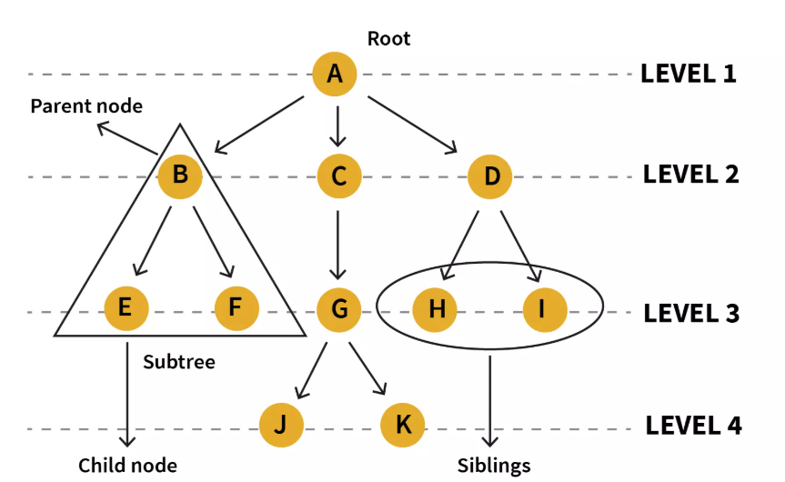

在一个tree中，核心术语包括：

* Node：Tree的基本组成部分，每一个Node都包含一个数据值和指向其子节点的引用
* Root：根节点，是整个Tree中唯一没有父节点的节点。
* Edge: 连接parent node和child node的线
* Parent: 父节点
* Child: 子节点
* Siblings: 拥有相同父节点的多个节点
* Leaf Node: 没有任何子节点的节点
* Internal Node: 至少有一个子节点的节点
* Path: 从一个节点到另一个节点所经过的边的序列
* Depth of a Node: 从root到该节点的路径长度。根节点的深度为0.
* Height of a Tree: 所有节点中深度的最大值，即root到最远leaf node的路径长度。空tree的height一般记为-1.

在python中，一般的tree通过以下方式实现：

```python
class TreeNode:
    """
    通用树的节点类
    """
    def __init__(self, value):
        self.value = value  # 节点存储的值
        self.children = []  # 一个列表，用来存储所有子节点对象

    def add_child(self, child_node):
        """
        为当前节点添加一个子节点
        """
        # 确保传入的是TreeNode的实例
        if isinstance(child_node, TreeNode):
            self.children.append(child_node)
        else:
            # 如果传入的是值，则为其创建一个节点
            self.children.append(TreeNode(child_node))

    def __repr__(self, level=0):
        """
        一个辅助函数，用于美观地打印树的结构（递归实现）
        """
        # level参数用来控制缩进，表示当前节点的深度
        ret = "  " * level + repr(self.value) + "\n"
        for child in self.children:
            ret += child.__repr__(level + 1)
        return ret

# --- 创建树 ---
# 1. 创建根节点
root = TreeNode("CEO")

# 2. 创建第一层子节点 (VP)
vp_eng = TreeNode("VP of Engineering")
vp_mkt = TreeNode("VP of Marketing")

# 3. 将VP节点加为CEO的子节点
root.add_child(vp_eng)
root.add_child(vp_mkt)

# 4. 为VP of Engineering添加子节点 (Directors)
dir_infra = TreeNode("Director of Infrastructure")
dir_app = TreeNode("Director of Application")
vp_eng.add_child(dir_infra)
vp_eng.add_child(dir_app)

# 5. 为Director of Infrastructure添加子节点 (Managers)
#   这里我们直接传入值，让add_child方法自动创建节点
dir_infra.add_child("Cloud Manager")
dir_infra.add_child("Data Center Manager")

# 6. 为VP of Marketing添加子节点
vp_mkt.add_child("Director of Sales")


# --- 打印树的结构 ---
print(root)
```

最后print(root)的结果如下：

```
'CEO'
  'VP of Engineering'
    'Director of Infrastructure'
      'Cloud Manager'
      'Data Center Manager'
    'Director of Application'
  'VP of Marketing'
    'Director of Sales'
```

...

### Tree's Traversal

对于通用树，最常见的遍历方式是**深度优先搜索 (DFS)** 和  **广度优先搜索 (BFS)** 。

#### 1. BFS / Level-Order Traversal)

BFS 按层级顺序访问节点，先访问第一层（根），再访问第二层的所有节点，以此类推。这通常需要借助一个**队列 (Queue)** 来实现。

**Python**

```
from collections import deque

def traverse_bfs(root_node):
    """
    使用BFS遍历树
    """
    if not root_node:
        return

    nodes_to_visit = deque([root_node]) # 使用双端队列，效率更高

    while len(nodes_to_visit) > 0:
        current_node = nodes_to_visit.popleft() # 从队列左边取出节点
        print(current_node.value, end=" -> ")

        # 将当前节点的所有子节点加入队列的右边
        for child in current_node.children:
            nodes_to_visit.append(child)

# 使用上面创建的树进行BFS遍历
print("BFS Traversal:")
traverse_bfs(root)
print("End")
```

**BFS 输出:**

```
BFS Traversal:
CEO -> VP of Engineering -> VP of Marketing -> Director of Infrastructure -> Director of Application -> Director of Sales -> Cloud Manager -> Data Center Manager -> End
```

#### 2. DFS

DFS 会尽可能深地探索树的分支。当节点的所有子树都访问完毕后，才回溯到父节点。DFS 通常使用**递归 (Recursion)** 或**栈 (Stack)** 来实现。

递归实现非常自然和简洁。

**Python**

```
def traverse_dfs(node):
    """
    使用DFS（前序遍历）递归遍历树
    """
    if not node:
        return
  
    # 前序遍历：先访问当前节点
    print(node.value, end=" -> ")

    # 然后递归地访问每个子节点
    for child in node.children:
        traverse_dfs(child)
  
    # 如果是后序遍历，就把print语句放到for循环之后

# 使用上面创建的树进行DFS遍历
print("\nDFS (Pre-order) Traversal:")
traverse_dfs(root)
print("End")
```

**DFS 输出:**

```
DFS (Pre-order) Traversal:
CEO -> VP of Engineering -> Director of Infrastructure -> Cloud Manager -> Data Center Manager -> Director of Application -> VP of Marketing -> Director of Sales -> End
```

...

## Binary Tree

Binary Tree虽然是一种General Tree，但是其应用范围非常之广，所以一般都单独作为一个大类目来讲。

...

### Types of Binary Trees

...

#### Full Binary Tree

...

#### Complete Binary Tree

...

#### Perfect Binary Tree

...

#### Balanced Binary Tree

...

#### Skewed Binary Tree

...

### Traversal

...

#### DFS

DFS 的核心思想是“一条路走到黑，不撞南墙不回头”。它会尽可能深地探索树的分支。当一个节点的子树被完全访问完毕后，才会回溯到其父节点，探索其他分支。

对于二叉树，根据访问**根节点**的时机不同，DFS 分为三种主要形式：

1. **前序遍历 (Pre-order): 根 -> 左 -> 右**
   * **访问顺序** ：先访问当前节点，然后递归地访问左子树，最后递归地访问右子树。
   * **应用** ：常用于创建树的副本、序列化树。
2. **中序遍历 (In-order): 左 -> 根 -> 右**
   * **访问顺序** ：先递归地访问左子树，然后访问当前节点，最后递归地访问右子树。
   * **应用** ：在二叉搜索树（BST）中，中序遍历会得到一个**有序**的序列。
3. **后序遍历 (Post-order): 左 -> 右 -> 根**
   * **访问顺序** ：先递归地访问左子树，然后递归地访问右子树，最后访问当前节点。
   * **应用** ：常用于删除树（先删除子节点再删除父节点）、计算表达式树。

**DFS 实现 (Python, 递归)**

```python
class TreeNode:
    def __init__(self, val=0, left=None, right=None):
        self.val = val
        self.left = left
        self.right = right

def dfs_traversal(root):
    if not root:
        return
  
    # 前序遍历 Pre-order
    print(root.val) 
    self.dfs_traversal(root.left)
    self.dfs_traversal(root.right)
  
    # 中序遍历 In-order
    self.dfs_traversal(root.left)
    print(root.val)
    self.dfs_traversal(root.right)

    # 后序遍历 Post-order
    dfs_traversal(root.left)
    dfs_traversal(root.right)
    print(root.val)
```

#### BFS

BFS 的核心思想是“一层一层地访问”。它从根节点开始，先访问完第一层的所有节点，然后再访问第二层的所有节点，以此类推，像水波纹一样从中心向外扩散。

* **实现方式** ：BFS 通常需要借助一个**队列 (Queue)** 来实现。
* **访问顺序** ：也称为 **层序遍历 (Level-order Traversal)** 。

**BFS 实现 (Python, 迭代)**

```python
from collections import deque

def bfs_traversal(root):
    if not root:
        return
  
    queue = deque([root]) # 1. 初始化队列，放入根节点
  
    while queue: # 2. 当队列不为空时循环
        node = queue.popleft() # 3. 从队列头部取出一个节点
  
        print(node.val, end=" -> ") # 4. 访问该节点
  
        # 5. 如果它有左孩子，将其加入队列尾部
        if node.left:
            queue.append(node.left)
  
        # 6. 如果它有右孩子，将其加入队列尾部
        if node.right:
            queue.append(node.right)
    print("End")
```

...

#### Max Depth

最大深度是指从根节点到最远的叶子节点所经过的 **节点数量** （或边的数量+1）。这是一个典型的可以用 **DFS** 解决的问题。

**思路** ：
一棵树的最大深度，等于 `1` (当前节点本身) 加上其左、右子树中**较大的那个**深度。这是一个完美的递归定义。

**实现 (Python, 递归)**

```python
def max_depth(root: TreeNode) -> int:
    # Base Case: 如果节点为空，其深度为0
    if not root:
        return 0
  
    # 递归地计算左子树的深度
    left_depth = max_depth(root.left)
  
    # 递归地计算右子树的深度
    right_depth = max_depth(root.right)
  
    # 当前树的深度 = 1 + 左右子树深度的最大值
    return 1 + max(left_depth, right_depth)
```

#### Max Width

最大宽度是指在树的所有层级中，节点数量最多的那一层的节点数。这是一个典型的可以用 **BFS** 解决的问题，因为BFS天生就是按层处理的。

**思路** ：
使用BFS进行层序遍历。在遍历每一层时，记录下该层的节点数量，并与一个全局的最大宽度变量进行比较和更新。

**实现 (Python, 迭代)**

```python
from collections import deque

def max_width(root: TreeNode) -> int:
    if not root:
        return 0
  
    max_w = 0
    queue = deque([root])
  
    while queue:
        # 当前层的节点数量，也就是当前层的宽度
        level_width = len(queue)
  
        # 更新最大宽度
        max_w = max(max_w, level_width)
  
        # 遍历当前层的所有节点，并将它们的子节点加入队列
        for _ in range(level_width):
            node = queue.popleft()
  
            if node.left:
                queue.append(node.left)
            if node.right:
                queue.append(node.right)
  
    return max_w
```

如果要找到最大宽度并记录内容，并且包含中间的None（leetcode662），需要对整个tree进行“编号”。用BFS遍历的时候，每一层的队列的第一个元素，一定是这一层最左边的元素；而队列的最后一个元素，一定是这一层最右边的元素。

在binary tree中，所有的编号都是可以直接算出来的：

* 根节点root的位置是0
* 父节点的位置是 `i`
  * 左孩子是 `2*i + 1`
  * 右孩子是 `2*i + 2`

...

#### Max Diameter

如果我们想找到整个Binary Tree中的最长路径，这个路径不一定是经过root的（可以想象这棵树非常不平衡，那么最长的路径可能在root的左边或者右边）

如果直到如何求最大depth，那么max diameter这里首先要明白，diameter相当于是edge的数量。比如对于：[1, 2, 3]，假设2是parent而1和3是child，那么长度就是1-2-3共两条边，长度就是2.

那么最长path就应该等于下列三者中最长的一个：

* 经过当前node的最大path，即左孩子的深度+1+右孩子的深度+1。这里加的1就是node到左孩子或者右孩子的那条边。
* 左子树中最大的path
* 右子树中最大的path

我们可以维护一个全局变量max_diameter，这样我们只需要traverse整个tree，并找到每一个node处的：

* 经过当前node的最大path

就可以找到整个tree中最大的diameter了。

#### Check Same Tree

DFS检查：

```python
class Solution(object):
    def isSameTree(self, p, q):
        # 1. 如果两个节点都是 None, 它们是相同的
        if not p and not q:
            return True
        # 2. 如果只有一个是 None, 或者它们的值不同, 则不相同
        if not p or not q or p.val != q.val:
            return False
  
        # 3. 递归地检查左右子树
        return self.isSameTree(p.left, q.left) and self.isSameTree(p.right, q.right)
```

BFS检查：

```python
from collections import deque
class Solution(object):
    def isSameTree(self, p, q):
        queue = deque([(p, q)]) # 队列中存储节点对
  
        while queue:
            node1, node2 = queue.popleft()
  
            # 首先处理 None 的情况
            if not node1 and not node2:
                continue # 两个都是 None, 是相同的, 继续检查下一对
            if not node1 or not node2 or node1.val != node2.val:
                return False # 一个为 None 或值不同, 直接判为不等
  
            # 将子节点对加入队列
            queue.append((node1.left, node2.left))
            queue.append((node1.right, node2.right))
  
        return True # 如果队列处理完都没发现不同, 则两树相同
```

...

#### Check Sub Tree

检查一个tree是否是另一个tree的subtree。

## BST - Binary Search Tree

在BST中，所有节点左边的都更小，右边的都更大。

**BST一般被设计为一个“集合”，即所有的元素的值都是唯一的，不允许重复。**因为如果重复的话就没办法实现其快速搜索的特性了。

BST是全局有序的，也就是对于Tree中的任何Node，上述规则都是适用的。

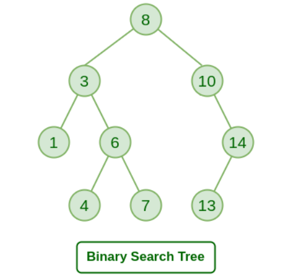

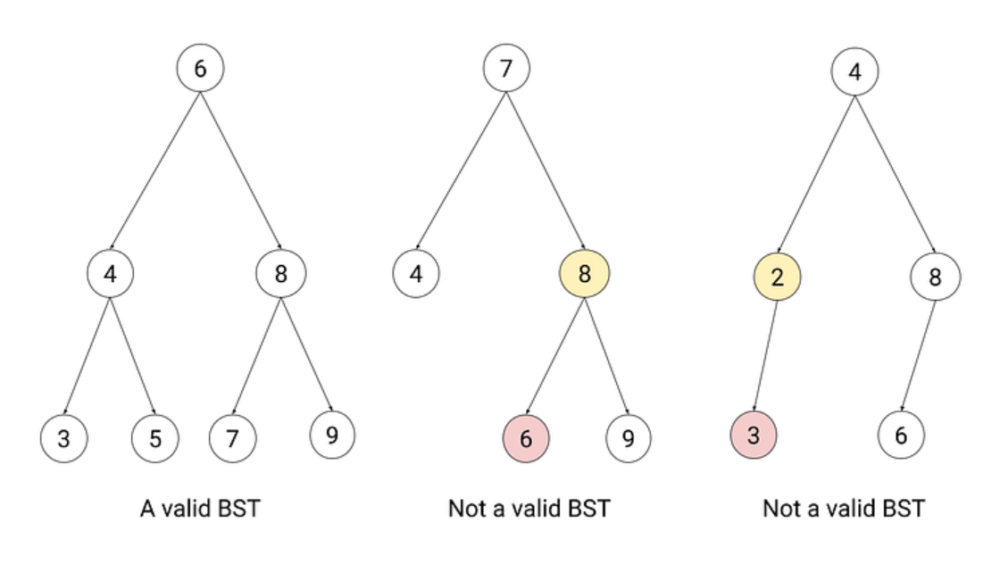

### General BST

#### Search in BST

对于一个array，Binary Search的时间复杂度是O(logN)。那么在BST中，如果我们要找一个target，从root开始，如果node小于target，我们就往右节点走；否则往左节点。这样很快就能找到target。

Search的算法实现（查找是否存在子节点）：

```python
def search(root, target):
    if not root:
        return False
  
    if target > root.val:
        return search(root.right, target)
    elif target < root.val:
        return search(root.left, target)
    else:
        return True # 如果要return节点，就return root
```

如果要return target节点，把return True改为return root就可以了。

...

#### Insertion & Delete

我们先来看一个最基本的BST，他满足最基本的BST要求，即左边总是比node小，右边总是比node大。我们要实现的功能也很简单，一个是插入，一个是删除。

**首先来看insert操作。**其思路就是，从root开始找，如果新值比当前节点 **小** ，就往**左**找；如果新值比当前节点 **大** ，就往**右**找，直到找到一个 `None`（空位），然后插入新节点。

在实现上，可以用Recursion来实现：

```python
# Insert a new node and return the root of the BST.
def insert(root, val):
    if not root:
        return TreeNode(val)
  
    if val > root.val:
        root.right = insert(root.right, val)
    elif val < root.val:
        root.left = insert(root.left, val)
    return root
```

**然后看remove操作**，删除操作比插入要复杂得多，因为它需要考虑在移除一个节点后，如何“修复”树的结构，以保证它仍然满足“左小右大”的黄金定律。

删除的第一步总是相同的：**首先，像查找一样，在树中找到要删除的那个节点。**

找到之后，根据这个节点有几个子节点，我们分为三种情况来处理：

**情况一：要删除的节点是叶子节点 (没有子节点)**

这是最简单的情况。

* **逻辑** ：直接把它从树上“摘掉”即可。
* **操作** ：将其父节点的对应指针（`left` 或 `right`）设置为 `None`。

**图示：删除 `20`**

**Code snippet**

```
graph TD
    subgraph Before
        30 --> 15
        15 --> 20
    end

    subgraph After
        30 --> 15'
        style 15' stroke:#000,stroke-width:2px
    end
```

**情况二：要删除的节点只有一个子节点**

* **逻辑** ：让它的子节点“越级”接替它的位置。
* **操作** ：将其父节点的对应指针，直接指向它的那个唯一的子节点。

**图示：删除 `15`**

**Code snippet**

```
graph TD
    subgraph Before
        30 --> 15
        15 --> 20
    end

    subgraph After
        30 --> 20
    end
```

**情况三：要删除的节点有两个子节点**

这是最复杂，也是最核心的情况。我们不能简单地删除它，因为这样会留下两个“孤儿”子树。

* **逻辑** ：我们不能凭空创造一个节点，所以必须在它的后代中找一个“替身”来顶替它的位置。这个“替身”必须能完美地维持“左小右大”的规则。
* **谁能当替身？** 有两个最佳人选：
  1. **中序后继 (In-order Successor)** ：它的**右子树**中的**最小**节点。
  2. **中序前驱 (In-order Predecessor)** ：它的**左子树**中的**最大**节点。

**通常我们选择第一种（中序后继）来实现。**

* **操作步骤 (以“中序后继”为例)** ：

1. **找到替身** ：从要删除节点的**右孩子**出发，然后一路向**左**走到尽头，那个节点就是“中序后继”。
2. **偷梁换柱** ：将“中序后继”的 **值** ，复制到我们要删除的节点上。
3. **转换问题** ：现在，原节点的值已经被替换，但树里出现了一个重复的节点（那个“中序后继”）。我们的问题就从“删除一个有两个孩子的节点”转换成了“ **删除那个中序后继节点** ”。
4. **删除替身** ：因为“中序后继”是其所在子树中最小的，所以它最多只有一个右孩子（不可能有左孩子）。因此，删除它就变成了我们上面已经解决的**情况一**或 **情况二** 。

如何通俗理解呢？

我们用一个“办公室调动”的例子来解释为什么必须这么做。

 **场景** ：假设我们要开除部门主管 `50`。主管 `50` 手下有两大业务团队：左团队（所有员工编号都 `< 50`）和右团队（所有员工编号都 `> 50`）。

 **我们的困境** ：我们不能直接让 `50` 走人，因为他走了之后，这两大团队就没人管了，整个部门的组织架构就乱了。我们必须找一个**合适的替身**来接替 `50` 的位置。

**谁是最佳替身？**
这个替身必须满足：

1. 他必须比 **左团队所有人都强** （值更大）。
2. 他必须比 **右团队所有人都弱** （值更小），这样才能服众。

符合这个条件的完美人选就是 **右团队里最弱的那个人** （即“中序后继”）。在我们的例子里，他就是右子树中值最小的节点。

```
# 1. 找到右子树的最小节点（即中序后继）
least = root.right
while least.left:
    least = least.left

# 2. 先把当前的root，也就是当前的节点的值替换为删掉的最小节点的值
root.val = least.val

# 3. 删除找到的这个右子树的最小节点
root.right = self.deleteNode(root.right, least.val)
```

这个操作其实是一个非常聪明的“障眼法”或者说“问题转换法”。

1. **`successor = ...`** ：我们找到了右团队里最弱的那个员工（中序后继），我们叫他 `55` 号员工。
2. **`root.val = successor.val`** : 这是最关键的一步，叫做**“偷梁换柱”**。我们并没有移动任何节点，只是把 `55` 号员工的**身份牌**（值）拿过来，贴在了主管 `50` 的办公室门上。现在，从外面看，主管办公室里的人已经是 `55` 了。原来的 `50` 实际上已经消失了。
3. **`root.right = self.deleteNode(...)`** : 现在出现了一个新问题：公司里有了两个 `55` 号员工！一个在主管办公室，一个还在右团队原来的位置上。我们必须把右团队里那个多余的 `55` 号员工开除掉。

**为什么这个新问题更简单？**
因为我们去找的那个替身（中序后继 `55`），他是他所在团队里最弱的（值最小），所以他 **绝对不可能有左孩子** ！因此，开除他，就变成了我们之前已经解决的**“情况一（没有孩子）” **或** “情况二（只有一个右孩子）”**的简单问题。

我们没有直接解决“如何删除一个有两个孩子的复杂节点”这个问题，而是把它巧妙地**转换**成了“如何删除一个最多只有一个孩子的简单节点”的问题。这是一个经典的算法思想： **将复杂问题转化为已知解的简单问题** 。

至此，删除操作完成，整棵树的“左小右大”规则依然被完美地保持着。

完整的实现如下：

```python
# TreeNode是所有实现的基础
class TreeNode:
    """二叉搜索树的节点类"""
    def __init__(self, key):
        self.key = key  # 键（或值）
        self.left = None
        self.right = None
        self.height = 1 # 为AVL树预留，此处暂时不用

    def __repr__(self):
        return f"Node({self.key})"

class BinarySearchTree:
    """一个标准的、非自平衡的二叉搜索树"""
    def __init__(self):
        self.root = None

    # -------------------- 插入操作 --------------------
    def insert(self, key):
        self.root = self._insert_recursive(self.root, key)

    def _insert_recursive(self, node, key):
        # 1. 如果当前位置为空，则创建新节点并返回
        if not node:
            return TreeNode(key)
  
        # 2. 否则，根据BST规则向下递归
        if key < node.key:
            node.left = self._insert_recursive(node.left, key)
        elif key > node.key:
            node.right = self._insert_recursive(node.right, key)
  
        # （注意：如果key已存在，此处不做任何事，直接返回原node）
        return node

    # -------------------- 删除操作 --------------------
    def delete(self, key):
        self.root = self._delete_recursive(self.root, key)

    def _delete_recursive(self, node, key):
        if not node:
            return node  # 如果没找到，直接返回

        # 1. 找到要删除的节点
        if key < node.key:
            node.left = self._delete_recursive(node.left, key)
        elif key > node.key:
            node.right = self._delete_recursive(node.right, key)
        else:
            # 2. 找到节点后，分情况处理
            # 情况 1: 节点只有一个孩子或没有孩子（叶节点）
            if not node.left:
                return node.right
            elif not node.right:
                return node.left
  
            # 情况 2: 节点有两个孩子
            # 找到其中序后继（右子树的最小节点）
            successor = self._get_min_value_node(node.right)
            # 将后继的值赋给当前节点
            node.key = successor.key
            # 从右子树中删除那个后继节点
            node.right = self._delete_recursive(node.right, successor.key)

        return node

    def _get_min_value_node(self, node):
        """找到并返回一棵树中最小值的节点"""
        current = node
        while current.left is not None:
            current = current.left
        return current
  
    # 辅助函数，用于打印树（中序遍历）
    def inorder_traversal(self):
        self._inorder_recursive(self.root)
        print()

    def _inorder_recursive(self, node):
        if node:
            self._inorder_recursive(node.left)
            print(node.key, end=' ')
            self._inorder_recursive(node.right)

# --- 标准BST使用示例 ---
print("--- Standard BST (Non-balancing) ---")
bst = BinarySearchTree()
# 插入有序数据，会导致树退化
keys_to_insert = [10, 20, 30, 40, 50]
for key in keys_to_insert:
    bst.insert(key)

print("Inorder traversal (should be sorted):")
bst.inorder_traversal() # 输出: 10 20 30 40 50 

# 此时的树结构是一个链表: 10 -> 20 -> 30 -> 40 -> 50
print("Deleting 30...")
bst.delete(30)
bst.inorder_traversal() # 输出: 10 20 40 50 
```

 **小结** ：这个基础版本能正确工作，但正如示例所示，插入有序数据会导致它性能下降。这就是我们需要自平衡的原因。

#### Tree Rotation

BST本身不是平衡结构，所以可能会退化，比如你有一个空的BST，然后依次插入 `10 -> 20 -> 30 -> 40 -> 50`。

1. 插入 `10`：`10` 成为根。
2. 插入 `20`：`20 > 10`，成为 `10` 的右孩子。
3. 插入 `30`：`30 > 10`，去右边；`30 > 20`，成为 `20` 的右孩子。
4. 插入 `40`：...成为 `30` 的右孩子。
5. 插入 `50`：...成为 `40` 的右孩子。

最终得到的树会是这样：

```
10
 \
  20
   \
    30
     \
      40
       \
        50
```

这棵树已经完全退化成了一个 **链表** 。在这种情况下，对它进行任何操作（查找、插入、删除），时间复杂度都从理想的 **O**(**l**o**g**N**)** 急剧恶化为 **O**(**N**)，失去了BST的全部优势。

为了解决这个问题，计算机科学家发明了 **自平衡二叉搜索树 (Self-Balancing Binary Search Tree)** 。

自平衡BST通过在每次插入和删除后进行一系列精巧的调整操作，来确保树的高度差维持在一定范围内，从而保证 **O**(**l**o**g**N**)** 的性能。

这个神奇的调整操作，其核心就是—— **树旋转 (Tree Rotation)** 。

树旋转是一种 **局部的、改变树结构的操作** ，它可以在不破坏BST“左<根<右”性质的前提下，降低树的高度，使之恢复平衡。旋转操作本身非常快，是 **O**(**1**) 的常数时间操作。

主要有两种旋转：

1. **左旋 (Left Rotation)** ：当某个节点的**右子树过高**时，对该节点进行左旋。
2. **右旋 (Right Rotation)** ：当某个节点的**左子树过高**时，对该节点进行右旋。

**右旋示例（对节点 Y 进行右旋）：**

```
    Y           (不平衡)              X       (平衡后)
   / \          ------>             / \
  X   T3        <------            T1  Y
 / \        (左旋恢复)                / \
T1  T2                              T2  T3
```

* **过程** ：`X` 提升为新的根，`Y` 降为 `X` 的右孩子。`X` 原本的右孩子 `T2` 现在“无家可归”，正好可以挂在 `Y` 空出来的左孩子位置上。
* **效果** ：树的高度降低了，但中序遍历的顺序 (`T1 -> X -> T2 -> Y -> T3`) 依然保持不变，BST的性质没有被破坏。

不同的自平衡树采用不同的策略来决定**何时**以及**如何**进行旋转。最著名的两种是：

**1. AVL 树 (Adelson-Velsky and Landis' Tree)**

* **平衡策略** ： **最严格的平衡** 。它要求树中**任何节点**的左、右子树高度差的绝对值 **不能超过 1** 。这个高度差被称为“平衡因子”。
* **维持方式** ：

1. 每次插入或删除后，从操作点向上回溯到根节点。
2. 检查路径上每个节点的平衡因子。
3. 一旦发现某个节点的平衡因子变成了 `+2` 或 `-2`，就立即通过一次或两次旋转来修正这个局部的不平衡。

* **特点** ：由于其严格的平衡，AVL树的查找速度非常快。但为了维持这种严格的平衡，插入和删除时可能需要进行更多的旋转，因此写操作稍慢。

**2. 红黑树 (Red-Black Tree)**

* **平衡策略** ： **相对宽松的平衡** 。它不直接关心高度差，而是通过给每个节点赋予“红色”或“黑色”并遵循以下5条规则来间接维持平衡：

1. 节点是红色或黑色。
2. 根是黑色。
3. 所有叶子（NIL节点）都是黑色。
4. 红色节点的子节点必须是黑色（ **不能有两个连续的红色节点** ）。
5. 从任一节点到其所有后代叶子节点的路径上，均包含相同数目的黑色节点。

* **维持方式** ：插入或删除后，如果破坏了上述规则（比如出现了两个连续的红色节点），就通过一系列的**颜色翻转**和**树旋转**来修正，重新满足规则。
* **特点** ：它的平衡没有AVL树那么严格（最长路径不会超过最短路径的两倍），所以查找速度理论上稍慢。但它的插入和删除操作通常需要更少的旋转，因此写操作更快。在实际应用中，这种综合性能使其更受欢迎，例如 **C++ 的 `std::map`、`std::set` 和 Java 的 `TreeMap`、`TreeSet`** 内部都是用红黑树实现的。

这是自平衡算法的原子操作。我们将在一个类中实现它们，以便后续的AVL树使用。旋转的目的是在**不破坏BST“左<根<右”性质**的前提下，调整树的结构以降低高度。

```python
class AVLTree: # 先创建一个框架，放入旋转逻辑
    # ... (其他方法将在第3部分实现)

    # -------------------- 旋转操作 --------------------
  
    def _right_rotate(self, y):
        """
        对节点y进行右旋
              y                              x
             / \                           /   \
            x   T3  -- 右旋 (y) -->        T1    y
           / \                                 / \
          T1  T2                              T2  T3
        """
        print(f"Right rotating on {y.key}")
        x = y.left
        T2 = x.right

        # 执行旋转
        x.right = y
        y.left = T2

        # 更新高度 (必须先更新y，再更新x)
        y.height = 1 + max(self._get_height(y.left), self._get_height(y.right))
        x.height = 1 + max(self._get_height(x.left), self._get_height(x.right))

        # 返回新的根节点
        return x

    def _left_rotate(self, x):
        """
        对节点x进行左旋
            x                               y
           / \                            /   \
          T1  y   -- 左旋 (x) -->         x     T3
             / \                        / \
            T2  T3                     T1  T2
        """
        print(f"Left rotating on {x.key}")
        y = x.right
        T2 = y.left

        # 执行旋转
        y.left = x
        x.right = T2
  
        # 更新高度
        x.height = 1 + max(self._get_height(x.left), self._get_height(x.right))
        y.height = 1 + max(self._get_height(y.left), self._get_height(y.right))

        # 返回新的根节点
        return y

    def _get_height(self, node):
        return node.height if node else 0

    def _get_balance(self, node):
        """获取节点的平衡因子"""
        if not node:
            return 0
        return self._get_height(node.left) - self._get_height(node.right)
```

 **小结** ：这两个旋转方法是后续所有自平衡操作的基础。注意每次旋转后**更新高度**是至关重要的。

#### 自平衡AVL

现在，我们将旋转操作整合到 `insert` 和 `delete` 方法中，创建一个完整的 `AVLTree`。

```python
class AVLTree:
    def __init__(self):
        self.root = None

    def _get_height(self, node):
        return node.height if node else 0

    def _get_balance(self, node):
        if not node:
            return 0
        return self._get_height(node.left) - self._get_height(node.right)

    # (在此处粘贴上面已实现的 _right_rotate 和 _left_rotate 方法)
    def _right_rotate(self, y):
        print(f"Right rotating on {y.key}")
        x = y.left
        T2 = x.right
        x.right = y
        y.left = T2
        y.height = 1 + max(self._get_height(y.left), self._get_height(y.right))
        x.height = 1 + max(self._get_height(x.left), self._get_height(x.right))
        return x

    def _left_rotate(self, x):
        print(f"Left rotating on {x.key}")
        y = x.right
        T2 = y.left
        y.left = x
        x.right = T2
        x.height = 1 + max(self._get_height(x.left), self._get_height(x.right))
        y.height = 1 + max(self._get_height(y.left), self._get_height(y.right))
        return y


    # -------------------- 带平衡的插入操作 --------------------
    def insert(self, key):
        self.root = self._insert_recursive(self.root, key)

    def _insert_recursive(self, node, key):
        # 1. 执行标准的BST插入
        if not node:
            return TreeNode(key)
        if key < node.key:
            node.left = self._insert_recursive(node.left, key)
        else:
            node.right = self._insert_recursive(node.right, key)

        # 2. 更新当前节点的高度
        node.height = 1 + max(self._get_height(node.left), self._get_height(node.right))

        # 3. 获取平衡因子，检查是否需要旋转
        balance = self._get_balance(node)

        # 4. 根据四种情况进行旋转
        # Case 1: 左-左 (Left-Left)
        if balance > 1 and key < node.left.key:
            return self._right_rotate(node)

        # Case 2: 右-右 (Right-Right)
        if balance < -1 and key > node.right.key:
            return self._left_rotate(node)

        # Case 3: 左-右 (Left-Right)
        if balance > 1 and key > node.left.key:
            node.left = self._left_rotate(node.left)
            return self._right_rotate(node)

        # Case 4: 右-左 (Right-Left)
        if balance < -1 and key < node.right.key:
            node.right = self._right_rotate(node.right)
            return self._left_rotate(node)

        return node

    # -------------------- 带平衡的删除操作 --------------------
    def delete(self, key):
        self.root = self._delete_recursive(self.root, key)

    def _delete_recursive(self, node, key):
        # 1. 执行标准的BST删除
        if not node:
            return node
        if key < node.key:
            node.left = self._delete_recursive(node.left, key)
        elif key > node.key:
            node.right = self._delete_recursive(node.right, key)
        else:
            if not node.left:
                return node.right
            elif not node.right:
                return node.left
  
            successor = self._get_min_value_node(node.right)
            node.key = successor.key
            node.right = self._delete_recursive(node.right, successor.key)
  
        # 如果树在删除后变空了
        if not node:
            return node

        # 2. 更新高度
        node.height = 1 + max(self._get_height(node.left), self._get_height(node.right))

        # 3. 获取平衡因子并执行旋转 (逻辑同插入)
        balance = self._get_balance(node)
  
        # 左-左
        if balance > 1 and self._get_balance(node.left) >= 0:
            return self._right_rotate(node)
        # 左-右
        if balance > 1 and self._get_balance(node.left) < 0:
            node.left = self._left_rotate(node.left)
            return self._right_rotate(node)
        # 右-右
        if balance < -1 and self._get_balance(node.right) <= 0:
            return self._left_rotate(node)
        # 右-左
        if balance < -1 and self._get_balance(node.right) > 0:
            node.right = self._right_rotate(node.right)
            return self._left_rotate(node)

        return node
  
    # 辅助函数
    def _get_min_value_node(self, node):
        current = node
        while current.left is not None:
            current = current.left
        return current
  
    def inorder_traversal(self):
        self._inorder_recursive(self.root)
        print()

    def _inorder_recursive(self, node):
        if node:
            self._inorder_recursive(node.left)
            print(node.key, end=' ')
            self._inorder_recursive(node.right)


# --- AVL树使用示例 ---
print("\n--- Self-Balancing AVL Tree ---")
avl_tree = AVLTree()
keys_to_insert = [10, 20, 30, 40, 50] # 同样插入有序数据
for key in keys_to_insert:
    print(f"\nInserting {key}...")
    avl_tree.insert(key)
    print("Current tree (inorder):", end=" ")
    avl_tree.inorder_traversal()

# 最终的树是平衡的，而不是链表！
# 插入30后, 对10进行左旋, 树变为: 20 -> (10, 30)
# 插入50后, 对30进行左旋, 树变为: 40 -> (30, 50)
# 之后再对20进行左旋, 树变为: 40 -> (20, 50) -> (10, 30)

print("\nDeleting 10...")
avl_tree.delete(10)
print("Current tree (inorder):", end=" ")
avl_tree.inorder_traversal()

print("\nDeleting 40...")
avl_tree.delete(40)
print("Current tree (inorder):", end=" ")
avl_tree.inorder_traversal()
```

...

**总结**

1. **标准BST** ：逻辑简单，但有性能隐患。插入和删除的核心是递归地找到位置，然后修改指针。删除有两个孩子的节点时，需要找到其后继来替换。
2. **树旋转** ：是自平衡的关键。通过 `_left_rotate`和 `_right_rotate`可以局部调整树的结构，降低高度，且不破坏BST的性质。
3. **AVL树** ：在标准BST的每个 `insert`和 `delete`操作的递归返回路径上，增加了**更新高度**和**检查平衡因子**的步骤。一旦发现不平衡（平衡因子大于1或小于-1），就立即调用相应的旋转函数（四种情况）来恢复平衡，从而始终保证树的性能在 **O**(**l**o**g**N**)**。

#### BST vs Array

**BST在维护数据有序性的成本上，远远低于有序数组。**

让我们通过一个详细的对比表格来看一下：

| 操作 (Operation)           | 平衡二叉搜索树 (Balanced BST)             | 有序数组 (Sorted Array)                                 | 对比分析                                |
| -------------------------- | ----------------------------------------- | ------------------------------------------------------- | --------------------------------------- |
| **查找 (Search)**    | **O**(**l**o**g**N**)** | **O**(**l**o**g**N**)**(使用二分查找) | **打平** 。两者在查找上同样高效。 |
| **插入 (Insertion)** | **O**(**l**o**g**N**)** | **O**(**N**)****                            | **BST 完胜** 。这是最关键的区别。 |
| **删除 (Deletion)**  | **O**(**l**o**g**N**)** | **O**(**N**)****                            | **BST 完胜** 。这也是关键区别。   |

**为什么插入和删除差异如此巨大？**

**有序数组的问题：牵一发而动全身**

想象一下一个有序数组 `[10, 20, 30, 40, 50]`。

* **插入 `25`** :

1. **查找位置** : 用二分查找可以很快（**O**(**l**o**g**N**)**）确定 `25` 应该在 `20` 和 `30` 之间。
2. **移动元素** : 为了给 `25` 腾出空间，你必须将 `30`, `40`, `50` **所有**后续元素都向右移动一个位置。如果数组有一百万个元素，这可能意味着几十万次的数据移动。这个移动操作的时间复杂度是 **O**(**N**)。
3. **总成本** : **O**(**l**o**g**N**)**+**O**(**N**)**=**O**(**N**)**。

* **删除 `20`** :

1. **查找位置** : 同样，用二分查找很快（**O**(**l**o**g**N**)**）找到 `20`。
2. **移动元素** : 为了填补 `20` 留下的空缺，你必须将 `30`, `40`, `50` **所有**后续元素都向左移动一个位置。这个操作的时间复杂度也是 **O**(**N**)。
3. **总成本** : **O**(**l**o**g**N**)**+**O**(**N**)**=**O**(**N**)**。

**BST 的优势：局部修改，无需移动**

**想象一下一个平衡的BST。**

* **插入 `25`** :

1. **查找位置** : 从根节点开始，通过比较大小，一路向下走到一个空位（**O**(**l**o**g**N**)**）。例如，最终会发现 `30` 的左子节点是空的。
2. **插入节点** : 直接将 `25` 作为一个新节点挂在 `30` 的左子节点上。这是一个指针的修改，是 **O**(**1**) 操作。
3. **平衡调整 (Rebalancing)** : 对于自平衡树（如AVL树、红黑树），可能需要做几次旋转操作来恢复平衡，这个过程也是 **O**(**l**o**g**N**)**。
4. **总成本** : **O**(**l**o**g**N**)**。

* **删除 `20`** :

1. **查找位置** : 找到 `20` 这个节点 (**O**(**l**o**g**N**)**)。
2. **删除节点** : 通过修改指针来移除该节点，比如让其父节点指向它的子节点 (**O**(**1**))。
3. **平衡调整** : 同样，可能需要 **O**(**l**o**g**N**)** 的旋转操作来恢复平衡。
4. **总成本** : **O**(**l**o**g**N**)**。

**其他维度对比**

| 维度                         | 平衡BST                                                                                       | 有序数组                                                                               |
| ---------------------------- | --------------------------------------------------------------------------------------------- | -------------------------------------------------------------------------------------- |
| **内存开销**           | **较高** 。每个节点除了数据外，还需要存储左、右指针，甚至父指针和颜色等额外信息。       | **较低** 。只存储数据本身，非常紧凑。                                            |
| **空间局部性 (Cache)** | **差** 。节点在内存中是分散的，访问时可能导致缓存未命中（Cache Miss），降低实际性能。   | **极好** 。数据在内存中是连续的，CPU可以高效地预读取和缓存，遍历速度飞快。       |
| **实现复杂度**         | **高** 。需要实现复杂的节点、指针操作和平衡算法（如旋转）。                             | **简单** 。大多数语言都内置了数组/列表。                                         |
| **平衡问题**           | 普通BST有退化风险（变成**O**(**N**)）。必须使用自平衡树来保证性能，增加了复杂性。 | **无** 。其**O**(**l**o**g**N**)**的搜索性能是稳定且有保证的。 |

**BST 的核心意义在于为“动态数据集”提供了一套“三项全能”的高效解决方案。**

当你的应用场景需要**频繁地进行查找、插入和删除**操作时，BST（特别是自平衡BST）是近乎完美的结构，因为它将这三个核心操作的时间复杂度都维持在了优秀的 **O**(**l**o**g**N**)** 水平。

**何时使用它们？**

* **使用有序数组** ：
  * 如果你的数据集是**静态的**或者 **很少变动** （Write-Once, Read-Many）。
  * 你只需要极快的**查找**速度，而几乎没有插入/删除操作。
  * 对内存占用和缓存性能要求极高。
  * **例如** ：一个不常更新的配置表，一个城市的邮政编码列表。
* **使用平衡BST** ：
  * 如果你的数据集是 **动态的** ，插入和删除操作非常频繁。
  * 你需要同时保证查找、插入、删除都有很高的性能。
  * **例如** ：数据库索引、需要实时更新的在线用户列表、操作系统的进程调度。

#### Ordered Set & Map

在C++中，std::map和std::set使用红黑树（一种特殊的自平衡BST）来实现有序的set和map。

在Java中，TreeMap和TreeSet使用红黑树实现。

Python中没有内置有序set和有序map，需要借助第三方库sortedcontainers来实现。这个由社区自维护的第三方库非常强大，经过了大量的优化。

为什么python不使用有序字典呢？因为python的设计哲学是简单，python设计者认为大多数编程场景中使用hashmap的需求主要是快速存入、取出和删除，即追求平均时间复杂度为O(1)的常数时间的常规操作。红黑树则需要O(logN)。

### BST Traversal

BST必须要掌握的几个技能

#### Ascending Visit

由于 BST 的特性（左子节点的值 < 根节点的值 < 右子节点的值），对 BST 进行中序遍历总是会按节点值的**升序**访问节点。

...

#### Descending Visit

....

#### Find Kth Smallest

如果你执行中序遍历，第一个访问到的节点是最小的，第二个是第二小的，依此类推。你在这次遍历中访问到的第 K 个节点，就是第 K 小的元素。

....

#### Find Kth Largest

....

### AVL Tree

...

### Red-Black Tree

...

### Expression Tree

...

### Huffman Tree

...

...

## Trie

...

## B Tree

...

## Graph

Linked List和Tree都是特殊的Graph。

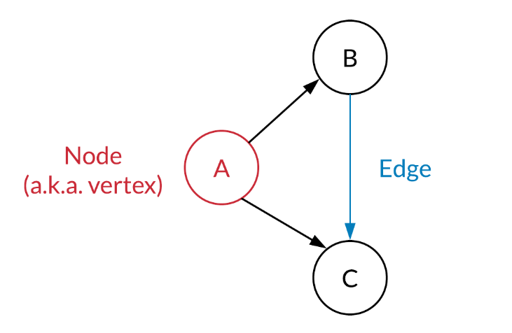

在一个Graph（图）中，包含两类：

* Vertex
* Edge

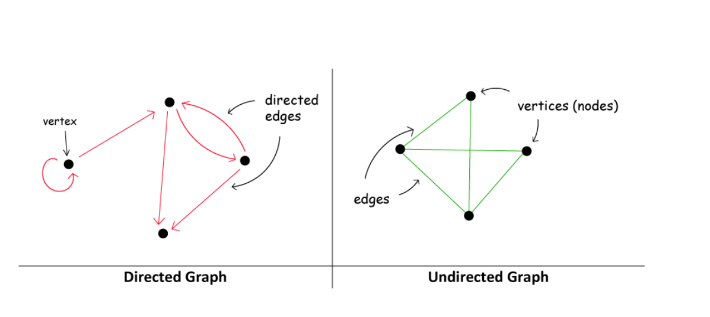

在一个图中：

* Edge可能是有向的
* Edge可以指向自己形成环

### Graph Properties

图的性质。

#### E <= V^2

如果图中两个节点之间最多只能有一条路，而一个节点最多只能有一个自环，那么V和E之间遵循E <= V^2的关系。

只有当节点只有一个的时候，一个节点加一个自环，E == V^2。

#### degree(u)

* **对于无向图 (Undirected Graph)：**
  顶点 `u` 的度数是指 **与顶点 `u` 相连的边的数量** 。
  例如，在一个无向图中，如果顶点 A 连接到 B, C, D，那么顶点 A 的度数就是 3。
* **对于有向图 (Directed Graph)：**
  有向图的度数通常分为两种：
  * **出度 (Out-degree)：** 从顶点 `u` **出发**的边的数量。
  * **入度 (In-degree)：** **指向**顶点 `u` 的边的数量。
    当提到 `degree(u)` 而没有特别指明时，通常指的是 **出度** （尤其是在邻接列表的上下文中，因为它通常存储的是出边信息），或者是无向图的度数。

握手引理（Handshaking Lemma）：在任何无向图中，所有顶点的度数之和等于边数的两倍：

$$
\left( \sum_{v \in V} \deg(v) = 2 \cdot E \right)
$$

...

#### Density

图的密度是衡量一个图“有多满”的指标，即它有多少边是实际存在的，相对于它可能拥有的最大边数。

- **对于简单无向图：**

  - 最多可以有 $V(V - 1)/2$ 条边。这是一个组合数 $\binom{V}{2}$。
  - 密度通常定义为：

    $$
    \text{Density} = \frac{E}{V(V - 1)/2}
    $$
  - 密度值介于 $0$ 到 $1$ 之间。密度接近 $1$ 表示是稠密图 (Dense Graph)，接近 $0$ 表示是稀疏图 (Sparse Graph)。
- **对于简单有向图：**

  - 最多可以有 $V(V - 1)$ 条边。
  - 密度通常定义为：

    $$
    \text{Density} = \frac{E}{V(V - 1)}
    $$

### Graph Representation

在leetcode中，图相关的题一般涉及以下三种形式：

* Matrix
* Adjacency Matrix
* Adjacency List

#### Matrix

用Matrix表示的图一般用一个2d grid来表示，用0表示通，1表示blocked：

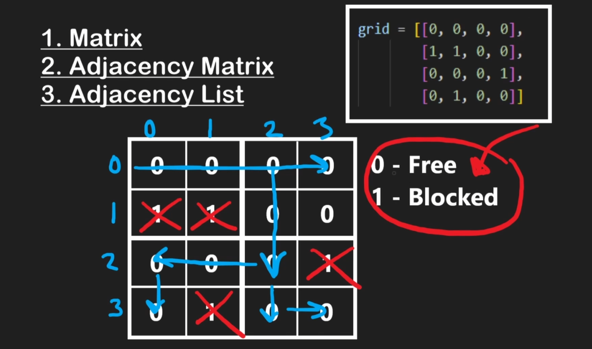

这种情况下一般可以用来表示一个无向图：

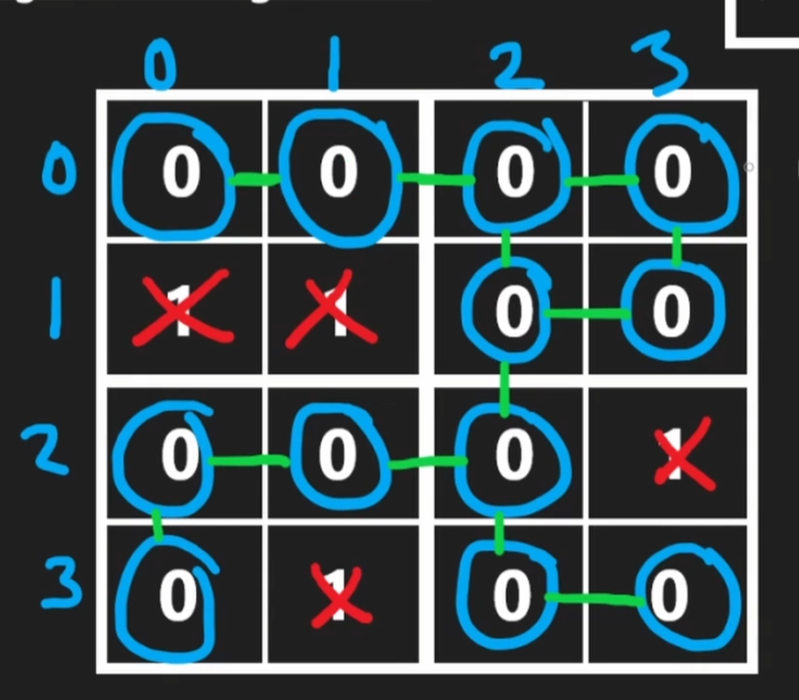

...

#### Adjacency Matrix

adjacency matrix是记录图的一个非常好的工具，他之所以能记录图，是因为在图中，如果我们对每个node进行编号，那么这个node和另外一个node（或者和自己）一定有一个唯一且确定的关系：从a到b是否连通。

如果我们把所有的点的关系记录下来，就可以形成一个matrix：

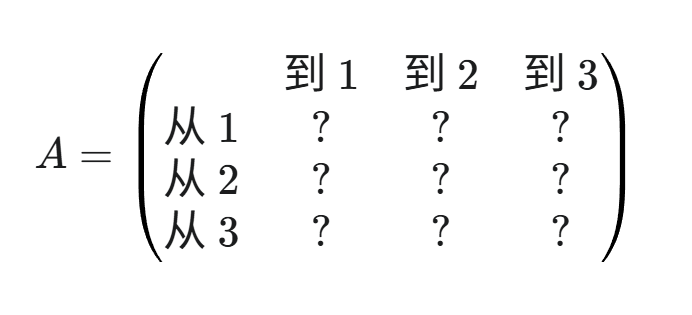

我们用：

* `A[i][j] = 1`来表示从顶点i到顶点j有边
* `A[i][j] = 0`来表示从顶点i到顶点j没有边

用下面这个例子来说明：

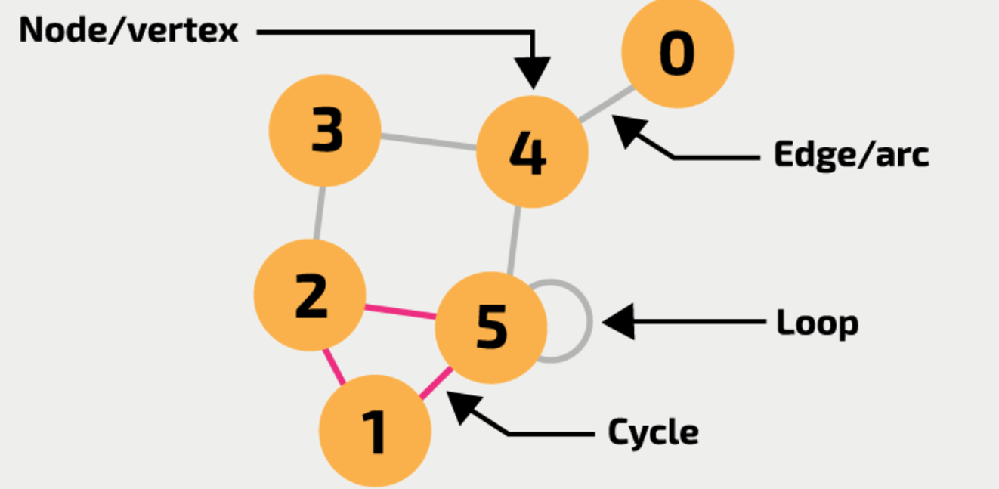

以上图为例，如果我们想把这个图用adjacency matrix记录，那么我们就要先把所有的顶点列出来并进行编号：0、1、2、3、4、5，一共有6个顶点。

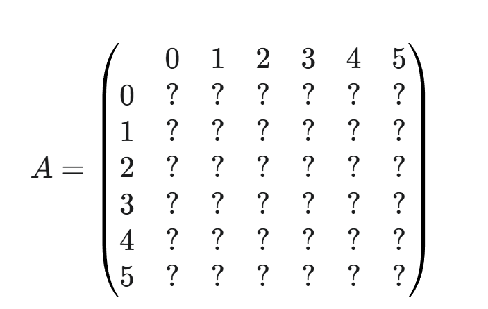

我们一个一个node来看：

* 1和2、5连通，所以1到2和5是1，即A[1][2]和A[1][5]是1，其他是0
* 以此类推，可以得到：

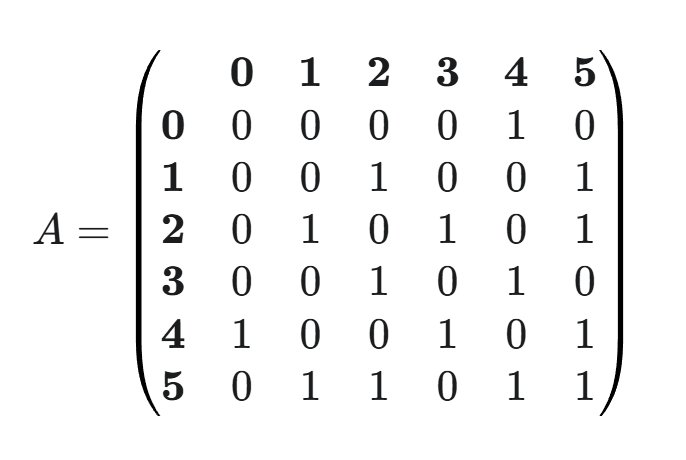

由于图例是无向图，所以途中的矩阵是对称的。如果是有向图，假设从1到2但是不从2到1，那么显然就不对称了。

对于一个adjacency matrix，显然其空间复杂度较大，为O(V^2)。因为无论图有多少条边，都要为可能的VxV对分配空间。对于稀疏图（E远小于V^2），这种方式会浪费大量空间。

时间复杂度：

* 检查边是否存在，直接访问A[u][v]，O(1)，优势巨大
* 查找所有邻居：traverse顶点所在行，O(V)
* 添加/删除边：O(1)，直接修改
* 遍历：O(N^2)

### Adjacency List

Adjacency List和Adjacency Matrix都是用来存储graph的。

一般而言，一个图的Node的数据结构可以写为：

```
class Node {
    public int val;
    public List<Node> neighbors;
}
```

这个Node就是构成图的基本单元，每个node都有一个他自己的值，并且知道他的所有邻居是谁。

如果值是唯一的，值本身就可以作为index；如果值不唯一，则需要把值和index分开存储，一般把index作为key存储。

在处理这种问题的时候，如果我们直接对Node进行处理操作，那么操作起来会有点困难，所以这里引入以hashmap + list为组建核心的adjacency list作为工具来帮我们快速构建图。

...

#### Adjacency List Intro

Adjacency List在leetcode和interview中较为常见，用一个简单的数据结构就能记录value和adjacency：

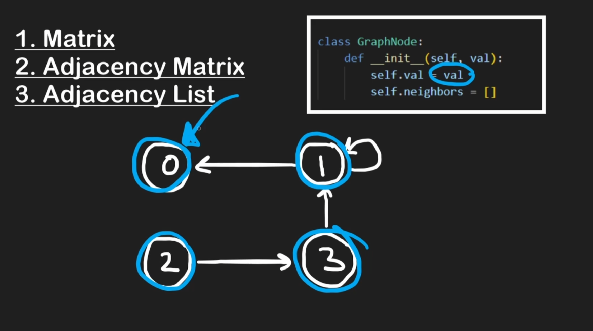

这里的neighbors只记录当前节点node可以通向的对象。

如果我们用adjacency list记录刚才的这个例子：


还是一样，我们先把所有的node列出来：

```
0: []
1: []
2: []
3: []
4: []
5: []
```

然后我们对每个node，把他相连的node添加上去：

```
0: [4]
1: [2, 5]
2: [1, 3, 5]
3: [2, 4]
4: [0, 3, 5]
5: [1, 2, 4, 5]
```

其中5连通自己，所以5也被记录在了5中。

Adjacency List的空间复杂度是O(V+E)，是稀疏图的最佳选择，因为他只存储实际存在的边。

时间复杂度：

* 检查边是否存在：遍历顶点的邻居，O(degree(u)), 最坏O(V)
* 查找所有邻居：遍历顶点u的邻居列表，O(degree(u))
* 添加边：O(1)
* 删除边：需要先找到，再删除：O(degree(u))

...

#### 无重复值Implementation

Adjacency List实现起来并不难，首先我们需要构建一个原始数据，记录当下的边的情况：

```
# edges 是 "说明书"
edges = [["A", "B"], ["B", "C"], ["B", "E"], ["C", "E"], ["E", "D"]]
```

然后我们根据说明书搭建Adjacency List。Adjacency List（邻接表）的优点是可以快速找到一个node的所有neighbors。

我们用一个hashmap来构造邻接表：

```
adjList = {}
```

更具体地说，邻接表是由以下内容构建的：

* node目录：用hashmap记录所有node
* 邻居内容：每一个node key对应所有的邻居，用list记录

即

```
adjList = {key: nodes; values: node's neighbors}
```

然后我们可以根据edges中的信息，构建出这张表：

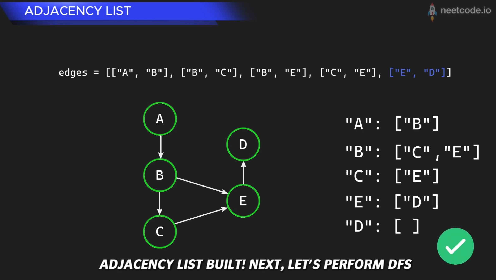

代码实现如下：

```python
# edges 是 "说明书"
edges = [["A", "B"], ["B", "C"], ["B", "E"], ["C", "E"], ["E", "D"]]

# adjList 是我们准备要搭建的 "模型"，目前是空的
adjList = {}

# 开始阅读 "说明书"，一条一条地执行指令
for src, dst in edges:
    # 指令: ["A", "B"]
    # src = "A", dst = "B"
  
    # 检查一下模型里有没有 "A" 和 "B" 这两个节点，如果没有就创建出来
    if src not in adjList:
        adjList[src] = []  # 在模型里为 "A" 创建一个空间，用来存放它的邻居
    if dst not in adjList:
        adjList[dst] = []  # 在模型里为 "B" 创建一个空间

    # 核心步骤：执行指令，建立连接
    # 在模型中，找到 "A" 的邻居列表，然后把 "B" 加进去
    adjList[src].append(dst)
```

构建完成后，adjList就变成了：

```
{
  "A": ["B"],
  "B": ["C", "E"],
  "C": ["E"],
  "E": ["D"],
  "D": [] 
}
```

...

#### 有重复值Implementation

如果图中有重复值，又想用邻接表存储的话，需要对node升级一下：

* 标识符（ID）：必须是独一无二的唯一ID，作为key
* 值（Value）：可以重复的值，单独分开存储

这个方法是算法竞赛和工程实践中常用的方法，举例来说，假设图的输入是这样的：

* **节点的值** : `[5, 8, 5, 2]`  (注意，索引0的节点和索引2的节点值都是5)
* **边** : `(0, 1)`, `(0, 2)`, `(2, 3)` (表示从ID为0的节点到ID为1的节点有边，以此类推)

我们的数据结构会变成这样：

1. **邻接表 `adjList`** : 键是节点的 **唯一ID (整数)** 。
2. **值存储 `nodeValues`** : 一个独立的数组或HashMap，用来通过ID查询节点的值。

```python
# 节点的值 (索引就是它们的唯一ID)
nodeValues = [5, 8, 5, 2] 

# 邻接表 (只关心结构，只存储ID)
adjList = {
    0: [1, 2],  # ID为0的节点连接到ID为1和ID为2的节点
    1: [],
    2: [3],
    3: []
}

# 现在，我们既能表示图的结构，又能处理重复的值
print(f"节点ID 0 的值是: {nodeValues[0]}") # 输出 5
print(f"节点ID 2 的值是: {nodeValues[2]}") # 输出 5
print(f"节点ID 0 的邻居是ID为 {adjList[0]} 的节点") # 输出 [1, 2]
```

...

#### DFS in Adjacency List

假如我们现在有一个adjacency list，然后想看看target这个目标值是否在adj. list里，我们可以进行遍历。

对于图的遍历，标准的做法是DFS和BFS。那么为什么不直接把hashmap进行普通的hashmap traverse呢？他们不都是访问所有的元素，用了O(V+E)的时间吗？

这是因为，如果你直接迭代循环hashmap，你确实可以找到所有的点，但是这种访问是缺乏顺序的。如果问题不仅仅是有没有target，而是：

* Reachability: 我从节点A能否到达节点Z？
* Shortest Path: 从A到Z最少需要几步？（无权图）
* Cycle Detection: 图中是否有环路？
* Connected Components: 连通分量，即这张图是否完全连通？如果不是，他们分成了几个相互独立的小岛？

因此，我们直接学习标准图遍历，而不是学习一个只能解决有没有target的问题的解法。

Neetcode中的教程：（图片来自neetcode.io）

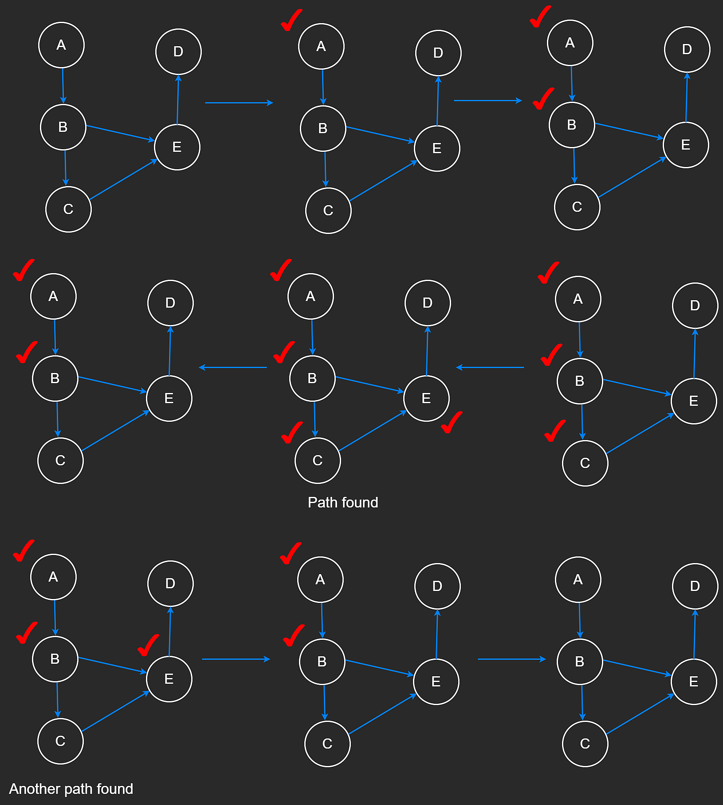

标准DFS实现：

```python
def dfs_recursive(graph: dict, start_node: str) -> list:
    """
    对图进行深度优先搜索 (DFS)，使用递归实现。

    Args:
        graph: 图的邻接表表示 (字典)。
        start_node: 遍历的起始节点。

    Returns:
        一个包含DFS遍历顺序的节点列表。
        如果起始节点不存在，则返回空列表。
    """
    if start_node not in graph:
        return []
  
    visited = set()
    path = []

    # 定义一个辅助递归函数
    def _dfs_helper(node):
        # 访问当前节点
        visited.add(node)
        path.append(node)

        for neighbor in graph.get(node, []):
            if neighbor not in visited:
                _dfs_helper(neighbor)

    _dfs_helper(start_node)
    return path

# --- 使用示例 ---
dfs_rec_path = dfs_recursive(graph_example, "A")
print(f"DFS (递归) 遍历路径: {dfs_rec_path}")
# 输出: DFS (递归) 遍历路径: ['A', 'B', 'D', 'C', 'E']
```

...

当图非常大的时候，推荐用迭代版DFS：

```python
def dfs_iterative(graph: dict, start_node: str) -> list:
    """
    对图进行深度优先搜索 (DFS)，使用迭代和栈实现。

    Args:
        graph: 图的邻接表表示 (字典)。
        start_node: 遍历的起始节点。

    Returns:
        一个包含DFS遍历顺序的节点列表。
        如果起始节点不存在，则返回空列表。
    """
    if start_node not in graph:
        return []

    stack = [start_node]      # 使用list作为栈
    visited = set()           # visited集合防止重复访问和死循环
    path = []

    while stack:
        current_node = stack.pop()

        # 注意：一个节点可能在栈里出现多次，但我们只在它第一次被弹出时访问它
        if current_node not in visited:
            visited.add(current_node)
            path.append(current_node)

            # 将邻居逆序压入栈，以保证遍历顺序与递归版一致
            # (因为栈是后进先出)
            for neighbor in reversed(graph.get(current_node, [])):
                if neighbor not in visited:
                    stack.append(neighbor)
  
    return path

# --- 使用示例 ---
dfs_it_path = dfs_iterative(graph_example, "A")
print(f"DFS (迭代) 遍历路径: {dfs_it_path}")
# 输出: DFS (迭代) 遍历路径: ['A', 'B', 'D', 'C', 'E']
```

...

#### BFS in Adjacency List

...

图片来自neetcode.io：

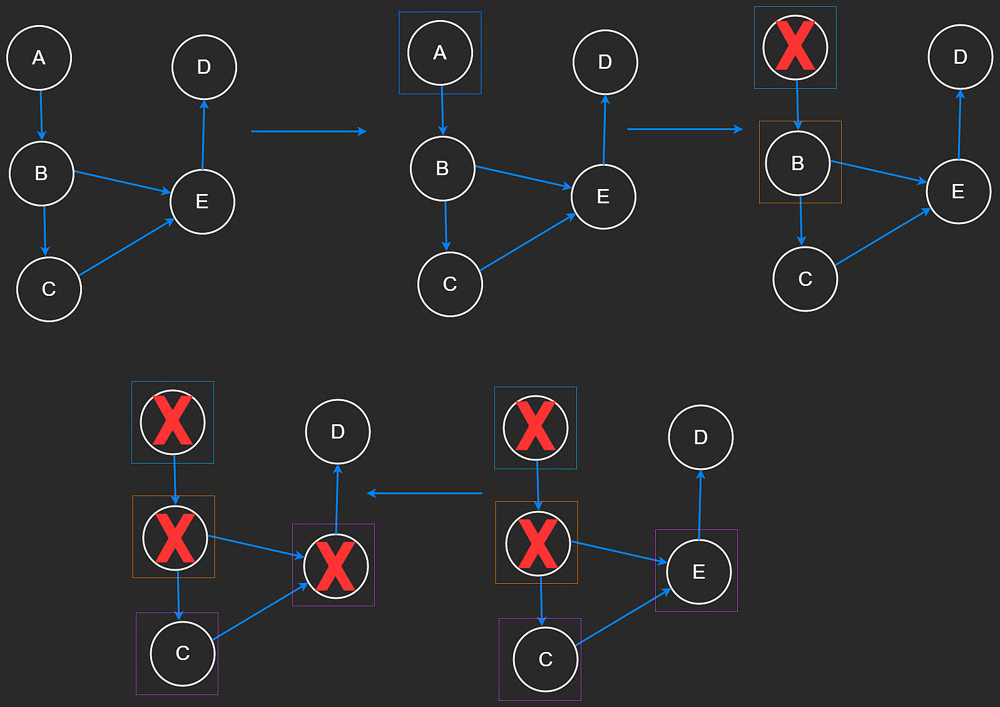

代码如下：

```python
from collections import deque

def bfs(graph: dict, start_node: str) -> list:
    """
    对图进行广度优先搜索 (BFS)。

    Args:
        graph: 图的邻接表表示 (字典)。
        start_node: 遍历的起始节点。

    Returns:
        一个包含BFS遍历顺序的节点列表。
        如果起始节点不存在，则返回空列表。
    """
    # 1. 健壮性检查：确认起始节点在图中
    if start_node not in graph:
        return []

    # 2. 初始化：使用高效的数据结构
    queue = deque([start_node])  # 使用deque作为队列
    visited = {start_node}       # 使用set进行O(1)复杂度的快速查找
    path = []                    # 用于存储最终的遍历路径

    # 3. 循环直到队列为空
    while queue:
        # 从队列左侧取出节点 (先进先出)
        current_node = queue.popleft()
        path.append(current_node)

        # 遍历当前节点的所有邻居
        # 使用 graph.get(current_node, []) 避免因节点没有邻居列表而报错
        for neighbor in graph.get(current_node, []):
            if neighbor not in visited:
                # 将新发现的节点加入visited集合和队列
                visited.add(neighbor)
                queue.append(neighbor)
  
    return path

# --- 使用示例 ---
bfs_path = bfs(graph_example, "A")
print(f"BFS 遍历路径: {bfs_path}")
# 输出: BFS 遍历路径: ['A', 'B', 'C', 'D', 'E']
```

...

### DAG & Topo Sort

Directed Acyclic Graph, 简称DAG，即有向无环图。

Topo  Sort即Topological Sort，拓扑排序。

DAG的Topological Sort拓扑排序是leetcode和interview的重点

...

#### Topological Sort

对于DAG图，如果想理清楚依赖关系，拓扑排序是必不可少的。

拓扑排序（Topological Sort）是对有向无环图（Directed Acyclic Graph，简称 DAG）的顶点进行的一种线性排序。

它的核心思想是：**如果图中有从顶点 U 到顶点 V 的有向边（即 U -> V），那么在拓扑排序的结果中，顶点 U 总是出现在顶点 V 的前面。**

简单来说，拓扑排序解决的是“先做A才能做B”这类依赖性问题。如果一系列任务或事件之间存在依赖关系，拓扑排序就能给出一个可行的执行顺序。

Topological sort的重点在于根据图的结构来进行排序，并且：

1. **必须是有向图：** 关系是单向的，例如“A 必须在 B 之前”，而不是“A 必须在 B 之前，B 也必须在 A 之前”。
2. **不能有环：** 图中不能有循环依赖。如果存在循环（例如，A 必须在 B 之前，B 必须在 C 之前，C 又必须在 A 之前），那么就不可能找到一个有效的线性顺序来完成所有任务，这种情况下，拓扑排序是无法进行的。

拓扑排序的典型应用：

* 课程先修关系（经典的course schedule）
* 编译器依赖、软件包管理、任务调度等

#### DFS解法

这个方法并非最适合解决拓扑排序的方法，可以了解一下，记住DFS是“反向”。

对于一个有向图，DFS法是反着来的：

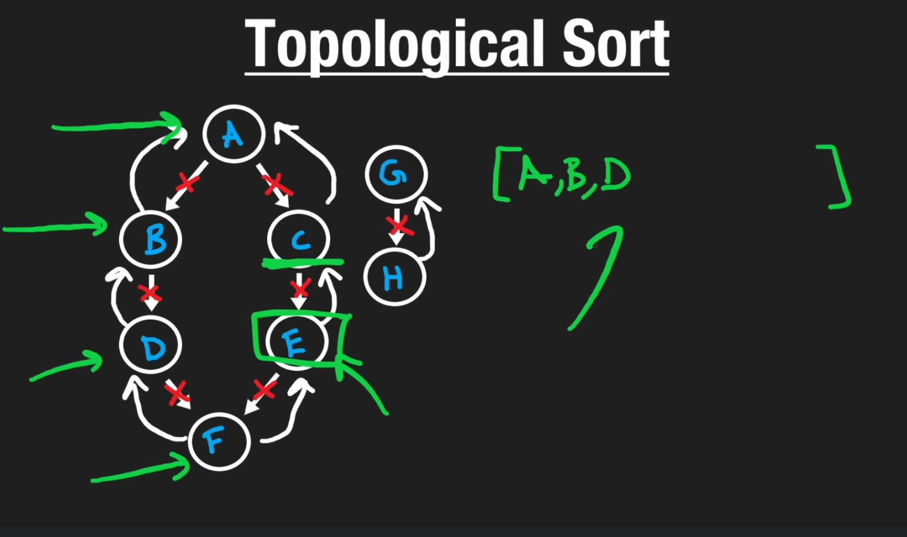

我们从结果出发，然后往回找，当找到没有前序内容或者前序内容都已经添加的时候，就把这个node添加进去。

当然，我们也可以顺着来，当找到最后的node的时候作为base case添加到result中，得到一个和正确排序正好相反的结果：

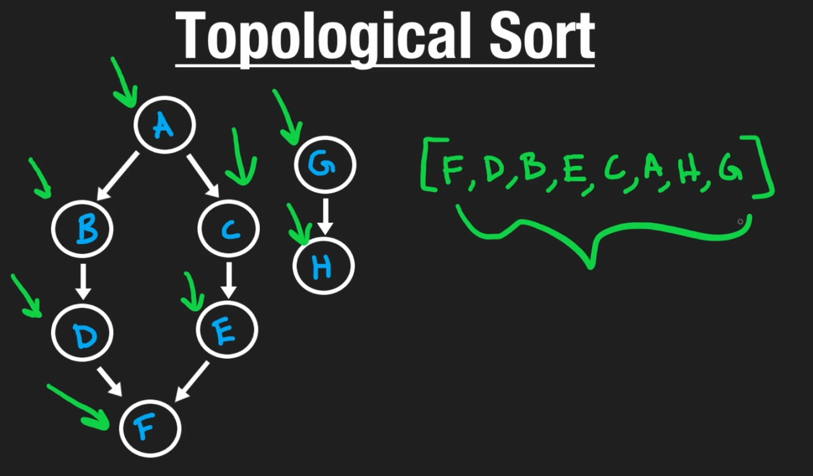

然后我们把result反过来（reverse）就可以了。

#### BFS解法

在course schedule问题中，我们一开始并不知道哪门课是图的起点。虽然DFS也可以解决，但是BFS法会更简单直观。BFS的拓扑排序也叫做Kahn's Algorithm，是DAG拓扑排序的经典解法。

Kahn's Algorithm所需的数据结构：

* 一个Queue：存储所有当前入度为0的nodes，记录当前可以处理的nodes
* 一个记录入度（In-degree）的list/hashtable：用于存放每个node有多少条指向它的边，例如 `in_degree[A] = 2`，意味着node A有两个前置依赖。
* 一个adjacency list：用于表示图的结构，即每个节点指向哪些其他节点。

针对一个DAG，Kahn's算法步骤如下：

```
遍历图中所有边，计算出每个节点的初始入度（in-degree）
初始化queue，将所有in-degree为0的节点全部放入
一个result，用来存储最终拓扑排序的结果

循环，当队列不为空时：
    从queue中取出一个节点u，将u放入result
    遍历u的所有邻居v：
	对于每个邻居v，v的入度 -= 1（象征前置依赖已经满足）
	如果邻居v的入度减1后变为0，则将v放入queue
	（象征所有前置依赖都已经满足）

循环结束后，检查result中的节点数量：
    如果result中的节点数量等于图中的节点数量：
	说明该图是一个有效的拓扑排序
    如果result中的节点数量小于图中的节点数量：
	说明该图中存在环路（Cycle）
	（环路中的节点入度永远无法变为0）
```

可以记忆一下标准模板：

```python
indegree = {}
neighbors = {}

for i in range(numCourses):
    indegree[i] = 0
    neighbors[i] = []

for course, pre_course in prerequisites:
    indegree[course] += 1
    neighbors[pre_course].append(course)

queue = deque()
for node in indegree:
    if indegree[node] == 0:
	queue.append(node)

result = []
while queue:
    node = queue.popleft()
    result.append(node)
  
    node_neighbors = neighbors[node]
    for neighbor in node_neighbors:
	indegree[neighbor] -= 1
	if indegree[neighbor] == 0:
	    queue.append(neighbor)

if len(result) == numCourses:
    return result # or return True, the DAG is valid
else:
    return False # the DAG has circle
```

在分析时间复杂度的时候，N代表nodes数量，E代表边的数量：

* for循环numCourses: O(N)
* for循环prerequisites: O(E)
* for循环indegree: O(N)
* while循环queue: O(N)
* while循环中的for循环:O(E)

这里要注意，最终整体时间复杂度是O(N+E)，为什么嵌套在while循环里的O(E)是被加上去而不是乘上去的呢？

想象一下，你要规划一次全国旅行：

* **N** : 代表你要访问的  **城市总数** 。
* **E** : 代表连接这些城市的  **公路总数** 。

你的旅行计划（也就是我们的算法）分为两部分工作：

1. **抵达每个城市（外层 `while` 循环）** : 每抵达一个城市，你都要去酒店办一次入住手续。因为你每个城市只去一次，所以你总共要办 **N** 次入住手续。
2. **开车走公路（内层 `for` 循环）** : 每当你身处一个城市时，你会开车走完 **从这个城市出发的所有公路** ，前往下一个城市。

现在我们来计算总工作量：

* **`O(N*E)` 的错误逻辑** : 这种逻辑相当于说：“我每抵达一个城市（总共N个），就要把全国所有的高速公路（总共E条）都开一遍。” 这显然是荒谬的，没有人会这样旅行。
* **`O(N+E)` 的正确逻辑** : 我的总工作量是“ **所有城市的入住手续总和** ” **加上** “ **所有公路的驾驶里程总和** ”：
  * 办入住的总次数 = **N**
  * 因为你的旅行计划会确保全国的每一条公路你都只走一次，所以开车走公路的总次数 = **E**
  * 因此，总工作量 = **O(N + E)**

所以在course schedule问题以及类似的问题中，时间复杂度是O(N+E)，这是一个重要的知识点。

...

## Disjoint Set

...

## Multiset

...

## Bloom Filter

...

## Hash Table

作为数据结构的hash table，以hash function为核心，可以实现高效的O(1)的Search, Insert, Remove(查找、添加、删除)。

hash table的数据结构实现有以下重点内容：

* hash function，用来将要存储的对象的key转化为一个整数
* buckets：实际在底层存储内容的list/array，被认为是很多个bucket
* resizing，扩容。当hash table（一般底层是数组）中存储的元素达到一定比例时，一般是一半时，为了维护高效性能，创建的一个新的更大容量的底层数组
* re-hashing: 当hash table扩容后，所有的元素都要重新计算hash并重新存储。
* collisions: 哈希冲突，即经过hash function的计算后，不同的key转换后是一个整数，这个时候就出现了collisions。
  * Chaining: 链表法，在底层数组的每个bucket(即索引位置)上存放linked list。这样已经有内容的话，就作为一个新的node添加上去。
  * Open Addressing: 发生冲突的时候，寻找一个空的位置存放。寻找空位的过程称为Probing（探查）。probing设计起来比较麻烦，无特殊原因一般不使用。

...

...

...

...

## LRU Cache

...

...

...

...

...
